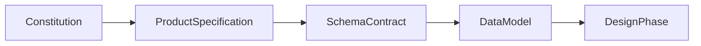
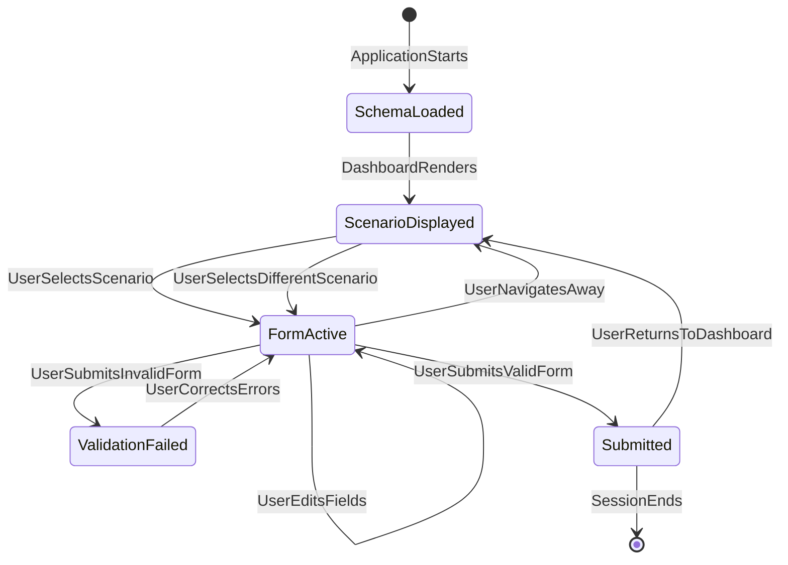
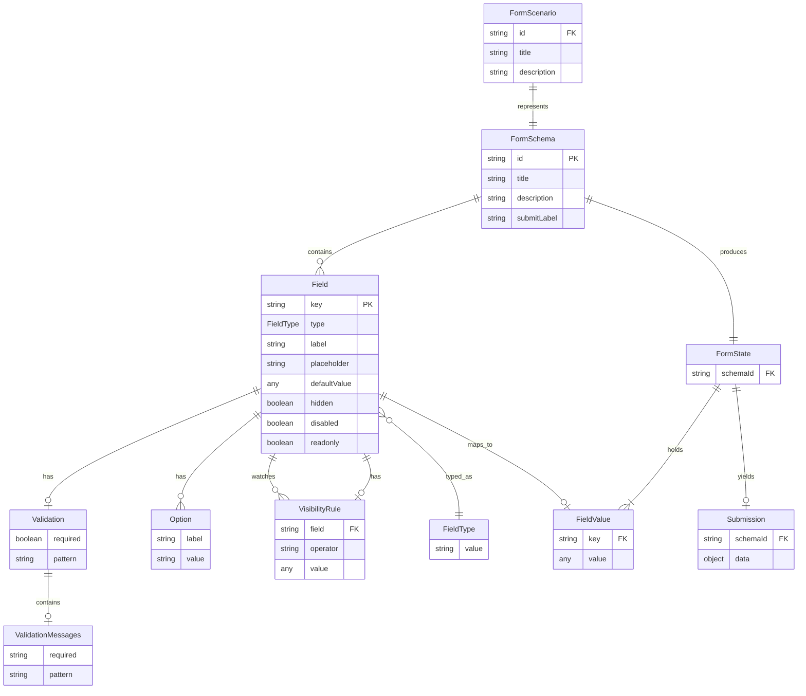
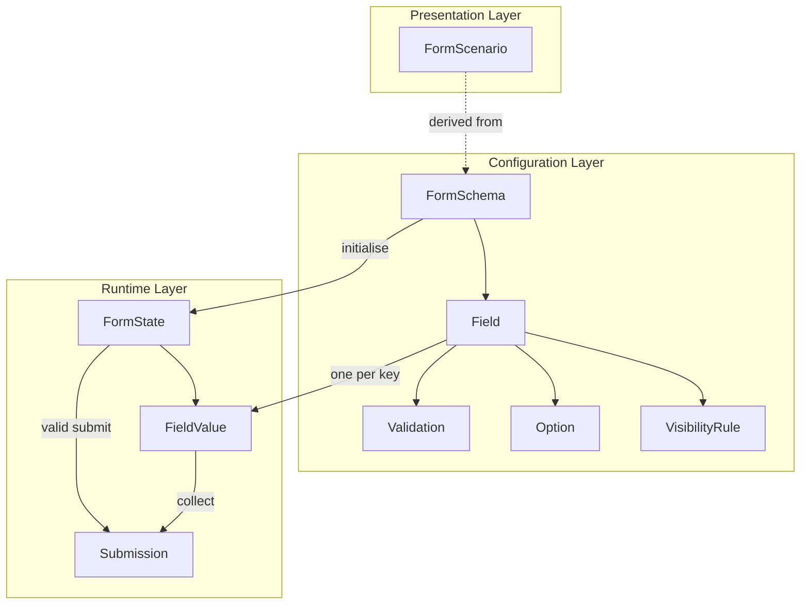

# FormFlow Data Model

**Document Type:** Data Model Specification  
**Project:** FormFlow  
**Tagline:** Build Once. Configure Forever.  
**Version:** 1.0  
**Status:** Draft  
**Parent Document:** [constitution.md](./constitution.md) v1.1  
**Related Documents:** [spec.md](./spec.md) v1.0, [schema-contract.md](./schema-contract.md) v1.0  
**Timebox:** 3-day Angular case study

---

## 1. Document Overview

### 1.1 What This Document Is

This document defines the **business entities**, their **properties**, **relationships**, **constraints**, and **lifecycle** for FormFlow Version 1.0.

FormFlow is a configuration-driven dynamic form renderer. Forms are defined entirely in JSON schemas and rendered at runtime without hardcoded field markup. The Banking Portal is a demonstration environment used to showcase the renderer — it is not a banking product.

This document describes **what data exists** in the FormFlow domain and **how that data relates**. It is the conceptual data foundation that developers should understand before implementation begins.

### 1.2 What This Document Is Not

| This Document Is | This Document Is Not |
|---|---|
| A business entity reference | An Angular design document |
| A conceptual data model | A database or persistence design |
| A technology-independent domain model | An implementation or service-layer specification |
| A companion to the Schema Contract | A source of TypeScript interfaces or code |

There is **no backend** in FormFlow V1. All entities described here exist as in-memory configuration data and transient runtime state within the application at runtime. No persistence layer, API, or database schema is defined.

### 1.3 Audience

| Audience | Use of This Document |
|---|---|
| **Developer** | Understand domain entities and data flow before building the renderer |
| **Evaluator** | Verify that submitted output and schema structure align with the defined model |
| **Future Maintainer** | Extend demo forms by understanding entity rules and constraints |
| **Solution Architect** | Confirm entity boundaries and relationships are coherent across specifications |
| **Product Owner** | Resolve entity-related scope questions before Design and Implementation |

### 1.4 Document Relationships

| Document | Role |
|---|---|
| [constitution.md](./constitution.md) | Authoritative scope reference; wins on conflict |
| [spec.md](./spec.md) | Behavioural product specification; user journeys and acceptance criteria |
| [schema-contract.md](./schema-contract.md) | Authoritative JSON structure; serialisation format for entities |
| **data-model.md** (this document) | Business entity definitions, relationships, constraints, and lifecycle |



### 1.5 Scope Boundaries

**In scope for this data model:**

- Eleven domain entities: FormSchema, Field, FieldType, Validation, ValidationMessages, Option, VisibilityRule, FormScenario, FormState, FieldValue, Submission
- Six V1 field types: `text`, `textarea`, `date`, `dropdown`, `multiselect`, `checkbox`
- Synchronous validation rules: `required`, `pattern` (text and textarea only)
- Bonus entities and properties: VisibilityRule; `hidden`, `disabled`, `readonly` field state flags
- Data lifecycle from schema loading through submission and navigation reset
- Two V1 demo FormSchema instances: `account-opening`, `loan-inquiry`
- Technology-independent conceptual definitions only

**Out of scope for this data model:**

- Framework-specific types, interfaces, services, or UI components
- Database tables, ORM models, API payloads, or audit persistence
- Implementation architecture, folder structure, or rendering logic
- Features deferred in the Constitution (async validation, wizard flows, schema versioning, i18n, form builder, and related platform capabilities)

### 1.6 Upstream Alignment Summary

| Upstream Document | How This Data Model Aligns |
|---|---|
| **Constitution** | No persistence entities; six field types only; synchronous validation; bonus entities marked optional; AC-01–AC-11 traceable to entities |
| **Product Specification** | Banking demo modules, submission behaviour, edge cases, and user journey reflected in entity lifecycle and validation rules |
| **Schema Contract** | Property names, types, naming conventions, and JSON examples match the contract exactly; invalid patterns inform configuration-time rules |

**Conflict resolution:** Constitution → Product Specification → Schema Contract → Data Model.

---

## 2. Purpose

### 2.1 Objectives

The Data Model is produced before Design and Implementation to achieve the following objectives:

| ID | Objective | Upstream Source |
|---|---|---|
| **DM-OBJ-01** | Establish a shared domain vocabulary for all FormFlow entities | Constitution NFR-01, NFR-03; spec OBJ-01 |
| **DM-OBJ-02** | Define entity properties, relationships, and constraints independent of any implementation technology | Constitution Section 10; spec Section 6 |
| **DM-OBJ-03** | Bridge the Schema Contract (JSON serialisation) and runtime behaviour (FormState, Submission) | schema-contract Sections 4–11; spec Sections 13–16 |
| **DM-OBJ-04** | Distinguish configuration, runtime, and output entity categories | spec Section 16.4; schema-contract Section 18.7 |
| **DM-OBJ-05** | Provide a review gate before Design and Implementation phases | Constitution AC-09; spec AC-09 |
| **DM-OBJ-06** | Support traceability from functional requirements to domain entities | spec Section 21 |

### 2.2 Document Purpose

This document exists to:

1. **Define all business entities** used throughout FormFlow V1 so all stakeholders share a common vocabulary
2. **Describe entity properties and relationships** independent of any technology or framework
3. **Document constraints and validation rules** that govern entity integrity at configuration time and runtime
4. **Explain the data lifecycle** from schema loading through user interaction to submission output
5. **Provide sample object representations** that illustrate how entities appear in configuration and output
6. **Establish a stable conceptual foundation** aligned with the Constitution, Product Specification, and Schema Contract

A developer who reads this document should understand what data flows through FormFlow, how entities relate to one another, and what rules govern valid data — without needing to read implementation source code.

---

## 3. Design Principles

The FormFlow data model follows these principles, drawn from the Schema Contract and Product Specification:

### 3.1 Configuration as Data

Form structure, field definitions, validation rules, options, and error messages are **data entities**, not embedded logic. The FormSchema and its child entities fully describe a form's behaviour.

### 3.2 Flat and Readable

Entities are organised in a flat hierarchy: one FormSchema contains an ordered list of Fields. There are no nested field groups, sections, or wizard steps in V1. Schemas are human-editable and require no code generation.

### 3.3 Demo-Agnostic Domain

Banking scenario names, field labels, and option text are demonstration content. The entity model itself is generic and reusable for any form scenario that conforms to the contract.

### 3.4 Synchronous Validation Only

Validation is a property of the Field entity, evaluated synchronously at interaction time. There are no async validators, remote lookups, or cross-form dependencies.

### 3.5 Stable V1 Contract

Field type values, root entity structure, and validation behaviour are stable for the duration of V1 development. Changes require updates to this document and the Schema Contract before implementation.

### 3.6 Submission as Terminal Output

The Submission entity represents the terminal success state of a form interaction. Displayed JSON output is the complete proof of form capture. No persistence entity exists in V1.

### 3.7 Separation of Configuration and Runtime State

Configuration entities (FormSchema, Field, Validation, Option) are static and bundled with the application. Runtime entities (FormState, FieldValue, Submission) are transient and exist only during user interaction.

### 3.8 Naming Consistency

Entity property names and naming conventions align with the Schema Contract:

| Entity / Property | Convention | Example |
|---|---|---|
| FormSchema `id` | kebab-case | `account-opening` |
| Field `key` | camelCase | `dateOfBirth` |
| Option `value` | snake_case (convention) | `internet_banking` |
| FieldType `type` | lowercase literal | `multiselect` |

---

## 4. Core Business Entities

FormFlow V1 defines the following core business entities:

| Entity | Category | Description |
|---|---|---|
| **FormSchema** | Configuration | Root entity defining a complete form: identity, presentation metadata, and ordered field list |
| **Field** | Configuration | A single form input definition with type, label, validation, options, and optional behaviour flags |
| **FieldType** | Domain Value | Closed enumeration of the six supported input types |
| **Validation** | Configuration | Synchronous validation rules attached to a Field |
| **ValidationMessages** | Configuration | Configuration-driven error message text keyed by validation rule |
| **Option** | Configuration | A selectable choice for dropdown and multiselect Fields |
| **VisibilityRule** | Configuration (Bonus) | Conditional display rule referencing another Field's value |
| **FormScenario** | Presentation | Dashboard-facing summary of a FormSchema for user selection |
| **FormState** | Runtime | Transient collection of current field values during user interaction |
| **FieldValue** | Runtime | The current value of a single Field within FormState |
| **Submission** | Runtime / Output | The flat JSON result produced when a valid form is submitted |

### 4.1 Entity Categories

**Configuration Entities** are authored as JSON and bundled with the application. They are read-only at runtime and define what the form looks like and how it behaves.

**Runtime Entities** are created when a user opens a form and destroyed or reset when the user navigates away. They hold the current state of user input.

**Output Entities** are produced on successful submission and displayed to the user. They are not persisted.

**Presentation Entities** are derived views of configuration data used by the Banking Portal dashboard to let users select a form scenario.

### 4.2 Entity Count Summary

| Category | Entities |
|---|---|
| Configuration | FormSchema, Field, Validation, ValidationMessages, Option, VisibilityRule |
| Domain Values | FieldType |
| Presentation | FormScenario |
| Runtime | FormState, FieldValue |
| Output | Submission |

### 4.3 FormScenario Entity

FormScenario is a presentation-layer entity derived from a FormSchema's root metadata. It enables the Banking Portal dashboard to list available forms without exposing the full field configuration.

| Property | Data Type | Required | Source |
|---|---|---|---|
| `id` | string | Yes | FormSchema `id` |
| `title` | string | Yes | FormSchema `title` |
| `description` | string | No | FormSchema `description` |

**V1 instances:**

| id | title | description |
|---|---|---|
| `account-opening` | Account Opening | Apply for a new savings or current account. |
| `loan-inquiry` | Loan Inquiry | Submit a personal loan inquiry. |

Selecting a FormScenario loads the corresponding FormSchema and initialises a new FormState.

### 4.4 FormState Entity

FormState is the transient runtime container for all FieldValue entities belonging to one active form instance.

| Property | Data Type | Required | Description |
|---|---|---|---|
| `schemaId` | string | Yes | References the active FormSchema `id` |
| `values` | map of FieldValue | Yes | One entry per Field `key` in the FormSchema |

**Lifecycle rules:**

- Created when a user selects a FormScenario
- Discarded when the user navigates to the dashboard or selects a different scenario
- Does not persist across scenario changes (spec EC-09)
- Initialised from Field `defaultValue` properties or implicit type defaults

### 4.5 FieldValue Entity

FieldValue represents the current captured value for a single Field within FormState.

| Property | Data Type | Required | Description |
|---|---|---|---|
| `key` | string | Yes | Matches the parent Field `key` |
| `value` | any | Yes | Type-appropriate value per FieldType |

**Value type by FieldType:**

| FieldType | FieldValue Type |
|---|---|
| `text` | string |
| `textarea` | string |
| `date` | string (`YYYY-MM-DD`) or empty string |
| `dropdown` | string (selected option value) or empty |
| `multiselect` | string[] |
| `checkbox` | boolean |

---

## 5. Entity Relationships

### 5.1 Relationship Overview

```
FormSchema (1) ──contains──▶ (0..*) Field
Field (1) ──has optional──▶ (0..1) Validation
Validation (1) ──contains──▶ (0..1) ValidationMessages
Field (1) ──has optional──▶ (0..*) Option          [dropdown, multiselect only]
Field (1) ──has optional──▶ (0..1) VisibilityRule [bonus]
Field (1) ──has exactly──▶ (1) FieldType
VisibilityRule (1) ──references──▶ (1) Field        [by key, same FormSchema]
FormScenario (1) ──represents──▶ (1) FormSchema
FormSchema (1) ──produces at runtime──▶ (1) FormState
FormState (1) ──holds──▶ (1..*) FieldValue          [one per Field key]
FormState (1) ──on valid submit──▶ (0..1) Submission
Field (1) ──maps to──▶ (1) FieldValue              [at runtime, per key]
```

### 5.2 Cardinality Rules

| Parent | Child | Cardinality | Notes |
|---|---|---|---|
| FormSchema | Field | 1 : 0..* | Fields are ordered; order determines render sequence |
| Field | Validation | 1 : 0..1 | Optional; fields without validation have no rules |
| Validation | ValidationMessages | 1 : 0..1 | Optional; demo schemas should always include messages |
| Field | Option | 1 : 0..* | Required (non-empty) for dropdown and multiselect; absent for other types |
| Field | VisibilityRule | 1 : 0..1 | Bonus only; references another Field by key |
| FormSchema | FormState | 1 : 1 | One FormState per active form instance |
| FormState | FieldValue | 1 : 1..* | One FieldValue per Field defined in the schema |
| FormState | Submission | 1 : 0..1 | Created only on successful valid submission |
| FormScenario | FormSchema | 1 : 1 | FormScenario is a derived view of FormSchema metadata |

### 5.3 Referential Integrity

- Every Field belongs to exactly one FormSchema
- Every Option belongs to exactly one Field
- Every Validation belongs to exactly one Field
- A VisibilityRule's `field` reference must resolve to another Field's `key` within the same FormSchema
- A FormScenario references exactly one FormSchema by `id`
- FieldValue keys must match Field keys defined in the parent FormSchema
- FormState `schemaId` must reference a valid FormSchema `id`

### 5.4 Requirement Traceability

| Functional Requirement | Primary Entities |
|---|---|
| FR-01 (dynamic form renderer) | FormSchema, Field |
| FR-02 (six field types) | Field, FieldType |
| FR-04, FR-05 (validation) | Validation, ValidationMessages, FieldValue |
| FR-06 (config-driven messages) | ValidationMessages |
| FR-07, FR-08 (submit and JSON output) | Submission, FieldValue |
| FR-09 (block invalid submit) | Validation, FieldValue |
| FR-10 (multi-schema) | FormSchema, FormScenario |
| FR-11 (dashboard selection) | FormScenario, FormSchema |
| FR-B01 (conditional visibility) | VisibilityRule, FieldValue |
| FR-B02–FR-B04 (hidden/disabled/readonly) | Field state flags, FieldValue |

---

## 6. FormSchema Entity

The FormSchema is the root configuration entity. It defines a complete, self-contained form.

### 6.1 Description

A FormSchema represents everything needed to render and validate a form: its identity, presentation metadata, submit action label, and an ordered list of Field definitions. Multiple FormSchemas may exist in the application; each is independently renderable by the same engine.

### 6.2 Properties

| Property | Data Type | Required | Description |
|---|---|---|---|
| `id` | string | Yes | Unique identifier for the form across the application (e.g., `account-opening`) |
| `title` | string | Yes | Display title shown on the dashboard and form header |
| `description` | string | No | Short summary shown on the dashboard scenario card |
| `submitLabel` | string | No | Label for the submit action. Default: `"Submit"` |
| `fields` | Field[] | Yes | Ordered list of Field entities defining the form inputs |

### 6.3 Identity Rules

- `id` must be unique across all FormSchemas bundled in the application
- `id` uses **kebab-case** (lowercase words separated by hyphens)
- Examples: `account-opening`, `loan-inquiry`
- No `schemaVersion` or migration metadata property exists in V1

### 6.4 Behavioural Semantics

- Fields are rendered in the order they appear in the `fields` array
- The `title` is displayed in both the dashboard scenario card and the form view header
- The `description` is displayed on the dashboard only
- When `submitLabel` is omitted, the submit action displays `"Submit"`
- No additional root-level properties are defined in V1
- A structurally invalid FormSchema (missing required root properties) must not produce a rendered form

### 6.5 V1 Demo Instance: Account Opening

| Property | Value |
|---|---|
| **id** | `account-opening` |
| **title** | Account Opening |
| **description** | Apply for a new savings or current account. |
| **submitLabel** | Submit Application |

| Field Key | FieldType | Label | Required | Notes |
|---|---|---|---|---|
| `fullName` | text | Full Name | Yes | Placeholder: "Enter your full name" |
| `email` | text | Email Address | Yes | Pattern: email format |
| `dateOfBirth` | date | Date of Birth | Yes | — |
| `accountType` | dropdown | Account Type | Yes | Options: Savings, Current |
| `services` | multiselect | Additional Services | No | Default: `[]` |
| `termsAccepted` | checkbox | I accept the terms and conditions | Yes | Default: `false` |

**Demonstrates:** text, email pattern validation, date, dropdown, multiselect, required checkbox.

### 6.6 V1 Demo Instance: Loan Inquiry

| Property | Value |
|---|---|
| **id** | `loan-inquiry` |
| **title** | Loan Inquiry |
| **description** | Submit a personal loan inquiry. |
| **submitLabel** | Submit Inquiry |

| Field Key | FieldType | Label | Required | Notes |
|---|---|---|---|---|
| `applicantName` | text | Applicant Name | Yes | — |
| `loanType` | dropdown | Loan Type | Yes | Options: Personal, Home, Auto |
| `loanAmount` | text | Requested Amount | Yes | Pattern: numeric digits only |
| `purpose` | textarea | Purpose of Loan | Yes | Placeholder: "Briefly describe the purpose" |
| `preferredContactDate` | date | Preferred Contact Date | No | Optional date field |
| `consentToContact` | checkbox | I consent to be contacted regarding this inquiry | Yes | Default: `false` |

**Demonstrates:** textarea, numeric pattern on text field, optional date, dropdown, required checkbox.

### 6.7 Field Type Coverage Matrix

| FormSchema | text | textarea | date | dropdown | multiselect | checkbox | pattern |
|---|---|---|---|---|---|---|---|
| `account-opening` | Yes | — | Yes | Yes | Yes | Yes | `email` |
| `loan-inquiry` | Yes | Yes | Yes | Yes | — | Yes | `loanAmount` |

### 6.8 Example

```json
{
  "id": "account-opening",
  "title": "Account Opening",
  "description": "Apply for a new savings or current account.",
  "submitLabel": "Submit Application",
  "fields": []
}
```

---

## 7. Field Entity

The Field entity defines a single form input: its identity, type, presentation, validation, options, and optional behaviour flags.

### 7.1 Description

Each Field is a named input control within a FormSchema. The Field's `key` becomes the property name in FormState and Submission output. Fields are the primary unit of form configuration.

### 7.2 Properties

| Property | Data Type | Required | Description |
|---|---|---|---|
| `key` | string | Yes | Unique identifier within the FormSchema; used as the key in runtime state and submission output |
| `type` | FieldType | Yes | One of six supported field types |
| `label` | string | Yes | Visible label displayed to the user |
| `placeholder` | string | No | Placeholder text for text-based inputs (`text`, `textarea` only) |
| `defaultValue` | any | No | Initial value when the form loads (type must match FieldType) |
| `validation` | Validation | No | Validation rules and error messages |
| `options` | Option[] | Conditional | Required for `dropdown` and `multiselect`; must be non-empty |
| `visibleWhen` | VisibilityRule | No | Bonus: conditional visibility rule |
| `hidden` | boolean | No | Bonus: field is not rendered but value may appear in output |
| `disabled` | boolean | No | Bonus: field is rendered but not editable |
| `readonly` | boolean | No | Bonus: field is visible but not editable |

### 7.3 FieldType Domain Value

FieldType is a closed enumeration. V1 supports exactly six values:

| Value | UI Control (descriptive) | Value Type in State/Submission |
|---|---|---|
| `text` | Single-line text input | string |
| `textarea` | Multi-line text input | string |
| `date` | Date picker | string (`YYYY-MM-DD`) |
| `dropdown` | Single-select list | string (selected option value) |
| `multiselect` | Multi-select list | string[] (array of selected option values) |
| `checkbox` | Single checkbox | boolean |

Field type values are **case-sensitive** lowercase string literals. Values such as `Text`, `TEXT`, or `radio` are invalid.

### 7.4 Key Rules

- Must be unique within the parent FormSchema
- Must use **camelCase** (e.g., `fullName`, `dateOfBirth`, `termsAccepted`)
- Must not contain spaces, hyphens, or special characters
- Becomes the property name in FormState and Submission output

### 7.5 Implicit Default Values

When `defaultValue` is omitted, the Field initialises as follows:

| FieldType | Implicit Default |
|---|---|
| `text` | `""` (empty string) |
| `textarea` | `""` (empty string) |
| `date` | `""` (no date selected) |
| `dropdown` | No selection (empty) |
| `multiselect` | `[]` (empty array) |
| `checkbox` | `false` |

### 7.6 Explicit Default Value Rules

When `defaultValue` is provided, it must conform to these type rules:

| FieldType | `defaultValue` Type | Valid Examples |
|---|---|---|
| `text` | string | `"Jane Doe"` |
| `textarea` | string | `"Some text"` |
| `date` | string (`YYYY-MM-DD`) or empty | `"1990-05-15"` or `""` |
| `dropdown` | string (must match an option `value`) | `"savings"` |
| `multiselect` | string[] | `["internet_banking"]` or `[]` |
| `checkbox` | boolean | `true` or `false` |

### 7.7 Type-Specific Property Applicability

| Property | text | textarea | date | dropdown | multiselect | checkbox |
|---|---|---|---|---|---|---|
| `placeholder` | Yes | Yes | No | No | No | No |
| `options` | No | No | No | Required | Required | No |
| `validation.required` | Yes | Yes | Yes | Yes | Yes | Yes |
| `validation.pattern` | Yes | Yes | No | No | No | No |
| `visibleWhen` | Yes | Yes | Yes | Yes | Yes | Yes |
| `hidden` | Yes | Yes | Yes | Yes | Yes | Yes |
| `disabled` | Yes | Yes | Yes | Yes | Yes | Yes |
| `readonly` | Yes | Yes | Yes | Yes | Yes | Yes |

### 7.8 Bonus State Flags

| Flag | Rendered | Editable | Included in Submission |
|---|---|---|---|
| (default) | Yes | Yes | Yes |
| `hidden: true` | No | No | Yes (if value exists) |
| `disabled: true` | Yes | No | Yes |
| `readonly: true` | Yes | No | Yes |

Authors should use one state flag per Field. Combining multiple flags is undefined in V1.

### 7.9 Example

```json
{
  "key": "email",
  "type": "text",
  "label": "Email Address",
  "placeholder": "name@example.com",
  "validation": {
    "required": true,
    "pattern": "^[A-Z0-9._%+-]+@[A-Z0-9.-]+\\.[A-Z]{2,}$",
    "messages": {
      "required": "Email address is required",
      "pattern": "Enter a valid email address"
    }
  }
}
```

---

## 8. Validation Entity

The Validation entity defines synchronous validation rules and configuration-driven error messages for a Field.

### 8.1 Description

Validation is an optional child entity of Field. It declares which rules apply to the field's value and what messages to display when a rule fails. All validation is evaluated synchronously at interaction time.

### 8.2 Properties

| Property | Data Type | Required | Description |
|---|---|---|---|
| `required` | boolean | No | When `true`, the field must have a value per type-specific required rules |
| `pattern` | string | No | Regular expression string applied to the field value (`text` and `textarea` only) |
| `messages` | ValidationMessages | No | Error message text keyed by validation rule |

### 8.3 ValidationMessages Entity

ValidationMessages is a child object of Validation containing human-readable error text.

| Message Key | When Displayed |
|---|---|
| `required` | Field is required and empty, unchecked, or unselected |
| `pattern` | Field value does not match the `pattern` regular expression |

Messages are plain strings. No internationalisation keys or translation identifiers exist in V1. Error messages must be sourced from the schema configuration, not hardcoded per field in a way that requires code changes to update copy.

### 8.4 Required Behaviour by FieldType

| FieldType | Required Condition |
|---|---|
| `text` | Value must be a non-empty string |
| `textarea` | Value must be a non-empty string |
| `date` | A date must be selected (non-empty `YYYY-MM-DD` value) |
| `dropdown` | An option must be selected |
| `multiselect` | At least one option must be selected |
| `checkbox` | Checkbox must be checked (`true`) |

### 8.5 Pattern Behaviour

| Rule | Behaviour |
|---|---|
| Applicable types | `text` and `textarea` only |
| Empty optional fields | Pattern is **not** evaluated; no pattern error shown |
| Non-empty values | Pattern is evaluated as a regular expression against the string value |
| JSON encoding | Backslashes in regex must be escaped in JSON (e.g., `\\.` for a literal dot) |

### 8.6 Pattern Applicability Matrix

| FieldType | Pattern Supported |
|---|---|
| `text` | Yes |
| `textarea` | Yes |
| `date` | No |
| `dropdown` | No |
| `multiselect` | No |
| `checkbox` | No |

### 8.7 Validation Timing

- Validation is evaluated when the user attempts to submit the form
- Validation feedback is also available through standard form interaction (e.g., after a field is touched or blurred)
- No async or server-side validation occurs
- When a user corrects an invalid field, the error for that field clears when the field becomes valid
- When multiple fields are invalid on submit, all applicable errors are displayed simultaneously

### 8.8 Example

```json
{
  "required": true,
  "pattern": "^[0-9]+$",
  "messages": {
    "required": "Loan amount is required",
    "pattern": "Enter a valid numeric amount"
  }
}
```

---

## 9. Option Entity

The Option entity defines a selectable choice for `dropdown` and `multiselect` Fields.

### 9.1 Description

Options provide the list of choices from which a user selects. The presentation layer displays the `label`; FormState and Submission output use the `value`.

### 9.2 Properties

| Property | Data Type | Required | Description |
|---|---|---|---|
| `label` | string | Yes | Display text shown to the user |
| `value` | string | Yes | Value stored in form state and submitted in output |

### 9.3 Rules

- `options` array is **required** and must be **non-empty** for `dropdown` and `multiselect` Fields
- Every Option must include both `label` and `value`
- `value` should be unique within a Field's `options` array
- Options are **inline only** — external data sources are out of scope
- `value` convention: **snake_case** (e.g., `internet_banking`, `debit_card`, `savings`)

### 9.4 Selection Semantics

| FieldType | Selection Model | Output |
|---|---|---|
| `dropdown` | Single selection | Selected option's `value` as a string |
| `multiselect` | Multiple selection | Array of selected option `value` strings |

For `dropdown`, `defaultValue` (if set) must match an option `value`. For `multiselect`, each entry in `defaultValue` must match an option `value`.

### 9.5 V1 Option Sets

**Account Opening — `accountType`:**

| label | value |
|---|---|
| Savings | `savings` |
| Current | `current` |

**Account Opening — `services`:**

| label | value |
|---|---|
| Internet Banking | `internet_banking` |
| Debit Card | `debit_card` |

**Loan Inquiry — `loanType`:**

| label | value |
|---|---|
| Personal | `personal` |
| Home | `home` |
| Auto | `auto` |

### 9.6 Example

```json
{
  "label": "Internet Banking",
  "value": "internet_banking"
}
```

---

## 10. VisibilityRule Entity (Bonus)

> **Bonus feature (FR-B01):** Conditional visibility is optional for V1 delivery. Core acceptance criteria do not depend on this entity.

### 10.1 Description

A VisibilityRule determines whether a Field is displayed based on the current value of another Field in the same FormSchema. It is an optional child entity of Field, serialised as the `visibleWhen` property.

### 10.2 Properties

| Property | Data Type | Required | Description |
|---|---|---|---|
| `field` | string | Yes | `key` of the Field to watch |
| `operator` | string | Yes | Comparison operator. V1 supports: `equals` |
| `value` | any | Yes | Value to compare against the watched Field's current value |

### 10.3 Behaviour

- When the condition is **met**, the Field is visible and interactive (subject to other state flags)
- When the condition is **not met**, the Field is hidden from the user interface
- When a Field becomes hidden after the user entered a value, the **last value is retained** in submission output unless explicitly cleared (spec EC-14)
- The referenced `field` must be the `key` of another Field defined in the same FormSchema
- V1 supports only the `equals` operator; other operators are out of scope

### 10.4 Constraints

- `field` must reference an existing Field `key` in the same FormSchema
- Circular visibility dependencies should be avoided
- Invalid references produce a configuration error; the condition never evaluates true

### 10.5 Example

```json
{
  "field": "accountType",
  "operator": "equals",
  "value": "business"
}
```

---

## 11. Submission Entity

The Submission entity represents the output produced when a user successfully submits a valid form.

### 11.1 Description

A Submission is a flat key-value object containing the captured values of all applicable Fields in a FormSchema. It is the terminal success state of the form interaction. In V1, the Submission is displayed as formatted JSON on screen — it is not persisted to any backend, and no confirmation workflow follows.

### 11.2 Structure

A Submission is a single object where:

- Each **key** is a Field `key` from the FormSchema
- Each **value** is the type-appropriate captured value for that Field
- No nesting or metadata wrapper is defined in V1

### 11.3 Value Types by FieldType

| FieldType | Submission Value Type | Example |
|---|---|---|
| `text` | string | `"Jane Doe"` |
| `textarea` | string | `"Home renovation"` |
| `date` | string (`YYYY-MM-DD`) | `"1990-05-15"` |
| `dropdown` | string (option value) | `"savings"` |
| `multiselect` | string[] | `["internet_banking", "debit_card"]` |
| `checkbox` | boolean | `true` |

### 11.4 Inclusion Rules

| Condition | Included in Submission |
|---|---|
| All Fields defined in schema | Yes |
| Optional empty text/textarea/date | Yes, as `""` |
| Optional empty multiselect | Yes, as `[]` |
| Optional unchecked checkbox | Yes, as `false` |
| Hidden field with `defaultValue` (bonus) | Yes, with default or current value |
| Disabled field (bonus) | Yes, with current value |
| Readonly field (bonus) | Yes, with current value |
| Conditionally hidden field (bonus) | Yes, retains last value unless cleared |

### 11.5 Submission Preconditions

A Submission is produced **only** when:

1. The user initiates the submit action
2. All active Validation rules pass for all applicable Fields
3. No validation errors remain

If any validation rule fails:

- No Submission is created
- FormState remains unchanged
- Validation errors are displayed for all failing fields
- No submission JSON output is shown

### 11.6 Post-Submission Behaviour

- No data is persisted
- No email, notification, or confirmation workflow is triggered
- Displayed JSON is the complete proof of successful form capture

### 11.7 Example — Account Opening

```json
{
  "fullName": "Jane Doe",
  "email": "jane.doe@example.com",
  "dateOfBirth": "1990-05-15",
  "accountType": "savings",
  "services": ["internet_banking", "debit_card"],
  "termsAccepted": true
}
```

### 11.8 Example — Loan Inquiry

```json
{
  "applicantName": "John Smith",
  "loanType": "personal",
  "loanAmount": "500000",
  "purpose": "Home renovation",
  "preferredContactDate": "2026-08-01",
  "consentToContact": true
}
```

---

## 12. Entity Constraints

### 12.1 FormSchema Constraints

| Constraint | Rule |
|---|---|
| Required properties | `id`, `title`, and `fields` must be present |
| Unique identity | `id` must be unique across all FormSchemas in the application |
| ID format | `id` must use kebab-case |
| Fields array | `fields` must be a JSON array (may be empty, but demo forms always include fields) |
| No versioning | No `schemaVersion` or migration metadata property in V1 |
| No extra root properties | No additional root-level properties are defined in V1 |

### 12.2 Field Constraints

| Constraint | Rule |
|---|---|
| Required properties | `key`, `type`, and `label` must be present on every Field |
| Unique keys | `key` must be unique within a FormSchema |
| Key format | `key` must use camelCase with no spaces or special characters |
| Valid type | `type` must be one of the six defined FieldType values |
| Options requirement | `dropdown` and `multiselect` must have a non-empty `options` array |
| Options prohibition | `options` must not be present on other field types |
| Placeholder scope | `placeholder` is meaningful only on `text` and `textarea` |
| Pattern scope | `validation.pattern` is valid only on `text` and `textarea` |
| Default value type | `defaultValue` type must match the FieldType (see Section 7.6) |
| State flag exclusivity | Use one of `hidden`, `disabled`, `readonly` per Field in demo schemas |

### 12.3 Validation Constraints

| Constraint | Rule |
|---|---|
| Synchronous only | No async or server-side validation rules |
| No cross-field validation | Validation rules apply to individual Fields only (except `visibleWhen` for display) |
| Pattern encoding | `pattern` is a JSON string; regex metacharacters must be properly escaped |
| Message completeness | Demo schemas must include explicit messages for every active validation rule |

### 12.4 Option Constraints

| Constraint | Rule |
|---|---|
| Inline only | All options must be defined inline in the schema |
| Completeness | Every Option must have both `label` and `value` |
| Value uniqueness | `value` should be unique within a Field's options array |
| Non-empty array | `dropdown` and `multiselect` require at least one Option |

### 12.5 VisibilityRule Constraints (Bonus)

| Constraint | Rule |
|---|---|
| Valid reference | `field` must reference an existing Field `key` in the same FormSchema |
| Supported operator | Only `equals` is supported in V1 |
| No circular dependency | A Field should not create circular visibility dependencies |

### 12.6 Submission Constraints

| Constraint | Rule |
|---|---|
| Flat structure | Submission is a single-level object; no nesting |
| Key correspondence | Every key in Submission must match a Field `key` in the source FormSchema |
| Type correspondence | Every value must match the type expected for its Field's FieldType |
| Validity gate | Submission is produced only when all validation rules pass |
| No persistence | Submission is displayed on screen only; not stored or transmitted |

### 12.7 Runtime Entity Constraints

| Constraint | Rule |
|---|---|
| FormState isolation | One FormState per active form; no cross-scenario state carryover |
| FieldValue completeness | One FieldValue per Field `key` in the active FormSchema |
| FieldValue type safety | Each FieldValue `value` must conform to its Field's FieldType |
| Submission singularity | At most one Submission displayed per successful submit action |

### 12.8 Out-of-Scope Entities and Properties

The following are explicitly **not** part of the V1 data model:

| Category | Out of Scope |
|---|---|
| Persistence | Database records, API payloads, audit logs, FormSubmissionRecord |
| Identity | User accounts, sessions, authentication tokens |
| Metadata | Schema versioning, migration history |
| Structure | Nested field groups, wizard steps, form sections |
| Logic | Computed fields, formula expressions, event hooks |
| Data sources | External option lookups, remote validation |
| Internationalisation | Translation keys, locale-specific message catalogues |

---

## 13. Data Lifecycle

### 13.1 Lifecycle Overview



### 13.2 Phase 1: Schema Loading

**Trigger:** Application starts or user navigates to a form scenario.

**Entities involved:** FormSchema, Field, Validation, Option, VisibilityRule.

**Behaviour:**

- Static JSON configuration is loaded into memory
- FormSchema is validated for required root properties (`id`, `title`, `fields`)
- If the schema is structurally invalid, the form does not render and an error state is shown
- Individual Field configuration errors degrade gracefully without breaking the entire application

### 13.3 Phase 2: Form Initialisation

**Trigger:** User selects a FormScenario from the dashboard.

**Entities involved:** FormSchema, Field, FormState, FieldValue, FormScenario.

**Behaviour:**

- A new FormState is created for the selected FormSchema
- One FieldValue is initialised per Field, using `defaultValue` if defined or implicit defaults otherwise
- Previous FormState from a different scenario does not carry over (spec EC-09)
- FormScenario metadata (`title`, `description`) is displayed from the FormSchema

### 13.4 Phase 3: User Interaction

**Trigger:** User enters, selects, or toggles field values.

**Entities involved:** FormState, FieldValue, VisibilityRule (bonus).

**Behaviour:**

- FieldValue entities are updated as the user interacts with controls
- Validation feedback may appear after field interaction (touch/blur) or on submit attempt
- VisibilityRule conditions are re-evaluated when the watched Field's value changes (bonus)
- Disabled and readonly Fields accept no user input (bonus)
- Hidden Fields are not displayed but may retain values (bonus)

### 13.5 Phase 4: Validation

**Trigger:** User attempts to submit the form.

**Entities involved:** Field, Validation, ValidationMessages, FieldValue, FormState.

**Behaviour:**

- All active Validation rules are evaluated synchronously against current FieldValues
- If any rule fails, submission is blocked and error messages from ValidationMessages are displayed
- All failing fields show errors simultaneously
- No Submission entity is created

### 13.6 Phase 5: Submission

**Trigger:** User submits a form where all validation rules pass.

**Entities involved:** FormState, FieldValue, Submission.

**Behaviour:**

- Current FieldValues are collected into a flat Submission object keyed by Field `key`
- Submission is displayed as formatted JSON on screen
- No persistence, notification, or confirmation workflow occurs
- Displayed JSON is the complete proof of successful form capture

### 13.7 Phase 6: Navigation and Reset

**Trigger:** User returns to the dashboard or selects a different form scenario.

**Entities involved:** FormState, FieldValue, Submission.

**Behaviour:**

- Current FormState and any displayed Submission are discarded
- Selecting a new scenario creates a fresh FormState from the new FormSchema
- No form state persists across scenario changes

### 13.8 Lifecycle Constraints

| Rule | Behaviour |
|---|---|
| No persistence | No entity survives beyond the active session |
| No cross-form state | FormState does not carry over between scenarios |
| No backend round-trip | All lifecycle phases occur without external services |
| Terminal submission | Submission display is the success terminus; no post-submit workflow |

### 13.9 End-to-End Journey Mapping

| Step | User Action | Entity Transition |
|---|---|---|
| 1 | Opens application | FormScenarios displayed from bundled FormSchemas |
| 2 | Views dashboard | FormScenario list rendered |
| 3 | Selects a scenario | FormSchema loaded → FormState initialised |
| 4 | Enters data | FieldValues updated in FormState |
| 5 | Submits invalid form | Validation fails → errors shown; no Submission |
| 6 | Corrects and resubmits | FieldValues updated → Validation passes → Submission created |
| 7 | Selects different scenario | FormState discarded → new FormState from new FormSchema |

---

## 14. Entity Validation Rules

This section consolidates validation rules that govern entity integrity at **configuration time** (schema authoring) and **runtime** (user interaction).

### 14.1 Configuration-Time Validation (Schema Authoring)

Rules applied when a FormSchema JSON document is authored or reviewed:

| Rule ID | Entity | Rule | Invalid Example |
|---|---|---|---|
| CV-01 | FormSchema | Must include `id`, `title`, and `fields` | Schema with no `id` |
| CV-02 | FormSchema | `id` must be unique across the application | Two schemas with `id: "contact"` |
| CV-03 | FormSchema | `id` must use kebab-case | `id: "AccountOpening"` |
| CV-04 | Field | Must include `key`, `type`, and `label` | Field with no `type` |
| CV-05 | Field | `key` must be unique within the FormSchema | Two fields with `key: "email"` |
| CV-06 | Field | `key` must use camelCase | `key: "full name"` |
| CV-07 | Field | `type` must be a valid FieldType | `type: "radio"` |
| CV-08 | Field | `dropdown`/`multiselect` must have non-empty `options` | Dropdown with no options array |
| CV-09 | Field | `pattern` only on `text`/`textarea` | Pattern on a `date` field |
| CV-10 | Field | `defaultValue` type must match FieldType | `defaultValue: "yes"` on checkbox |
| CV-11 | Option | Must include both `label` and `value` | Option with no `value` |
| CV-12 | VisibilityRule | `field` must reference existing Field key | Reference to `nonExistentField` |

### 14.2 Runtime Validation (User Interaction)

Rules applied when a user interacts with a rendered form:

| Rule ID | Entity | Rule | Trigger |
|---|---|---|---|
| RV-01 | FieldValue (text) | Non-empty string when `required: true` | Submit |
| RV-02 | FieldValue (textarea) | Non-empty string when `required: true` | Submit |
| RV-03 | FieldValue (date) | Non-empty `YYYY-MM-DD` when `required: true` | Submit |
| RV-04 | FieldValue (dropdown) | Option selected when `required: true` | Submit |
| RV-05 | FieldValue (multiselect) | At least one option selected when `required: true` | Submit |
| RV-06 | FieldValue (checkbox) | Value is `true` when `required: true` | Submit |
| RV-07 | FieldValue (text/textarea) | Value matches `pattern` regex when value is non-empty | Submit |
| RV-08 | FieldValue (optional) | Empty value does not trigger pattern validation | Submit |
| RV-09 | Submission | Not created when any RV rule fails | Submit |
| RV-10 | ValidationMessages | Error text sourced from schema configuration | On error display |

### 14.3 Edge Case Mapping

Product Specification edge cases mapped to entity behaviour:

| Edge Case ID | Scenario | Entity Behaviour |
|---|---|---|
| EC-01 | Submit without interacting with any fields | All required Field validation fails; no Submission |
| EC-02 | Required multiselect with zero selections | RV-05 fails; no Submission |
| EC-03 | Required checkbox unchecked | RV-06 fails; no Submission |
| EC-04 | Optional text field empty | Submitted as `""`; no required error |
| EC-05 | Optional date field empty | Submitted as `""`; no required error |
| EC-06 | Optional field with pattern, left empty | RV-08 applies; no pattern error |
| EC-07 | Text field fails pattern | RV-07 fails; no Submission |
| EC-08 | Resubmit after modifying valid form to invalid | Validation re-evaluated; no Submission until valid |
| EC-09 | Navigate between scenarios | FormState discarded; fresh initialisation |
| EC-10 | Required dropdown with no selection | RV-04 fails; no Submission |
| EC-11 | Optional multiselect with `defaultValue: []` | Submitted as `[]` |
| EC-12 | Optional checkbox with `defaultValue: false` | Submitted as `false` |
| EC-13 | `submitLabel` omitted | FormSchema default `"Submit"` applies |
| EC-14 | Conditionally hidden field had value (bonus) | Last FieldValue retained in Submission |
| EC-15 | Hidden field with `defaultValue` (bonus) | FieldValue included in Submission |
| EC-16 | Duplicate `key` in schema | CV-05 violation; invalid configuration |

### 14.4 Error Handling by Entity

| Entity | Configuration Error | Runtime Error |
|---|---|---|
| FormSchema | Form does not render; error state shown | N/A |
| Field | Field fails gracefully; other fields unaffected | Validation error displayed on submit |
| Validation | N/A | Rule evaluated; message shown on failure |
| Option | Dropdown/multiselect may not function correctly | N/A |
| VisibilityRule | Condition never evaluates true | Field remains hidden |
| FormState | N/A | Holds invalid FieldValues until corrected |
| Submission | N/A | Not created until all rules pass |

---

## 15. Sample Object Model

This section presents consolidated samples showing how entities appear together in configuration, runtime state, and output. These are illustrative JSON representations of the entity model — not implementation code.

### 15.1 Complete FormSchema — Account Opening

```json
{
  "id": "account-opening",
  "title": "Account Opening",
  "description": "Apply for a new savings or current account.",
  "submitLabel": "Submit Application",
  "fields": [
    {
      "key": "fullName",
      "type": "text",
      "label": "Full Name",
      "placeholder": "Enter your full name",
      "validation": {
        "required": true,
        "messages": {
          "required": "Full name is required"
        }
      }
    },
    {
      "key": "email",
      "type": "text",
      "label": "Email Address",
      "placeholder": "name@example.com",
      "validation": {
        "required": true,
        "pattern": "^[A-Z0-9._%+-]+@[A-Z0-9.-]+\\.[A-Z]{2,}$",
        "messages": {
          "required": "Email address is required",
          "pattern": "Enter a valid email address"
        }
      }
    },
    {
      "key": "dateOfBirth",
      "type": "date",
      "label": "Date of Birth",
      "validation": {
        "required": true,
        "messages": {
          "required": "Date of birth is required"
        }
      }
    },
    {
      "key": "accountType",
      "type": "dropdown",
      "label": "Account Type",
      "options": [
        { "label": "Savings", "value": "savings" },
        { "label": "Current", "value": "current" }
      ],
      "validation": {
        "required": true,
        "messages": {
          "required": "Please select an account type"
        }
      }
    },
    {
      "key": "services",
      "type": "multiselect",
      "label": "Additional Services",
      "options": [
        { "label": "Internet Banking", "value": "internet_banking" },
        { "label": "Debit Card", "value": "debit_card" }
      ],
      "defaultValue": []
    },
    {
      "key": "termsAccepted",
      "type": "checkbox",
      "label": "I accept the terms and conditions",
      "defaultValue": false,
      "validation": {
        "required": true,
        "messages": {
          "required": "You must accept the terms and conditions"
        }
      }
    }
  ]
}
```

### 15.2 Complete FormSchema — Loan Inquiry

```json
{
  "id": "loan-inquiry",
  "title": "Loan Inquiry",
  "description": "Submit a personal loan inquiry.",
  "submitLabel": "Submit Inquiry",
  "fields": [
    {
      "key": "applicantName",
      "type": "text",
      "label": "Applicant Name",
      "validation": {
        "required": true,
        "messages": {
          "required": "Applicant name is required"
        }
      }
    },
    {
      "key": "loanType",
      "type": "dropdown",
      "label": "Loan Type",
      "options": [
        { "label": "Personal", "value": "personal" },
        { "label": "Home", "value": "home" },
        { "label": "Auto", "value": "auto" }
      ],
      "validation": {
        "required": true,
        "messages": {
          "required": "Please select a loan type"
        }
      }
    },
    {
      "key": "loanAmount",
      "type": "text",
      "label": "Requested Amount",
      "placeholder": "e.g. 500000",
      "validation": {
        "required": true,
        "pattern": "^[0-9]+$",
        "messages": {
          "required": "Loan amount is required",
          "pattern": "Enter a valid numeric amount"
        }
      }
    },
    {
      "key": "purpose",
      "type": "textarea",
      "label": "Purpose of Loan",
      "placeholder": "Briefly describe the purpose",
      "validation": {
        "required": true,
        "messages": {
          "required": "Purpose is required"
        }
      }
    },
    {
      "key": "preferredContactDate",
      "type": "date",
      "label": "Preferred Contact Date"
    },
    {
      "key": "consentToContact",
      "type": "checkbox",
      "label": "I consent to be contacted regarding this inquiry",
      "defaultValue": false,
      "validation": {
        "required": true,
        "messages": {
          "required": "Consent is required to proceed"
        }
      }
    }
  ]
}
```

### 15.3 FormScenario (Dashboard Presentation)

Derived from FormSchema root properties for dashboard display:

```json
{
  "id": "account-opening",
  "title": "Account Opening",
  "description": "Apply for a new savings or current account."
}
```

### 15.4 FormState (Runtime — After User Input)

Transient state before submission:

```json
{
  "schemaId": "account-opening",
  "values": {
    "fullName": "Jane Doe",
    "email": "jane.doe@example.com",
    "dateOfBirth": "1990-05-15",
    "accountType": "savings",
    "services": ["internet_banking"],
    "termsAccepted": true
  }
}
```

### 15.5 Submission (Output — After Valid Submit)

Flat output object (FormState `values` without wrapper):

```json
{
  "fullName": "Jane Doe",
  "email": "jane.doe@example.com",
  "dateOfBirth": "1990-05-15",
  "accountType": "savings",
  "services": ["internet_banking"],
  "termsAccepted": true
}
```

### 15.6 Entity Nesting Diagram

```
FormSchema
├── id: "account-opening"
├── title: "Account Opening"
├── description: "..."
├── submitLabel: "Submit Application"
└── fields[]
    ├── Field (fullName)
    │   ├── key, type, label, placeholder
    │   └── Validation
    │       ├── required: true
    │       └── ValidationMessages { required: "..." }
    ├── Field (email)
    │   ├── key, type, label, placeholder
    │   └── Validation
    │       ├── required: true
    │       ├── pattern: "..."
    │       └── ValidationMessages { required: "...", pattern: "..." }
    ├── Field (accountType)
    │   ├── key, type, label
    │   ├── options[]
    │   │   ├── Option { label: "Savings", value: "savings" }
    │   │   └── Option { label: "Current", value: "current" }
    │   └── Validation { required: true, messages: {...} }
    └── Field (termsAccepted)
        ├── key, type, label, defaultValue: false
        └── Validation { required: true, messages: {...} }

Runtime (on scenario select):
FormState
├── schemaId: "account-opening"
└── values
    ├── FieldValue (fullName) → "Jane Doe"
    ├── FieldValue (email) → "jane.doe@example.com"
    └── ... (one per Field key)

Output (on valid submit):
Submission → flat object of Field key → value pairs
```

---

## 16. Relationship Diagram

### 16.1 Entity Relationship Diagram



### 16.2 Data Flow Diagram



### 16.3 V1 Demo Module Entity Map

| FormSchema | Fields | Option Fields | Required Fields | Pattern Fields |
|---|---|---|---|---|
| `account-opening` | 6 | `accountType`, `services` | 5 | `email` |
| `loan-inquiry` | 6 | `loanType` | 5 | `loanAmount` |

### 16.4 Acceptance Criteria Entity Map

| Acceptance Criterion | Entities Involved |
|---|---|
| AC-01 (six field types from schema) | FormSchema, Field, FieldType, Option |
| AC-03 (required validation) | Validation, ValidationMessages, FieldValue |
| AC-04 (pattern validation) | Validation, FieldValue |
| AC-05 (JSON output on submit) | Submission, FieldValue |
| AC-06 (block invalid submit) | Validation, FieldValue |
| AC-07 (two schemas selectable) | FormSchema, FormScenario |
| AC-B01 (bonus visibility/state) | VisibilityRule, Field state flags |

---

## 17. Future Extensions

The following entity and property extensions are explicitly **out of V1 scope**. They are listed for continuity and potential future versions — not as part of the current data model.

### 17.1 New Field Types

Additional FieldType values that would extend the Field entity:

- File upload
- Rich text editor
- Radio button group
- Number with formatting

### 17.2 Validation Extensions

New Validation properties and child entities:

- Async validation rules
- Cross-field validation constraints
- Server-side or remote validation references
- Custom validator identifiers

### 17.3 Structural Extensions

New configuration entities for form organisation:

- FieldGroup or Section (nested field containers)
- WizardStep (multi-step form flows)
- FormLayout (grid or column configuration)

### 17.4 Logic Extensions

New entities for dynamic behaviour:

- ComputedField (derived values from other fields)
- FormEvent (hooks for custom actions on submit, change, etc.)
- ConditionalValidation (rules that depend on other field values)

### 17.5 Data Source Extensions

- ExternalOptionSource (remote or API-driven options)
- ReferenceData (shared lookup catalogues across schemas)

### 17.6 Visibility and State Extensions

Promotion of bonus entities to first-class features, plus:

- Additional VisibilityRule operators (`notEquals`, `contains`, `greaterThan`)
- FieldState entity unifying `hidden`, `disabled`, `readonly` semantics

### 17.7 Persistence and Identity Extensions

Entities not present in V1 that a future version might introduce:

- User (authenticated identity)
- FormSubmissionRecord (persisted Submission with timestamp)
- SchemaVersion (versioning and migration metadata)
- AuditLog (change history for submissions)

### 17.8 Platform Extensions

- FormBuilderProject (visual schema authoring)
- Tenant (multi-tenant schema isolation)
- FormTemplate (reusable partial schemas)

---

## Document Governance

This Data Model is subordinate to the [FormFlow Constitution](./constitution.md). If a conflict arises, the Constitution takes precedence.

JSON serialisation format and authoring examples are defined in the [Schema Contract](./schema-contract.md). Behavioural requirements and user journeys are defined in the [Product Specification](./spec.md). This document is the authoritative reference for business entity definitions, relationships, constraints, and lifecycle.

**Conflict resolution order:** Constitution → Product Specification → Schema Contract → Data Model.

Changes to entity structure, relationships, or validation behaviour require an update to this document and the Schema Contract before implementation changes are made.

When time is constrained, core entity definitions supporting AC-01 through AC-11 take precedence over bonus entities (VisibilityRule, state flags) and Future Extensions.

### Review Status

| Attribute | Value |
|---|---|
| **Document** | `specs/001-formflow/data-model.md` |
| **Version** | 1.0 |
| **Status** | Draft — pending review |
| **Next step** | Review against Schema Contract and Product Specification; approve before Design phase |
