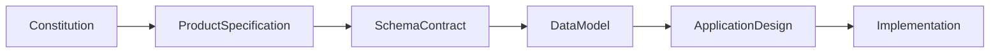
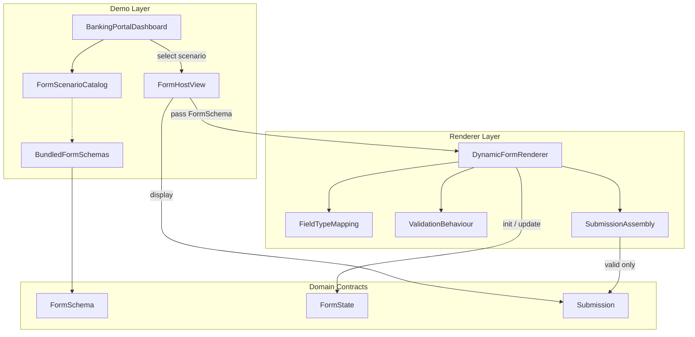
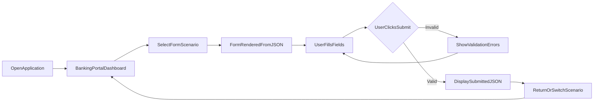
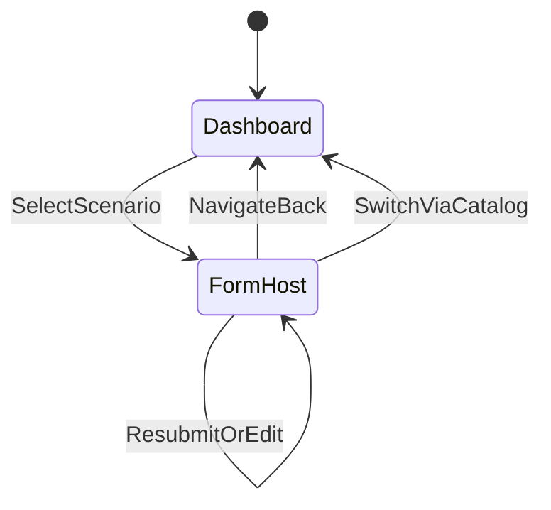
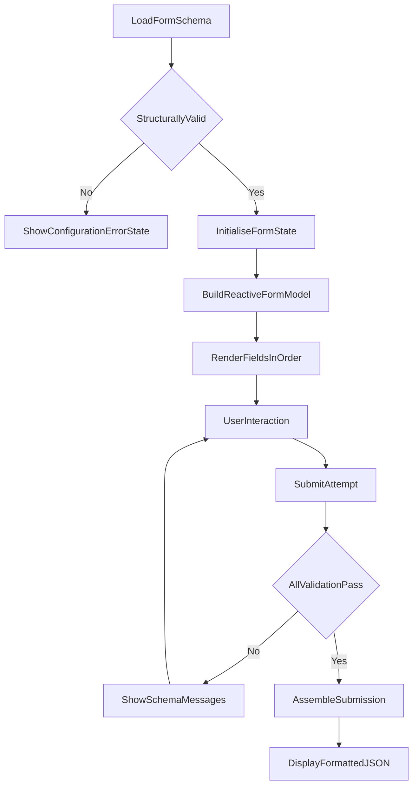
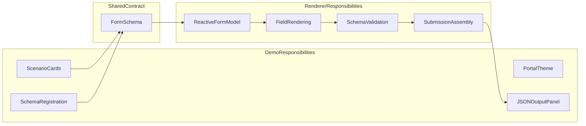

# FormFlow Application Design

**Document Type:** Application Design  
**Project:** FormFlow  
**Tagline:** Build Once. Configure Forever.  
**Version:** 1.0  
**Status:** Approved  
**Parent Document:** [constitution.md](./constitution.md) v1.1  
**Related Documents:** [spec.md](./spec.md) v1.0, [schema-contract.md](./schema-contract.md) v1.0, [data-model.md](./data-model.md) v1.0  
**Timebox:** 3-day Angular case study

---

## 1. Document Overview

### 1.1 Purpose

This document defines **how** FormFlow Version 1.0 is structured at the application-design level. It translates the approved Constitution, Product Specification, Schema Contract, and Data Model into conceptual architecture, navigation, dynamic rendering workflows, validation and submission behaviour, and UX design for the demonstration environment.

This document does **not** describe Angular class names, TypeScript interfaces, services, folder trees, or implementation code. Those decisions belong to the Implementation phase.

### 1.2 Audience

| Audience | Use of This Document |
|---|---|
| **Frontend Developer** | Understand application structure, flows, and responsibilities before coding |
| **Evaluator** | Verify that the intended design matches case-study scope and separation of concerns |
| **Product Owner** | Confirm design stays within V1 bounds and preserves demo vs renderer separation |
| **Future Maintainer** | Understand how new schemas attach to the demo without changing the renderer |

### 1.3 Document Relationships

| Document | Role |
|---|---|
| [constitution.md](./constitution.md) | Authoritative scope reference; wins on conflict |
| [spec.md](./spec.md) | Behavioural product specification; journeys, AC, UX |
| [schema-contract.md](./schema-contract.md) | JSON structure consumed by the renderer |
| [data-model.md](./data-model.md) | Business entities, relationships, lifecycle |
| **design.md** (this document) | Application design: architecture, flows, responsibilities, UX |

### 1.4 Conflict Resolution

Constitution → Product Specification → Schema Contract → Data Model → Design → Implementation.

When time is constrained, Business Goals and Acceptance Criteria (AC-01 through AC-11) take precedence over Bonus Features and Future Enhancements.

### 1.5 Design Status

This document is **Approved**. Implementation may proceed using this Design as the application-structure reference, remaining subordinate to the Constitution, Product Specification, Schema Contract, and Data Model.

---

## 2. Design Objectives

| ID | Objective | Success Indicator | Upstream |
|---|---|---|---|
| **DES-OBJ-01** | Separate the reusable Dynamic Form Renderer from Banking Portal demo content | Evaluator can identify renderer concerns vs dashboard/schemas at a glance | Constitution NFR-01, NFR-02; AC-09 |
| **DES-OBJ-02** | Enable one renderer to serve multiple FormSchemas | Account Opening and Loan Inquiry share one rendering engine | FR-01, FR-10; AC-01, AC-07 |
| **DES-OBJ-03** | Preserve configuration-driven behaviour | Labels, options, validation messages, and field order come from JSON | FR-06; NFR-08; Schema Contract |
| **DES-OBJ-04** | Define clear end-to-end application flows | Dashboard → form → validate → submit JSON → return/switch | Spec §12; Data Model §13 |
| **DES-OBJ-05** | Keep design appropriate for a 3-day case study | No plugin systems, form builders, or over-abstraction | Constitution §10 Risks; OBJ-05 |
| **DES-OBJ-06** | Support objective evaluation | Valid submission displays formatted JSON on screen | FR-07, FR-08; AC-05 |

---

## 3. Design Scope

### 3.1 In Scope for This Design

- Conceptual application architecture (renderer layer vs demo layer)
- Application and navigation flows for the Banking Portal demonstration
- Dynamic form rendering workflow from schema load through submission display
- Conceptual component / module responsibilities (behavioural, not code)
- Validation and submission behaviour design
- Multi-schema selection and FormState lifecycle
- UX and visual theme guidance for dashboard and form views
- Error and empty-state behaviour (configuration vs validation)
- Traceability from design decisions to FR, NFR, AC, and entities
- Optional bonus behaviour notes (visibility / hidden / disabled / readonly) clearly marked secondary

### 3.2 Out of Scope for This Design

- Angular components, templates, TypeScript, services, or APIs
- Folder structure, naming of files, or package layout
- Database, persistence, authentication, or remote validation design
- Form builder UI, schema versioning, wizard/multi-step layouts
- Additional field types beyond the six V1 types
- Production banking operations, compliance, or real financial processing
- Expansion of V1 scope beyond AC-01–AC-11

### 3.3 Technology Constraints (from Constitution)

The Design assumes the Constitution stack but does not prescribe implementation APIs:

| Layer | Constraint |
|---|---|
| Framework | Angular |
| Forms | Angular Reactive Forms (programmatic form model) |
| UI | PrimeNG |
| Styling | Tailwind CSS |
| Configuration | Static JSON schemas bundled with the application |
| Runtime | Entirely client-side; no backend |

---

## 4. Design Principles

### 4.1 One Engine, Many Forms

A single Dynamic Form Renderer consumes any conforming FormSchema and produces a functional form. Demo modules never duplicate per-form field markup.

### 4.2 Configuration over Code

Form structure, labels, placeholders, options, defaults, validation rules, and error messages live in JSON (FormSchema / Field / Validation / Option entities). Presentation templates do not hardcode per-field copy.

### 4.3 Renderer Independent of Demo Content

Banking Portal dashboard, scenario cards, and bundled demo schemas are demonstration content. Rendering logic must remain usable if demo schemas are replaced or extended.

### 4.4 Flat and Readable Schemas

Forms are flat ordered lists of Fields. No nested groups, wizard steps, or online schema generation. Design stays aligned with Schema Contract and Data Model flat hierarchy.

### 4.5 Synchronous, Client-Side Validation Only

Required and pattern rules evaluate on the client. No async validators, remote checks, or cross-field validation servers. Message text comes from schema configuration.

### 4.6 Submission as Terminal Success State

A valid submit produces a flat Submission (JSON on screen). No persistence, email, or confirmation workflow follows.

### 4.7 Ruthless Timeboxing

Prefer one clear renderer, a polished but bounded dashboard, and two demo schemas. Defer bonus features until AC-01–AC-11 pass. Avoid plugin/event-bus abstractions.

### 4.8 Spec-Driven Traceability

Every design behaviour should map to Constitution/Spec requirements or be explicitly marked deferred.

---

## 5. Conceptual Architecture

### 5.1 Layer Overview

FormFlow V1 is designed as three conceptual layers that communicate through well-defined entity contracts from the Data Model.

### 5.2 Layer Responsibilities

| Layer | Responsibility | Must Not Do |
|---|---|---|
| **Demo Layer** | Present Banking Portal theme; list FormScenarios; navigate; host renderer; display Submission JSON; register which schemas are available | Contain field-by-field form markup for banking scenarios |
| **Renderer Layer** | Accept FormSchema; build reactive form model; render six field types; apply schema validation and messages; assemble Submission on valid submit | Encode banking business rules; assume a particular demo schema |
| **Domain Contracts** | FormSchema, Field, Validation, Option, FormState, FieldValue, Submission as defined in Data Model / Schema Contract | Introduce persistence or user identity entities |

### 5.3 Key Design Decision: Separation Boundary

The boundary between Demo and Renderer is the primary architecture quality gate (NFR-02, AC-09):

- **Crosses the boundary toward the renderer:** a FormSchema (and optionally scenario id for context).
- **Returns from the renderer:** FormState updates during interaction; Submission payload (or validation failure with no Submission) after submit.
- **Stays in demo:** dashboard cards, portal chrome, module titles as marketing context, schema file registration list.

### 5.4 Why Not a Form Builder or Plugin System

Constitution risks call out over-engineering. V1 needs demonstrable clarity:

- Fixed six FieldTypes — no runtime plugin registration for custom types
- Static schema bundle — no schema authoring UI
- One renderer composition — not a marketplace of field widgets

These constraints keep the Design evaluable within three days.

---

## 6. Application Flow

### 6.1 End-to-End Journey

Aligned with Product Specification §12 and Data Model lifecycle.

### 6.2 Step-by-Step Design Behaviour

| Step | Actor | Action | System Design Response | Entities |
|---|---|---|---|---|
| 1 | Demo User / Evaluator | Opens app locally | Landing view is Banking Portal dashboard | FormScenario list from FormSchemas |
| 2 | Demo User | Reviews available modules | At least Account Opening and Loan Inquiry shown with title and description | FormScenario |
| 3 | Demo User | Selects a scenario | Form host opens; FormSchema loaded; FormState initialised with defaults | FormSchema, FormState, FieldValue |
| 4 | Demo User | Interacts with fields | Controls accept type-appropriate input; order matches `fields` array | Field, FieldValue |
| 5 | Demo User | Submits while invalid | Submit blocked; schema messages shown; no Submission JSON | Validation, ValidationMessages |
| 6 | Demo User | Corrects and submits valid data | Flat Submission displayed as formatted JSON | Submission |
| 7 | Demo User | Returns to dashboard or selects another schema | Prior FormState discarded; fresh form for new schema | FormState reset (EC-09) |
| 8 | Evaluator | Reviews JSON | Keys match Field `key`; values match field types | Submission |

### 6.3 Journey Constraints

- No authentication or login step
- No confirmation email, receipt, or backend write after submit
- Displayed JSON is the terminal success state
- Application runs entirely client-side without external services (NFR-06, NFR-10)

---

## 7. UI Navigation Design

### 7.1 Navigation Model

V1 uses a simple two-view navigation model suitable for a case study demo:

| View | Role | Entry |
|---|---|---|
| **Dashboard** | Discovery and selection of form scenarios | Default landing on application open |
| **Form Host** | Schema-driven form + validation + submission output | Selecting a FormScenario |

### 7.2 Dashboard Navigation Requirements

- Dashboard is the default landing view (Spec §18.2)
- Each available form scenario appears as a distinct selectable item (card or equivalent)
- Each item displays FormSchema `title` and `description` (FormScenario projection)
- Selection navigates to the Form Host for that schema `id`
- Layout is polished and consistent with a banking portal theme (FR-12, FR-13, NFR-04)

### 7.3 Form Host Navigation Requirements

- Form header displays schema `title`
- Clear control to return to the dashboard without browser refresh requirement for switching scenarios
- Submit action uses schema `submitLabel` or default `"Submit"` (EC-13)
- After valid submit, Submission JSON remains visible on the Form Host until navigation away
- Navigating away discards FormState and any displayed Submission; next scenario starts fresh (EC-09)

### 7.4 What Navigation Excludes

- Login, logout, or role-gated routes
- Multi-step wizard navigation within a form
- Deep-linked analytics or admin consoles
- Cross-scenario shared state or dirty-state persistence

### 7.5 Scenario Catalog Design

The demo layer maintains a catalog of available FormSchemas exposed as FormScenarios:

| id | title | description |
|---|---|---|
| `account-opening` | Account Opening | Apply for a new savings or current account. |
| `loan-inquiry` | Loan Inquiry | Submit a personal loan inquiry. |

Adding a third demo schema in the future requires catalog registration and a conforming JSON file — not renderer changes (US-08, NFR-03, Schema Contract Appendix).

---

## 8. Dynamic Rendering Workflow

### 8.1 Workflow Overview

### 8.2 Phase: Schema Load

**Trigger:** User selects a FormScenario.

**Behaviour:**

1. Resolve FormSchema by `id` from the bundled static catalog
2. Confirm required root properties (`id`, `title`, `fields`) per Schema Contract / CV rules
3. If structurally invalid: do not render the form; show a meaningful configuration error state in the Form Host (Spec §17.3)
4. Field-level configuration faults degrade gracefully so a single bad field does not crash the whole application when feasible

### 8.3 Phase: Form Initialisation

**Behaviour:**

1. Create a new FormState bound to `schemaId`
2. Create one FieldValue per Field `key`
3. Apply explicit `defaultValue` when present; otherwise apply implicit defaults from Data Model:

| FieldType | Implicit Default |
|---|---|
| `text` / `textarea` / `date` | `""` |
| `dropdown` | empty / no selection |
| `multiselect` | `[]` |
| `checkbox` | `false` |

4. Discard any previous scenario FormState (EC-09)
5. Build the Reactive Forms model programmatically (FR-03, AC-02) — Design requires a programmatic model; Implementation chooses Angular APIs

### 8.4 Phase: Field Rendering

**Behaviour:**

1. Iterate Fields in array order — order is visual sequence
2. For each Field, select UI control by FieldType:

| FieldType | UI Control Intent |
|---|---|
| `text` | Single-line text input |
| `textarea` | Multi-line text input |
| `date` | Date picker; values as `YYYY-MM-DD` |
| `dropdown` | Single-select; display Option `label`, store Option `value` |
| `multiselect` | Multi-select; display labels, store value array |
| `checkbox` | Boolean checkbox |

3. Bind visible `label`; associate label with control for accessibility (NFR-05, Spec §18.6)
4. Apply `placeholder` for `text` / `textarea` when present
5. Do not invent field types beyond the six V1 literals

### 8.5 Phase: Interaction

**Behaviour:**

- Update FieldValues as the user edits
- Validation feedback may appear after touch/blur and must appear on submit attempt
- Option lists are always inline from schema — no remote option loading
- Bonus only: re-evaluate `visibleWhen`; honour `hidden` / `disabled` / `readonly` flags

### 8.6 Phase: Validation and Submit Gate

See Section 9. Invalid submit never produces Submission display.

### 8.7 Phase: Submission Assembly and Display

On valid submit:

1. Collect current FieldValues into a flat Submission object keyed by Field `key`
2. Include type-appropriate empty values for optional empty fields (`""`, `[]`, `false` as applicable)
3. Display human-readable formatted JSON on the Form Host
4. Perform no persistence or outbound network write

---

## 9. Validation and Submission Design

### 9.1 Validation Sources of Truth

All validation rules and message copy come from Field `validation` in the FormSchema. The Design forbids hardcoding per-field message strings that require code changes to update copy for demo fields (FR-06). Fallback text for missing message keys is an Implementation detail; bundled demos always include explicit messages.

### 9.2 Required Behaviour by FieldType

| FieldType | Required Means |
|---|---|
| `text` / `textarea` | Non-empty string |
| `date` | Non-empty `YYYY-MM-DD` |
| `dropdown` | An option selected |
| `multiselect` | At least one option selected |
| `checkbox` | Value is `true` |

### 9.3 Pattern Behaviour

- Applies only to `text` and `textarea`
- Runs only when a value is present; empty optional fields do not raise pattern errors (EC-06)
- Pattern is a regex string from schema configuration
- On failure, display `validation.messages.pattern`

### 9.4 Validation Timing

| Moment | Behaviour |
|---|---|
| Submit attempt | Evaluate all active rules; show all failing messages; block Submission |
| Field interaction (touch/blur) | May show/update field-level feedback |
| Correction | Clear a field's error when that field becomes valid |

### 9.5 Invalid Submission Design

When any rule fails:

1. Do **not** create or display Submission JSON
2. Keep FormState editable
3. Show all applicable schema messages
4. Allow resubmit after correction (EC-08)

### 9.6 Valid Submission Design

When all rules pass:

1. Assemble flat Submission
2. Display formatted JSON
3. Treat display as complete proof of capture (FR-08, AC-05)

### 9.7 Edge Cases the Design Must Honour

| ID | Design Response |
|---|---|
| EC-01 | Blank submit shows all required errors |
| EC-02 / EC-03 / EC-10 | Required multiselect / checkbox / dropdown fail appropriately |
| EC-04 / EC-05 | Optional empty text/date submit as `""` |
| EC-09 | Scenario switch resets FormState |
| EC-11 / EC-12 | Optional empty multiselect / unchecked checkbox submit as `[]` / `false` |
| EC-13 | Missing `submitLabel` → `"Submit"` |
| EC-16 | Duplicate keys invalid; must not appear in bundled demos |

Bonus edge cases EC-14 / EC-15 apply only if bonus field states are implemented.

---

## 10. Conceptual Component Responsibilities

Responsibilities are conceptual. Names describe roles, not Angular selectors or file paths.

### 10.1 Responsibility Map

| Conceptual Role | Primary Responsibility | Inputs | Outputs / Effects |
|---|---|---|---|
| **Application Shell** | Provide Banking Portal chrome and host primary views | — | Consistent theme wrapper |
| **Dashboard View** | Present FormScenario catalog; start navigation to forms | FormScenario list | Select scenario |
| **Form Host View** | Load selected FormSchema; host renderer; show config errors; show Submission JSON; provide back navigation | schema `id` | Display form + output |
| **Scenario Catalog** | Know which FormSchemas are available in the demo | Bundled schemas | FormScenario projections |
| **Dynamic Form Renderer** | Single reusable engine: schema → reactive form → fields → validate → submit | FormSchema | FormState; Submission or validation errors |
| **Field Type Presentation** | Map FieldType to the correct control and binding semantics | Field + FieldValue | User-editable control |
| **Validation Feedback** | Surface schema `messages` adjacent to failing fields | ValidationMessages + control validity | Visible error text |
| **Submission Display** | Present formatted JSON after valid submit | Submission | Readable on-screen output |

### 10.2 Dynamic Form Renderer — Detailed Responsibilities

**Must:**

- Accept any V1-conforming FormSchema
- Support all six FieldTypes without per-form templates
- Use Reactive Forms as the form model (FR-03)
- Apply required and pattern rules from schema
- Prefer schema messages for error display
- Emit / expose Submission-ready values on valid submit
- Render fields in schema order
- Remain unchanged when switching between Account Opening and Loan Inquiry

**Must not:**

- Hardcode banking field labels or options
- Call backends or async validators
- Implement authentication
- Act as a form builder or schema editor
- Introduce unsupported FieldTypes

### 10.3 Demo Layer — Detailed Responsibilities

**Must:**

- Provide polished Banking Portal dashboard (AC-08)
- Expose at least two scenarios (AC-07)
- Navigate cleanly between dashboard and Form Host
- Display Submission JSON after successful submit in a clear region of the Form Host
- Keep schema files as data assets separate from renderer logic

**Must not:**

- Duplicate rendering logic per banking module
- Persist submissions
- Imply that FormFlow is a real banking product (vision clarity)

### 10.4 Responsibility Boundaries Diagram

---

## 11. Multi-Schema Support Design

### 11.1 Principle

The renderer is schema-agnostic. Changing which FormSchema is active must not require renderer modification (FR-10).

### 11.2 V1 Demo Modules

| Schema ID | Purpose | Field Types Emphasised |
|---|---|---|
| `account-opening` | Savings/current account application | text, date, dropdown, multiselect, checkbox + email pattern |
| `loan-inquiry` | Personal loan inquiry | text, textarea, date, dropdown, checkbox + numeric pattern |

Together they cover all six FieldTypes and both validation kinds (Spec §21.3).

### 11.3 Switching Behaviour

1. User returns to dashboard or selects another scenario
2. Active FormState and Submission display are discarded
3. New FormSchema loads and initialises a clean FormState
4. No browser refresh is required (Spec §18.7)

### 11.4 Extensibility Path (Design Intent)

To add a new demo form without touching renderer behaviour:

1. Author JSON conforming to Schema Contract
2. Register it in the demo Scenario Catalog
3. Verify dashboard card and end-to-end submit output

This directly supports US-08 and NFR-03 / NFR-07.

---

## 12. Error and Empty-State Design

### 12.1 Categories

| Category | Cause | User-Visible Design |
|---|---|---|
| **Validation errors** | User input fails schema rules | Field-associated schema messages; submit blocked |
| **Configuration errors** | FormSchema missing required root shape | Form does not render; meaningful error state on Form Host |
| **Field configuration faults** | e.g., dropdown missing `options` | Affected field fails gracefully; rest of app remains usable |
| **Empty dashboard** | No scenarios registered (should not occur in V1 delivery) | Avoid in delivery; catalog always includes two modules |

### 12.2 What Error Handling Excludes

- Network failure handling (no remote calls in V1)
- Auth errors / session timeout
- Server-side validation envelopes

---

## 13. UX and Visual Design

### 13.1 Banking Portal Theme

- Professional, credible banking portal aesthetic (NFR-04)
- Visual consistency between Dashboard and Form Host
- Polished enough for evaluator confidence; not a bare prototype
- FormFlow remains a renderer demo hosted in banking chrome — not a banking product

### 13.2 Dashboard UX

- Clear page identity as Banking Portal home
- Scenario cards show title + description
- Selection affordance is obvious (clickable card / action)
- At least two modules visible without hunting

### 13.3 Form View UX

- Header shows schema `title`
- Fields in schema order with clear labels
- Placeholders where defined
- Dropdown/multiselect show Option labels; store values
- Submit button uses `submitLabel` / `"Submit"`
- Validation errors visually associated with fields
- Successful path clearly distinct from error path
- Submission JSON presented in a readable formatted block after success

### 13.4 Accessibility Baseline

- Visible labels associated with inputs
- Error text perceivable when shown
- Interactive controls operable via standard keyboard patterns expected of the chosen UI library

### 13.5 UX Non-Goals

- i18n / locale switching
- Dark-mode product requirements beyond reasonable defaults
- Marketing microsite content beyond demo credibility
- Animated multi-step onboarding

---

## 14. Bonus Features Design Notes

> **Secondary to V1.** Implement only after AC-01–AC-11 pass. Design permits these behaviours when schema properties are present; core Design Path does not depend on them.

| Feature | Schema Signal | Design Behaviour |
|---|---|---|
| Conditional visibility | `visibleWhen` (`equals` only) | Show field only when watched FieldValue matches; retain last value if hidden after edit (EC-14) |
| Hidden | `hidden: true` | Do not render; may include `defaultValue` in Submission (EC-15) |
| Disabled | `disabled: true` | Render non-editable; include current value in Submission |
| Readonly | `readonly: true` | Visible non-editable; include current value in Submission |
| Unit tests | — | If delivered, cover schema interpretation, rendering paths, and validation (FR-B05, NFR-11) |

Authors should use one state flag per Field in demos; combining flags is undefined in V1.

---

## 15. Alignment with Constitution

| Constitution Area | Design Alignment |
|---|---|
| Vision: configuration-driven renderer + Banking Portal demo | Architecture separates renderer and demo; portal is demonstration only |
| FR-01–FR-03 | One reusable renderer; six types; Reactive Forms model |
| FR-04–FR-06 | Schema-driven required/pattern with config messages |
| FR-07–FR-09 | Submit, JSON display, invalid blocked |
| FR-10–FR-11 | Multi-schema without renderer edits; dashboard selection |
| FR-12–FR-13 | Polished Banking Portal dashboard entry |
| NFR-01–NFR-03 | Clear conceptual structure; documented contract; add schemas without renderer changes |
| NFR-04–NFR-06 | Banking theme; accessible labels/errors; local demo |
| NFR-07–NFR-08 | Localised extensibility; configuration remains data |
| NFR-09–NFR-10 | Demo-sized schemas; client-side only |
| Constraints | No backend, auth, extra field types, wizards, async validation |
| AC-01–AC-11 | Design path optimized for core AC before bonus |
| Risks | Avoids scope creep and over-engineering via bounded responsibilities |

---

## 16. Alignment with Product Specification

| Spec Area | Design Alignment |
|---|---|
| OBJ-01–OBJ-06 | Configuration-driven forms, six types, portal polish, two modules, timebox, JSON verification |
| In / Out of Scope §5–§6 | Design remains inside V1; explicitly excludes builder, APIs, i18n, wizards |
| US-01–US-08 | Dashboard, render, field types, validation messages, submit JSON, block invalid, multi-schema, maintainer extensibility |
| Modules §11 | Account Opening + Loan Inquiry as V1 scenarios |
| Journey §12 | Section 6 mirrors end-to-end flow |
| Schema summary §13–§15 | Renderer consumes contract without inventing types/rules |
| Submission §16 | Flat JSON, type rules, no persistence |
| Errors §17 | Validation vs configuration error states designed |
| UX §18 | Dashboard, form, feedback, accessibility covered in Section 13 |
| Edge Cases §19 | Section 9.7 maps EC behaviours |
| DoD / AC §20 | Design reviewable against AC before Implementation |

---

## 17. Alignment with Schema Contract

| Contract Area | Design Alignment |
|---|---|
| Root FormSchema shape | Load/validate `id`, `title`, `fields`; honour `description`, `submitLabel` |
| Field object | Renderer binds `key`, `type`, `label`, optional placeholder/default/validation/options |
| Six FieldTypes only | Field mapping table limited to contract literals |
| Validation object | Required/pattern/messages driving Validation Feedback role |
| Options | Inline label/value for dropdown and multiselect |
| Defaults | Explicit + implicit defaults as contract/data model define |
| Naming conventions | kebab-case schema ids; camelCase keys; snake_case option values as convention |
| Invalid examples | Inform configuration error and graceful field degradation behaviour |
| Bonus properties | Optional path only; not required for core Design success |
| Appendix (add schema) | Extensibility path in Section 11.4 |

The Design must not introduce new JSON properties or FieldTypes. Contract changes require upstream document updates before Design/Implementation changes.

---

## 18. Alignment with Data Model

| Data Model Area | Design Alignment |
|---|---|
| Configuration entities | FormSchema, Field, Validation, ValidationMessages, Option drive static behaviour |
| Presentation entity | FormScenario derives dashboard cards |
| Runtime entities | FormState / FieldValue created on scenario select; discarded on leave |
| Output entity | Submission produced only after valid submit |
| Relationships | One FormSchema → many Fields; FormState holds FieldValues; Submission is flat |
| Lifecycle §13 | Sections 6–8 follow SchemaLoaded → Active → Validate → Submitted → Reset |
| Constraints §12 | Unique keys/ids, options rules, no persistence entities |
| Categories | Design preserves configuration vs runtime vs output separation |
| Bonus VisibilityRule | Documented under optional path |
| AC entity map | Renderer and demo roles cover AC entity involvements |

---

## 19. Design Decisions and Trade-offs

| Decision | Choice | Rationale |
|---|---|---|
| Architecture style | Two layers (Demo + Renderer) with shared FormSchema contract | Satisfies NFR-02 without over-modularising for a 3-day build |
| Navigation | Two primary views | Matches Spec journey; avoids routing complexity beyond need |
| Form model | Reactive / programmatic | Constitution + FR-03 + AC-02 |
| Schema delivery | Static bundled JSON | No backend; NFR-10 |
| Output | On-screen JSON only | Evaluation-friendly; no persistence scope |
| Field system | Closed set of six types | Prevents type creep; matches AC-01 |
| Bonus features | Explicitly secondary | Protects timebox and AC completion |
| Abstraction depth | Single renderer, no plugin bus | Mitigation for over-engineering risk |

---

## 20. Requirement Traceability

### 20.1 Acceptance Criteria to Design Coverage

| AC | Design Coverage |
|---|---|
| AC-01 | Section 8 field rendering + six-type mapping |
| AC-02 | Reactive programmatic form model requirement |
| AC-03 / AC-04 | Section 9 required/pattern + schema messages |
| AC-05 | Submission display in Form Host |
| AC-06 | Invalid submit gate |
| AC-07 | Scenario catalog with two schemas |
| AC-08 | Dashboard UX + portal theme |
| AC-09 | Layer separation in Section 5 / 10 |
| AC-10 | Client-side, no backend dependency |
| AC-11 | Out-of-scope exclusions throughout |

### 20.2 Functional Requirements to Design Sections

| FR | Primary Design Sections |
|---|---|
| FR-01 | 5, 8, 10 |
| FR-02 | 8.4 |
| FR-03 | 8.3, 10.2 |
| FR-04–FR-06 | 9 |
| FR-07–FR-09 | 9.5–9.6 |
| FR-10–FR-11 | 7, 11 |
| FR-12–FR-13 | 7.2, 13 |
| FR-B01–FR-B04 | 14 |

---

## 21. Review Checklist

Checklist completed on Design approval. Implementation may begin.

| # | Check | Status |
|---|---|---|
| 1 | Design stays within Constitution/Spec V1 scope | ☑ |
| 2 | Renderer vs Banking Portal demo separation is explicit | ☑ |
| 3 | One reusable renderer for multiple schemas is required | ☑ |
| 4 | All six FieldTypes and both validation kinds are covered | ☑ |
| 5 | Application/navigation flows match Spec journey | ☑ |
| 6 | FormState reset on scenario switch (EC-09) is specified | ☑ |
| 7 | Submission is on-screen JSON only; no persistence | ☑ |
| 8 | Validation messages are schema-driven | ☑ |
| 9 | Schema Contract treated as immutable input for V1 | ☑ |
| 10 | Data Model entity vocabulary and lifecycle are respected | ☑ |
| 11 | No Angular/TypeScript/services/folder structure leaked into Design | ☑ |
| 12 | Bonus features clearly secondary to AC-01–AC-11 | ☑ |
| 13 | Design is appropriate for a 3-day case study (no over-engineering) | ☑ |
| 14 | AC-01–AC-11 are each traceable to Design sections | ☑ |
| 15 | Document reviewed and marked Approved | ☑ |

---

## 22. Implementation Readiness

### 22.1 What Comes Next

This Design is approved. Implementation may proceed to:

- Angular application scaffolding within Constitution stack
- Renderer and demo UI realisation of responsibilities in Section 10
- Bundled `account-opening` and `loan-inquiry` schemas conforming to Schema Contract
- Local demonstrability without backend

### 22.2 What Implementation Must Preserve

- Single reusable Dynamic Form Renderer
- Separation of renderer and demo content
- Schema Contract fidelity
- Core AC-first delivery order
- Client-side-only operation

### 22.3 What Implementation Must Not Introduce Early

- Backend, auth, persistence
- Extra field types or form builders
- Bonus behaviours before core AC are green
- Abstractions not justified by V1 requirements

---

## 23. What This Design Does Not Specify

To keep the Design phase bounded:

- Exact Angular file/folder layout
- TypeScript interfaces or class diagrams as code
- Service APIs or dependency injection graphs
- Pixel-perfect mockups or asset pipelines
- CI/CD, packaging, or npm library extraction
- Production observability or analytics

Those concerns are Implementation or Future Enhancements.

---

## Document Governance

This Application Design is subordinate to the [FormFlow Constitution](./constitution.md). Behavioural requirements come from the [Product Specification](./spec.md). JSON structure comes from the [Schema Contract](./schema-contract.md). Entity vocabulary and lifecycle come from the [Data Model](./data-model.md).

**Conflict resolution:** Constitution → Product Specification → Schema Contract → Data Model → Design.

Changes that affect V1 scope, field types, validation behaviour, navigation, or demo modules require updates to the relevant upstream documents before Design or Implementation changes are made.

When time is constrained, design choices that satisfy AC-01 through AC-11 take precedence over Bonus Features and Future Enhancements.

### Review Status

| Attribute | Value |
|---|---|
| **Document** | `specs/001-formflow/design.md` |
| **Version** | 1.0 |
| **Status** | Approved |
| **Next step** | Implementation may begin, remaining aligned with this Design and all upstream approved documents |
