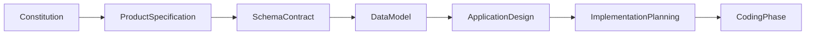
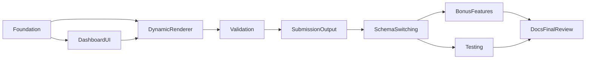

# FormFlow Implementation Planning

**Document Type:** Implementation Planning  
**Project:** FormFlow  
**Tagline:** Build Once. Configure Forever.  
**Version:** 1.0  
**Status:** Approved  
**Parent Document:** [design.md](./design.md) v1.0  
**Related Documents:** [constitution.md](./constitution.md) v1.1, [spec.md](./spec.md) v1.0, [schema-contract.md](./schema-contract.md) v1.0, [data-model.md](./data-model.md) v1.0, [design.md](./design.md) v1.0  
**Timebox:** 3-day Angular case study

---

## 1. Document Overview

### 1.1 Purpose

This document defines **how** FormFlow Version 1.0 implementation will be executed. It translates the approved Constitution, Product Specification, Schema Contract, Data Model, and Application Design into an ordered delivery strategy, milestones, dependencies, risks, quality gates, and acceptance gates suitable for a three-day Angular evaluation.

This document is an **execution plan**, not a specification of product behaviour and not a design of application structure. Behaviour remains owned by the Product Specification. Application structure remains owned by the Application Design. JSON structure remains owned by the Schema Contract. Entity vocabulary remains owned by the Data Model. Scope remains owned by the Constitution.

### 1.2 What This Document Is

- A Senior Engineering Manager view of delivery order and why that order exists
- A phased strategy that protects core Acceptance Criteria before Bonus Features
- A set of completion criteria, quality gates, and acceptance gates for V1 readiness
- A risk and dependency frame aligned to the three-day timebox

### 1.3 What This Document Is Not

This document does **not**:

- Generate Angular code, TypeScript, or configuration snippets
- Produce a task backlog, ticket list, or day-by-day stand-up schedule
- Prescribe folder trees, file names, class names, or dependency injection graphs
- Discuss implementation APIs, service boundaries as code, or component selectors
- Restate full Product Specification journeys, Schema Contract examples, or Design responsibility matrices

Those concerns belong either to upstream approved documents or to the subsequent coding phase after this plan is approved.

### 1.4 Audience

| Audience | Use of This Document |
|---|---|
| **Frontend Developer** | Follow delivery order, gates, and scope discipline while building |
| **Evaluator** | See that implementation was planned against AC-01–AC-11 and demo vs renderer separation |
| **Product Owner** | Confirm V1 remains ruthlessly timeboxed and bonus remains optional |
| **Future Maintainer** | Understand why capabilities were sequenced the way they were |

### 1.5 Document Relationships

| Document | Role |
|---|---|
| [constitution.md](./constitution.md) | Authoritative scope reference; wins on conflict |
| [spec.md](./spec.md) | Behavioural product specification; journeys, AC, UX |
| [schema-contract.md](./schema-contract.md) | JSON structure consumed by the renderer |
| [data-model.md](./data-model.md) | Business entities, relationships, lifecycle |
| [design.md](./design.md) | Application design: architecture, flows, responsibilities, UX |
| **implementation-plan.md** (this document) | Implementation execution strategy for V1 |

### 1.6 Conflict Resolution

Constitution → Product Specification → Schema Contract → Data Model → Design → Implementation Planning → Coding.

When time is constrained, Business Goals and Acceptance Criteria (AC-01 through AC-11) take precedence over Bonus Features and Future Enhancements.

### 1.7 Planning Status

This document is **Approved**. Coding may proceed under this Implementation Planning document as the execution-strategy reference, remaining subordinate to the Constitution, Product Specification, Schema Contract, Data Model, and Application Design.

---

## 2. Objectives

| ID | Objective | Success Indicator | Upstream |
|---|---|---|---|
| **IMP-OBJ-01** | Deliver all core Acceptance Criteria within the 3-day timebox | AC-01 through AC-11 are demonstrable locally | Constitution §11; Spec §20 |
| **IMP-OBJ-02** | Preserve separation of Dynamic Form Renderer and Banking Portal demo | Evaluator can distinguish product engine from demo chrome | Design §5; AC-09; NFR-01, NFR-02 |
| **IMP-OBJ-03** | Keep behaviour configuration-driven | Labels, options, validation messages, and field order come from FormSchema JSON | Schema Contract; FR-06; NFR-08 |
| **IMP-OBJ-04** | Prove multi-schema reuse with one renderer | Account Opening and Loan Inquiry share one rendering engine | FR-01, FR-10; AC-01, AC-07 |
| **IMP-OBJ-05** | Make success objectively evaluable | Valid submission displays formatted Submission JSON on screen | FR-07, FR-08; AC-05 |
| **IMP-OBJ-06** | Prevent scope compromise | Bonus only after core AC; no out-of-scope features that consume V1 budget | AC-11; Constitution §10, §12 |
| **IMP-OBJ-07** | Honour Design readiness constraints | Client-only, Schema Contract fidelity, single renderer, no early unjustified abstraction | Design §22 |

---

## 3. Implementation Strategy

### 3.1 Strategic Posture

FormFlow is a configuration-driven Dynamic Form Renderer. The Banking Portal is only a demonstration environment. Implementation therefore optimises for:

1. A working local baseline that can host both demo and renderer concerns
2. Early proof that navigation and presentation exist without hardcoding per-module forms
3. A single reusable renderer that covers all six FieldTypes from FormSchema
4. Validation correctness before submission success theatre
5. Multi-schema evidence after one complete path is stable
6. Bonus and testing only when core AC are green
7. Final documentation and review that protect AC-09 through AC-11

This order reduces the risk that polish, bonus logic, or second-schema encoding begins before the primary product can render, validate, and submit.

### 3.2 Delivery Order

### 3.3 Why This Order

#### Foundation before UI and renderer depth

The Constitution stack, client-only constraint, and Design layer boundary must exist as an executable baseline before dashboard polish or renderer feature depth. Without Foundation, Dashboard and Renderer work share no stable host and risk burying demo chrome inside product logic. Early Foundation also anchors Schema Contract and Data Model vocabulary as the shared language of implementation without inventing new product entities.

#### Dashboard UI before deep renderer completion

A navigable Banking Portal shell and Form Host frame reduce early evaluator risk: the case study is visibly a portal demo, not an orphaned control library. Dashboard work is deliberately timeboxed to avoid the Constitution risk that UI polish consumes renderer budget. Phase 2 establishes FormScenario presentation and navigation; it does not duplicate field markup per banking module.

#### Dynamic Renderer as the primary product pulse

After a host exists, implementation concentrates on the reusable Dynamic Form Renderer: one engine, six FieldTypes, Reactive Forms programmatic state, schema-driven field order. This is the product under evaluation. Banking labels and options remain schema data. Completing renderer capability before validation polish and before second-schema wiring prevents fragmented “one schema works differently” outcomes.

#### Validation before Submission Output

Design’s workflow and the Product Specification both treat invalid submit as a first-class path. Required and pattern behaviour with schema-configured messages must be proven before celebrating formatted JSON. Building submission display first encourages fake-complete demos that skip AC-03, AC-04, and AC-06. Validation-first protects evaluator honesty.

#### Submission Output after validation gates

Once invalid submission is blocked and visible errors behave correctly, valid Submission assembly and on-screen formatted JSON become trustworthy proof of capture. Submission remains a terminal success state with no persistence, matching the Data Model and Constitution assumptions.

#### Schema Switching after one solid path

Multi-schema support is proven when a second FormSchema is selectable from the dashboard and rendered by the same engine with the same validation and submission rules. Switching after one complete path avoids parallelisation of unfinished validation across two schemas. Both V1 demos together cover the six FieldTypes and both validation kinds; implementation uses that coverage matrix rather than inventing additional modules inside the timebox.

#### Bonus Features only after core AC

Conditional visibility, hidden, disabled, and readonly behaviours are Nice to Have (AC-B01). Constitution governance forbids expanding bonus at the expense of AC-01–AC-11. Phase 7 exists only when core gates are green.

#### Testing after a stable core path

Unit testing (AC-B02) uses the Constitution stack expectation of Jasmine and Karma, but tests are bonus coverage for renderer and validation logic—not a substitute for demonstrable AC. Testing follows a stable core path so tests lock correct behaviour rather than thrashing against unfinished contracts.

#### Documentation and Final Review last

Evaluator-facing clarity, structural separation evidence (AC-09), local run confirmation (AC-10), and explicit confirmation that out-of-scope features were not introduced (AC-11) close the timebox. Documentation does not invent new scope; it explains the demo renderer for evaluation.

### 3.4 Principles Recurring Across Phases

- **One engine, many forms** — never per-module form templates for banking scenarios
- **Configuration over code** — schema owns labels, options, messages, and order
- **Demo vs renderer boundary** — FormSchema in; FormState updates and Submission out
- **AC-first** — Bonus Features and Future Enhancements yield under time pressure
- **Ruthless timeboxing** — prefer architecture clarity over feature count
- **Client-side only** — no backend, auth, or remote validation during V1

---

## 4. Development Phases

Each phase defines objective, expected outcome, dependency, and completion criteria. Phases are capability gates, not ticket inventories.

### 4.1 Phase 1 — Foundation

**Objective**

Establish the executable baseline for the three-day case study so that subsequent demo and renderer work share a single client-only application context and a clear conceptual separation between Banking Portal concerns and Dynamic Form Renderer concerns.

**Expected outcome**

- Application runs locally with no backend setup
- Constitution technology constraints are adopted as the working stack baseline
- Demo layer vs renderer layer separation is recognised as an implementation invariant
- Schema Contract and Data Model vocabulary (FormSchema, Field, FieldType, Validation, Option, FormState, Submission, FormScenario) are treated as the shared domain language
- No product behaviour beyond baseline host readiness is claimed as complete

**Dependency**

- Approved Constitution, Product Specification, Schema Contract, Data Model, and Design
- Design §22 Implementation Readiness constraints
- This Implementation Planning document (Approved)

**Completion criteria**

- Local run is possible without server, database, or authentication setup (supports AC-10)
- Implementation posture explicitly preserves single reusable renderer intent and client-only operation
- No folder structure or code conventions in this plan are required as Phase 1 gates; coding phase realises Foundation without violating Design’s demo/renderer boundary

### 4.2 Phase 2 — Dashboard UI

**Objective**

Materialise the Banking Portal as a navigable demonstration shell: scenario discovery, Form Host framing, and polished portal presentation—without embedding per-scenario field markup.

**Expected outcome**

- Dashboard presents FormScenarios with titles and descriptions for the V1 banking modules
- Navigation supports Dashboard ↔ Form Host
- Portal theme communicates banking-demo credibility using the Constitution UI stack expectations
- Form Host is ready to receive a FormSchema and host the renderer later
- Dashboard remains demo-layer responsibility only

**Dependency**

- Phase 1 Foundation complete
- Design navigation and UX guidance for Dashboard and Form Host
- Product Specification Banking Portal and journey requirements
- FormScenario entity semantics from the Data Model

**Completion criteria**

- Banking Portal dashboard is present, navigable, and visually coherent (supports AC-08)
- At least the conceptual slots for Account Opening and Loan Inquiry scenarios are represented for selection
- No hardcoded module-specific form fields live in the dashboard
- UI effort remains timeboxed so renderer budget is not consumed (Constitution risk mitigation)

### 4.3 Phase 3 — Dynamic Renderer

**Objective**

Deliver the primary product: one reusable Dynamic Form Renderer that turns a FormSchema into a Reactive Forms experience covering all six V1 FieldTypes.

**Expected outcome**

- A single renderer accepts FormSchema and renders fields in schema order
- All six FieldTypes are supported: text, textarea, date, dropdown, multiselect, checkbox
- Form state is managed programmatically via Reactive Forms, not template-driven forms
- Defaults and option binding follow Schema Contract / Data Model rules
- Renderer remains demo-agnostic: no banking business rules hardcoded in the engine

**Dependency**

- Phase 1 Foundation
- Phase 2 Dashboard / Form Host shell sufficiently available to exercise rendering in context
- Schema Contract field types and root structure
- Design rendering workflow (load → initialise → render)

**Completion criteria**

- One dynamic renderer renders all six supported field types from JSON schema (AC-01)
- Reactive Forms are used; form state is managed programmatically (AC-02)
- Renderer does not require code changes to swap labels/options that belong in schema
- Structural readiness exists to attach validation in Phase 4 without redesigning the engine concept

### 4.4 Phase 4 — Validation

**Objective**

Apply schema-configured required and pattern validation with schema-configured messages, and ensure invalid submission cannot produce a Submission.

**Expected outcome**

- Required validation works across FieldTypes per Schema Contract / Spec rules
- Pattern validation works for applicable FieldTypes with schema messages
- Invalid submit is blocked; field errors are visible
- Validation timing and message sourcing follow upstream contracts (sync, client-side only)
- Fallback message behaviour, if any, does not replace the requirement that bundled demos include explicit messages

**Dependency**

- Phase 3 Dynamic Renderer complete for the six FieldTypes
- Schema Contract validation object and messages rules
- Design validation and invalid-submit behaviour
- Product Specification AC-03, AC-04, AC-06

**Completion criteria**

- Required validation shows schema-configured error messages (AC-03)
- Pattern validation shows schema-configured error messages (AC-04)
- Submitting an invalid form is blocked and errors are visible (AC-06)
- No async or remote validation is introduced
- No cross-field validation engine is introduced

### 4.5 Phase 5 — Submission Output

**Objective**

Complete the success path: assemble a flat Submission from valid FormState and display formatted JSON for evaluator verification.

**Expected outcome**

- Valid submit produces Submission JSON conforming to Contract / Data Model inclusion rules
- Formatted JSON is visible in the demo layer output panel
- Invalid path continues to produce no Submission
- No persistence, network post, or storage of submissions

**Dependency**

- Phase 4 Validation complete (invalid path is trustworthy)
- Submission entity semantics from Data Model
- Design submission assembly and display responsibilities
- Product Specification AC-05

**Completion criteria**

- Submitting a valid form displays captured values as JSON (AC-05)
- Submission occurs only when validation passes
- Output remains client-side proof of capture only

### 4.6 Phase 6 — Schema Switching

**Objective**

Prove multi-schema reuse: at least two distinct FormSchemas are selectable from the dashboard and consumed by the same renderer with correct lifecycle reset on navigate/switch.

**Expected outcome**

- Bundled demos for `account-opening` and `loan-inquiry` are available
- Selecting a different scenario loads a different FormSchema into the same renderer
- FormState resets appropriately on navigation / schema switch per Data Model lifecycle
- Together, the two demos exercise the six FieldTypes and both validation kinds required for V1 evaluation

**Dependency**

- Phases 3–5 complete on at least one end-to-end path
- Schema Contract demo schema examples as authoritative shapes
- Design multi-schema switching behaviour
- Product Specification AC-07 and multi-schema requirements

**Completion criteria**

- At least two distinct JSON schemas are available and selectable from the dashboard (AC-07)
- Switching does not require a second renderer
- Adding a third schema would remain a configuration + catalog concern, not a renderer rewrite (Design extensibility intent), though a third schema is not required for V1

### 4.7 Phase 7 — Bonus Features

**Objective**

If and only if AC-01 through AC-11 are demonstrably green, optionally implement schema-driven conditional visibility and/or hidden, disabled, and readonly field states.

**Expected outcome**

- Bonus behaviours follow Schema Contract bonus properties and Design bonus notes
- Core path remains unchanged and uncompromised
- Bonus is skipped entirely if time cannot support safe delivery

**Dependency**

- Phase 6 complete
- Core Acceptance Criteria AC-01–AC-11 satisfied
- Constitution rule: bonus must not expand scope at the expense of V1 AC

**Completion criteria**

- If delivered: AC-B01 satisfied for the implemented subset of bonus behaviours
- If not delivered: explicitly deferred; not treated as a V1 failure
- No bonus work begins while any core AC remains unmet

### 4.8 Phase 8 — Testing

**Objective**

If time remains after a stable core path, add focused unit coverage for schema-driven rendering and validation behaviour using the Constitution testing stack.

**Expected outcome**

- Meaningful unit tests exist for core renderer and validation logic when pursued
- Tests reinforce Contract/Spec behaviour rather than demo chrome
- Testing remains Nice to Have relative to demonstrable AC

**Dependency**

- Stable Phases 3–5 behaviour (preferably through Phase 6)
- Constitution testing technology expectation
- Bonus AC-B02

**Completion criteria**

- If delivered: AC-B02 satisfied (unit tests exist and pass for core renderer and validation logic)
- If not delivered: not a V1 failure
- Tests never replace manual demonstration of AC-01–AC-11

### 4.9 Phase 9 — Documentation & Final Review

**Objective**

Close the case study with evaluator-facing clarity, structural separation evidence, and confirmation that V1 stayed inside Constitution bounds.

**Expected outcome**

- Local run instructions and project intent are clear to an evaluator
- Demo vs renderer separation is evident (AC-09)
- Application remains runnable without backend (AC-10)
- No out-of-scope features were introduced that compromise V1 delivery (AC-11)
- Bonus outcomes (done or deferred) are honest

**Dependency**

- Core path through Phase 6 complete
- Optional Phases 7–8 resolved as done or deferred
- Constitution risks around evaluator misread of intent

**Completion criteria**

- AC-09, AC-10, and AC-11 are explicitly reviewable
- Final review confirms alignment with Constitution, Spec, Contract, Data Model, and Design
- Ready for evaluation demonstration

---

## 5. Milestones

Milestones are capability checkpoints inside the three-day timebox. They are not a personal day planner and not a task list.

| Milestone | Capability Checkpoint | Typical Timebox Placement | Primary AC Signal |
|---|---|---|---|
| **M1 — Executable Baseline** | Foundation established; local client-only app context exists; layer separation posture set | Early Day 1 | AC-10 (baseline) |
| **M2 — Navigable Portal Shell** | Dashboard and Form Host navigation work; scenarios visible; theme credible without field hardcoding | Day 1 | AC-08 |
| **M3 — Renderer Proof** | One renderer renders all six FieldTypes from FormSchema with Reactive Forms state | Day 1 → Day 2 | AC-01, AC-02 |
| **M4 — Validation Proof** | Required and pattern validation with schema messages; invalid submit blocked | Day 2 | AC-03, AC-04, AC-06 |
| **M5 — Submission Proof** | Valid submit displays formatted Submission JSON | Day 2 | AC-05 |
| **M6 — Multi-Schema Proof** | Both V1 schemas selectable; same engine; lifecycle reset on switch | Day 2 → Day 3 | AC-07 |
| **M7 — Optional Depth** | Bonus behaviours and/or unit tests only if M1–M6 and core AC are green | Day 3 (remaining time) | AC-B01, AC-B02 |
| **M8 — Evaluation Ready** | Documentation and final review confirm AC-09–AC-11 and overall DoD | End of Day 3 | AC-09, AC-10, AC-11 |

**Milestone rule:** Do not advance bonus milestone M7 while any core AC behind M1–M6 remains unmet. Prefer a complete core demo over partial bonus.

---

## 6. Dependencies

### 6.1 Upstream Document Dependencies

| Dependency | Why Implementation Needs It |
|---|---|
| Constitution | Scope lock, stack, risks, AC ownership |
| Product Specification | Behavioural acceptance, journeys, in/out of scope |
| Schema Contract | Authoritative JSON shapes for renderer and demos |
| Data Model | Entity vocabulary and lifecycle semantics |
| Application Design | Layer boundary, flows, responsibilities, UX, readiness |
| This Implementation Planning document | Delivery order and gates for coding |

### 6.2 Phase Dependencies

| Phase | Depends On |
|---|---|
| Foundation | Approved upstream docs; this Approved Implementation Planning document |
| Dashboard UI | Foundation |
| Dynamic Renderer | Foundation; Host shell from Dashboard sufficient to exercise |
| Validation | Dynamic Renderer |
| Submission Output | Validation |
| Schema Switching | Renderer + Validation + Submission path |
| Bonus Features | Core AC-01–AC-11 green |
| Testing | Stable renderer/validation behaviour |
| Documentation & Final Review | Core path complete; bonus/testing resolved as done or deferred |

### 6.3 Product Dependencies

- **Renderer depends on Schema Contract stability.** Mid-build contract drift breaks demos. Contract changes require upstream document updates before coding changes.
- **Demo schemas depend on Contract examples** for `account-opening` and `loan-inquiry` as the V1 bundled pair.
- **Banking Portal depends on FormScenario presentation**, not on embedding FormSchema field markup.
- **Submission display depends on validation gate**, not the reverse.
- **Bonus and tests depend on core AC**, never the reverse.

### 6.4 Explicit Non-Dependencies

V1 implementation deliberately has **no** dependency on:

- Backend services, databases, or APIs
- Authentication or role systems
- External option data sources
- Schema versioning services
- CI/CD or npm publishing pipelines
- Form builder tooling

---

## 7. Risk Assessment

Aligned with Constitution §12 and adapted to phase-level mitigation.

| Risk | Impact | Likelihood | Phase Sensitivity | Mitigation |
|---|---|---|---|---|
| **Scope creep** — bonus or Future Enhancements consume the timebox | High | Medium | Phases 7–9 early entry | Lock Constitution/Spec scope; forbid Phase 7 until AC-01–AC-11 green; AC-11 final review |
| **Over-engineering** — abstractions exceed case-study needs | Medium | Medium | Phases 1 and 3 | One renderer; fixed six FieldTypes; no plugin bus; Design §5.4 stance |
| **Schema contract instability** — JSON shape changes mid-build | Medium | Medium | Phases 3–6 | Treat Schema Contract as locked for V1; banking demos remain thin consumers |
| **UI polish time sink** — dashboard styling delays core renderer | Medium | Medium | Phase 2 | Timebox Dashboard; PrimeNG + Tailwind for coherent polish; pass Phase 2 when navigable and credible, not pixel-perfect |
| **Validation edge cases** — required/pattern combos across types | Low | Medium | Phase 4 | Limit demos to Contract-approved combinations; honour type applicability matrices; sync-only |
| **Evaluator misreads intent** — perceived as low-code platform | Medium | Low | Phases 2 and 9 | Keep Banking Portal framed as demo; document FormFlow as demo renderer, not SaaS/builder |
| **Second schema started too early** — duplicates unfinished validation | Medium | Medium | Phase 6 before 4–5 | Sequence Schema Switching after Validation and Submission proof |
| **Boundary erosion** — banking rules leak into renderer | High | Medium | Phases 2–3 | Enforce Design §5.3 boundary continuously; AC-09 final gate |

---

## 8. Quality Gates

Quality gates are phase-exit checks. Coding may proceed inside a phase, but the next phase should not be treated as started until the gate language is satisfied—except where this plan already records intentional parallel opportunity (Bonus and Testing after Schema Switching).

| Gate ID | From → To | Gate Requirement |
|---|---|---|
| **QG-01** | Start → Foundation | Upstream documents and this plan are the governing references; coding posture is client-only and AC-first |
| **QG-02** | Foundation → Dashboard UI | Local baseline exists; demo vs renderer separation is an explicit invariant |
| **QG-03** | Dashboard UI → Dynamic Renderer (in earnest) | Navigable portal shell and Form Host framing exist; scenario presentation does not hardcode fields |
| **QG-04** | Dynamic Renderer → Validation | AC-01 and AC-02 are demonstrable for all six FieldTypes |
| **QG-05** | Validation → Submission Output | AC-03, AC-04, and AC-06 are demonstrable |
| **QG-06** | Submission Output → Schema Switching | AC-05 is demonstrable on the first complete path |
| **QG-07** | Schema Switching → Bonus / Testing | AC-07 is demonstrable; core AC-01–AC-11 are green before Bonus entry |
| **QG-08** | Any phase → Documentation & Final Review readiness | Core path complete; optional work marked done or deferred; no open scope-creep introductions |
| **QG-09** | Final Review → Evaluation claim | AC-09, AC-10, and AC-11 confirmed; DoD = AC-01–AC-11 |

**Hard rule:** QG-07 for Bonus is mandatory. Bonus Features before green core AC is a planning violation.

---

## 9. Deliverables

### 9.1 Planning Deliverable

| Deliverable | Description | Status Intent |
|---|---|---|
| **Implementation Planning document** | This file: `specs/001-formflow/implementation-plan.md` | Approved |

### 9.2 Engineering Deliverables (after plan approval)

These are outcomes of the coding phase governed by this plan—not file-tree prescriptions.

| Deliverable | Description | Maps To |
|---|---|---|
| **Local FormFlow application** | Runs without backend | AC-10 |
| **Banking Portal demo shell** | Dashboard, Form Host, theme, scenario selection | AC-08 |
| **Dynamic Form Renderer** | Single reusable engine for six FieldTypes via Reactive Forms | AC-01, AC-02 |
| **Schema-driven validation** | Required + pattern with schema messages; invalid submit blocked | AC-03, AC-04, AC-06 |
| **Submission JSON display** | Valid submit shows formatted JSON | AC-05 |
| **Two bundled FormSchemas** | `account-opening` and `loan-inquiry` selectable | AC-07 |
| **Clean separation** | Renderer vs schemas/models vs demo UI concerns distinguishable | AC-09 |
| **Scope discipline evidence** | No compromising out-of-scope features | AC-11 |
| **Optional bonus behaviours** | Visibility / hidden / disabled / readonly if time | AC-B01 |
| **Optional unit tests** | Core renderer and validation coverage if time | AC-B02 |
| **Evaluator-facing documentation** | Clear intent and run guidance produced in Phase 9 | Phase 9; AC-09–AC-11 support |

### 9.3 Non-Deliverables

Not produced by this planning document and not required as V1 platform outcomes:

- npm package publication
- Backend, auth, persistence
- Form builder UI
- Additional FieldTypes beyond the closed set of six
- Wizards, async validation, i18n, external options loaders
- Task trackers or implementation tickets generated from this plan

---

## 10. Acceptance Gates

### 10.1 Core Acceptance Gates (Must Pass)

Definition of Done for FormFlow V1.0 is AC-01 through AC-11.

| AC | Criterion | Phase Concentration | Milestone |
|---|---|---|---|
| **AC-01** | Single dynamic form renderer renders all six FieldTypes from JSON schema | Phase 3 | M3 |
| **AC-02** | Reactive Forms; programmatic form state | Phase 3 | M3 |
| **AC-03** | Required validation with schema-configured messages | Phase 4 | M4 |
| **AC-04** | Pattern validation with schema-configured messages | Phase 4 | M4 |
| **AC-05** | Valid submit displays JSON | Phase 5 | M5 |
| **AC-06** | Invalid submit blocked; errors visible | Phase 4 | M4 |
| **AC-07** | At least two schemas selectable from dashboard | Phase 6 | M6 |
| **AC-08** | Banking Portal dashboard present, navigable, polished | Phase 2 | M2 |
| **AC-09** | Clean structure separating renderer, schemas, models, and demo UI | Phases 1–9 (verified in 9) | M8 |
| **AC-10** | Runs locally without backend setup | Phase 1 (sustained) | M1, M8 |
| **AC-11** | No out-of-scope features that compromise V1 delivery | Continuous; verified in Phase 9 | M8 |

### 10.2 Bonus Acceptance Gates (Nice to Have)

| AC | Criterion | Phase | Rule |
|---|---|---|---|
| **AC-B01** | Conditional visibility, hidden, disabled, or readonly per schema | Phase 7 | Only after core AC green |
| **AC-B02** | Unit tests exist and pass for core renderer and validation | Phase 8 | Only after stable core path |

### 10.3 Acceptance Gate Decision Rules

- Core AC unmet ⇒ V1 not ready for evaluation claim, regardless of bonus progress
- Bonus unmet ⇒ V1 may still pass if AC-01–AC-11 hold
- Any feature that threatens AC-11 must be deferred to Future Enhancements
- Conflict under time pressure ⇒ favour AC coverage over bonus depth and over secondary polish

---

## 11. Review Checklist

Use this checklist when reviewing this Implementation Planning document before approval.

| # | Check | Pass? |
|---|---|---|
| 1 | Document defines HOW execution is sequenced, not product behaviour restatement | |
| 2 | No Angular code, TypeScript, folder trees, task lists, or implementation API discussion | |
| 3 | All nine phases include objective, expected outcome, dependency, and completion criteria | |
| 4 | Phase order rationale explains Foundation → Dashboard → Renderer → Validation → Submission → Switching → Bonus → Testing → Docs | |
| 5 | AC-01–AC-11 take precedence over AC-B01–AC-B02 | |
| 6 | Banking Portal is framed as demo; Dynamic Form Renderer is framed as primary product | |
| 7 | Design §22 constraints preserved: client-only, single renderer, Schema Contract fidelity, no early backend/auth/extra types/unjustified abstraction | |
| 8 | Risks and mitigations align with Constitution without inventing new V1 scope | |
| 9 | Quality gates prevent Bonus before core AC are green | |
| 10 | Deliverables and acceptance gates map cleanly to AC-01–AC-11 | |
| 11 | Document remains suitable for a 3-day Angular evaluation | |
| 12 | Conflict order places this document after Design and before Coding | |
| 13 | Status is Approved after review | ✓ |
| 14 | Out of Scope covers both document exclusions and V1 product exclusions | |

---

## 12. Expected Deliverable

The expected deliverable of the Implementation Planning phase is this document:

**`specs/001-formflow/implementation-plan.md`**

This document is **Approved**. Coding may begin under the phase strategy and gates herein.

- Coding remains subordinate to Constitution, Product Specification, Schema Contract, Data Model, and Design
- This plan must not be misread as a ticket backlog; developers derive concrete work themselves while honouring phase intent and acceptance gates
- Changes that alter V1 scope, FieldTypes, validation behaviour, navigation model, or demo modules require upstream document updates before plan or code changes

---

## 13. Writing Conventions

These conventions govern this document and should guide adjacent implementation communication during the coding phase.

### 13.1 Language

- Prefer product language from upstream docs: FormSchema, Field, FieldType, Validation, Option, FormState, Submission, FormScenario, Dynamic Form Renderer, Banking Portal
- Prefer “Must / Must not” for gates and scope discipline
- Prefer capability outcomes over ticket verbs
- Prefer evaluator-visible proof language for completion criteria

### 13.2 Structure

- Numbered sections matching this planning template
- Tables for objectives, milestones, risks, gates, and acceptance mapping
- Mermaid diagrams only for strategy and document relationships—not for class or folder diagrams
- Phase sections always include the same four fields: objective, expected outcome, dependency, completion criteria

### 13.3 Prohibitions for This Document Type

- No code fences containing application source
- No TypeScript interfaces or Angular snippets
- No folder trees or file inventories
- No numbered engineering task lists masquerading as phases
- No API surface design
- No expansion of FieldTypes, validation modes, or Future Enhancements into V1 commitments

### 13.4 Traceability Style

When referencing requirements, cite stable IDs (AC-xx, FR-xx, NFR-xx) or upstream section intent rather than copying large specification passages.

---

## 14. Out of Scope

### 14.1 Out of Scope for This Document

- Angular / TypeScript implementation
- Task breakdowns and estimates as tickets
- Folder structure and naming schemes
- Service, component, or DI API design
- Pixel-perfect mockups and asset pipelines
- CI/CD configuration detail
- Rewriting Constitution, Spec, Contract, Data Model, or Design content

### 14.2 Out of Scope for V1 Implementation Execution

Consistent with Constitution, Product Specification, Schema Contract, Data Model, and Design:

- Backend, database, API integrations, persistence of submissions
- Authentication, authorisation, multi-tenancy
- Form builder UI, schema authoring tools, npm library publishing
- FieldTypes beyond the closed set of six
- File upload, rich text, radio groups, formatted number controls as V1 commitments
- Wizard / multi-step forms
- Async validators, remote validation, cross-field validation engines
- Computed fields, event-hook buses, plugin architectures
- External options loading, i18n frameworks
- Schema versioning / migration systems
- Workflow, approvals, analytics
- Treating Bonus Features as mandatory V1 scope
- Any Future Enhancement listed in Constitution §13 as part of the three-day deliverable

### 14.3 Deferred by Governance

If time remains after AC-01–AC-11, only Schema Contract–defined bonus behaviours and focused unit tests may be attempted. Everything else remains deferred.

---

## Document Governance

This Implementation Planning document is subordinate to the [FormFlow Constitution](./constitution.md). Behavioural requirements come from the [Product Specification](./spec.md). JSON structure comes from the [Schema Contract](./schema-contract.md). Entity vocabulary and lifecycle come from the [Data Model](./data-model.md). Application structure and flows come from the [Application Design](./design.md).

**Conflict resolution:** Constitution → Product Specification → Schema Contract → Data Model → Design → Implementation Planning.

Changes that affect V1 scope, field types, validation behaviour, navigation, or demo modules require updates to the relevant upstream documents before Implementation Planning or Coding changes are made.

When time is constrained, choices that satisfy AC-01 through AC-11 take precedence over Bonus Features and Future Enhancements.

### Review Status

| Attribute | Value |
|---|---|
| **Document** | `specs/001-formflow/implementation-plan.md` |
| **Version** | 1.0 |
| **Status** | Approved |
| **Next step** | Coding may begin under this plan’s phase strategy and gates, remaining aligned with all upstream approved documents |
