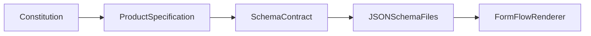

# FormFlow JSON Schema Contract

**Document Type:** Schema Contract Specification  
**Project:** FormFlow  
**Tagline:** Build Once. Configure Forever.  
**Version:** 1.0  
**Status:** Approved  
**Parent Document:** [constitution.md](./constitution.md) v1.1  
**Related Document:** [spec.md](./spec.md) v1.0  
**Timebox:** 3-day Angular case study

---

## 1. Document Overview

### 1.1 What This Document Is

This document defines the **complete JSON structure** consumed by the FormFlow dynamic form renderer. It is the single source of truth for form configuration: root schema shape, field definitions, supported types, validation rules, options, default values, and optional bonus behaviours.

This document defines the **JSON contract only**. It does not describe Angular implementation, component architecture, or rendering logic.

### 1.2 Audience

| Audience | Use of This Document |
|---|---|
| **Developer** | Author conforming JSON schemas and understand validation behaviour before implementation |
| **Evaluator** | Verify that demo schemas and submitted output match the documented contract |
| **Future Maintainer** | Add new banking form scenarios by authoring JSON without changing the renderer |
| **Product Owner** | Resolve schema-related scope questions and guard against contract drift |

### 1.3 Document Relationships

| Document | Role |
|---|---|
| [constitution.md](./constitution.md) | Authoritative scope reference; wins on conflict |
| [spec.md](./spec.md) | Complete behavioural product specification; summarises this contract at the product level |
| **schema-contract.md** (this document) | Authoritative reference for JSON structure, examples, and schema authoring rules |



### 1.4 Traceability

This contract directly supports:

- **NFR-03** — JSON schema contract documented sufficiently for an evaluator to add a new schema without modifying renderer internals
- **FR-01** — One reusable renderer accepts a JSON schema and produces a rendered form
- **FR-02** — Six supported field types defined in data
- **FR-04, FR-05, FR-06** — Required and pattern validation with configuration-driven messages
- **FR-10** — Multiple schemas loadable without renderer modification

---

## 2. Purpose

FormFlow renders forms entirely from JSON schemas. Every form the renderer displays must conform to this contract.

The purpose of this document is to:

1. Define the exact JSON structure expected by the FormFlow renderer
2. Specify supported field types, validation rules, and output format
3. Provide complete, copy-ready examples for schema authors
4. Document invalid patterns so authors can avoid configuration mistakes
5. Enable a developer to create new forms by following this contract alone — without reading renderer source code

---

## 3. Design Principles

1. **Configuration over code** — Form structure, labels, options, and validation messages live in JSON, not in templates or component logic.

2. **Flat and readable** — Schemas are human-editable JSON objects. No code generation, templating language, or build step is required to author a form.

3. **Demo-agnostic content** — Banking scenario names, field labels, and option text are demonstration data. The contract itself is generic and reusable.

4. **Synchronous validation only** — All validation rules are evaluated on the client at interaction time. No async validators, remote lookups, or cross-form dependencies.

5. **Stable contract** — Field `type` values and root structure shall not change during V1 without updating this document and the Product Specification.

---

## 4. Root Schema Structure

Every form is defined by a single JSON object (the **form schema**).

| Property | Type | Required | Description |
|---|---|---|---|
| `id` | `string` | Yes | Unique identifier for the form (e.g., `account-opening`) |
| `title` | `string` | Yes | Display title shown in the dashboard and form header |
| `description` | `string` | No | Short summary shown on the dashboard card |
| `submitLabel` | `string` | No | Label for the submit button. Default: `"Submit"` |
| `fields` | `Field[]` | Yes | Ordered list of field definitions |

### 4.1 Root Schema Example

```json
{
  "id": "account-opening",
  "title": "Account Opening",
  "description": "Apply for a new savings or current account.",
  "submitLabel": "Submit Application",
  "fields": []
}
```

### 4.2 Root Property Rules

- `id` must be unique across all schemas bundled in the application
- `fields` must be a JSON array (may be empty, though demo forms always include at least one field)
- `submitLabel` when omitted defaults to `"Submit"`
- No additional root-level properties are defined in V1

---

## 5. Field Object Structure

Every entry in the `fields` array is a **field object**.

| Property | Type | Required | Description |
|---|---|---|---|
| `key` | `string` | Yes | Unique form control name; used as the key in submitted JSON output |
| `type` | `FieldType` | Yes | One of the six supported field types (see Section 6) |
| `label` | `string` | Yes | Visible label for the field |
| `placeholder` | `string` | No | Placeholder text for text-based inputs (`text`, `textarea`) |
| `defaultValue` | `any` | No | Initial value when the form loads (see Section 11) |
| `validation` | `Validation` | No | Validation rules and messages (see Section 7) |
| `options` | `Option[]` | Conditional | **Required** for `dropdown` and `multiselect` field types (see Section 8) |
| `visibleWhen` | `VisibilityRule` | No | Bonus: conditional visibility (see Section 9) |
| `hidden` | `boolean` | No | Bonus: field is not rendered but value may be included in output (see Section 10) |
| `disabled` | `boolean` | No | Bonus: field is rendered but not editable (see Section 10) |
| `readonly` | `boolean` | No | Bonus: field is visible but not editable (see Section 10) |

### 5.1 Field Ordering

Fields are rendered in the order they appear in the `fields` array. Schema authors control visual field sequence by array position.

### 5.2 Field Object Minimal Example

```json
{
  "key": "fullName",
  "type": "text",
  "label": "Full Name"
}
```

---

## 6. Supported Field Types

V1 supports exactly **six** field types. No additional field types shall be introduced in V1.

| Type Value | UI Control | Default Value Type | Options Required | Placeholder Supported | Pattern Supported |
|---|---|---|---|---|---|
| `text` | Single-line text input | `string` | No | Yes | Yes |
| `textarea` | Multi-line text input | `string` | No | Yes | Yes |
| `date` | Date picker | `string` (ISO `YYYY-MM-DD`) | No | No | No |
| `dropdown` | Single-select dropdown | `string` | Yes | No | No |
| `multiselect` | Multi-select control | `string[]` | Yes | No | No |
| `checkbox` | Checkbox | `boolean` | No | No | No |

### 6.1 Text

- Accepts single-line string input
- Supports `placeholder`
- Supports `required` and `pattern` validation

```json
{
  "key": "fullName",
  "type": "text",
  "label": "Full Name",
  "placeholder": "Enter your full name",
  "validation": {
    "required": true,
    "messages": {
      "required": "Full name is required"
    }
  }
}
```

### 6.2 Textarea

- Accepts multi-line string input
- Supports `placeholder`
- Supports `required` and `pattern` validation

```json
{
  "key": "purpose",
  "type": "textarea",
  "label": "Purpose of Loan",
  "placeholder": "Briefly describe the purpose",
  "validation": {
    "required": true,
    "messages": {
      "required": "Purpose is required"
    }
  }
}
```

### 6.3 Date

- Presents a date picker control
- Stores and submits date as a string in `YYYY-MM-DD` format
- Supports `required` validation only (no pattern)

```json
{
  "key": "dateOfBirth",
  "type": "date",
  "label": "Date of Birth",
  "validation": {
    "required": true,
    "messages": {
      "required": "Date of birth is required"
    }
  }
}
```

### 6.4 Dropdown

- Presents a single-select list from the `options` array
- Displays option `label` values; stores and submits option `value` as a string
- Supports `required` validation only (no pattern)
- Requires a non-empty `options` array

```json
{
  "key": "accountType",
  "type": "dropdown",
  "label": "Account Type",
  "options": [
    { "label": "Savings", "value": "savings" },
    { "label": "Current", "value": "current" }
  ],
  "validation": {
    "required": true,
    "messages": {
      "required": "Please select an account type"
    }
  }
}
```

### 6.5 Multiselect

- Presents a multi-select control from the `options` array
- Submits an array of selected `value` strings
- Default value when unspecified should be an empty array (`[]`)
- When `required: true`, at least one option must be selected
- Requires a non-empty `options` array

```json
{
  "key": "services",
  "type": "multiselect",
  "label": "Additional Services",
  "options": [
    { "label": "Internet Banking", "value": "internet_banking" },
    { "label": "Debit Card", "value": "debit_card" }
  ],
  "defaultValue": []
}
```

### 6.6 Checkbox

- Presents a single checkbox control
- Submits `true` or `false`
- Default value when unspecified should be `false`
- When `required: true`, the checkbox must be checked (`true`)

```json
{
  "key": "termsAccepted",
  "type": "checkbox",
  "label": "I accept the terms and conditions",
  "defaultValue": false,
  "validation": {
    "required": true,
    "messages": {
      "required": "You must accept the terms and conditions"
    }
  }
}
```

---

## 7. Validation Object

Validation is defined per field inside a `validation` object. All validation is synchronous and evaluated on the client.

### 7.1 Validation Properties

| Property | Type | Required | Description |
|---|---|---|---|
| `required` | `boolean` | No | When `true`, the field must have a value per the rules in Section 18 |
| `pattern` | `string` | No | Regular expression string applied to the field value (text and textarea only) |
| `messages` | `ValidationMessages` | No | Configuration-driven error messages keyed by validation rule |

### 7.2 Validation Messages

| Message Key | When Shown |
|---|---|
| `required` | Field is required and empty, unchecked, or unselected (as applicable to field type) |
| `pattern` | Field value does not match the `pattern` regular expression |

Messages shall be sourced from `validation.messages` in the schema. Demo schemas shall always include explicit messages for every active validation rule.

### 7.3 Validation Object Example

```json
{
  "validation": {
    "required": true,
    "pattern": "^[A-Z0-9._%+-]+@[A-Z0-9.-]+\\.[A-Z]{2,}$",
    "messages": {
      "required": "Email address is required",
      "pattern": "Enter a valid email address"
    }
  }
}
```

### 7.4 Pattern Notes

- `pattern` is a **string** containing a regular expression
- Backslashes must be escaped in JSON (e.g., `\\.` for a literal dot)
- Pattern validation applies only to `text` and `textarea` field types
- Pattern validation applies only when a value is present; optional fields left empty shall not trigger a pattern error

---

## 8. Options Object

The `options` array is used by `dropdown` and `multiselect` field types to define selectable choices.

### 8.1 Option Structure

| Property | Type | Required | Description |
|---|---|---|---|
| `label` | `string` | Yes | Display text shown to the user |
| `value` | `string` | Yes | Value stored in form state and submitted in output JSON |

### 8.2 Option Example

```json
{
  "label": "Savings Account",
  "value": "savings"
}
```

### 8.3 Options Rules

- `options` is **required** and must be a non-empty array for `dropdown` and `multiselect` fields
- All options must include both `label` and `value`
- `value` should be unique within a field's `options` array
- Options are **inline only** — external data sources for options are out of scope
- The UI displays `label`; form state and submitted JSON use `value`

### 8.4 Options Array Example

```json
"options": [
  { "label": "Personal", "value": "personal" },
  { "label": "Home", "value": "home" },
  { "label": "Auto", "value": "auto" }
]
```

---

## 9. Conditional Visibility (Bonus)

> **Bonus feature (FR-B01):** Conditional visibility is optional for V1 delivery. The renderer should support `visibleWhen` when present, but core acceptance criteria do not depend on it.

When `visibleWhen` is present on a field, that field is shown only when another field's value matches the specified condition.

### 9.1 VisibilityRule Structure

| Property | Type | Required | Description |
|---|---|---|---|
| `field` | `string` | Yes | `key` of the field to watch |
| `operator` | `string` | Yes | Comparison operator. V1 supports: `equals` |
| `value` | `any` | Yes | Value to compare against the watched field's current value |

### 9.2 VisibilityRule Example

```json
{
  "key": "companyName",
  "type": "text",
  "label": "Company Name",
  "visibleWhen": {
    "field": "accountType",
    "operator": "equals",
    "value": "business"
  }
}
```

### 9.3 Visibility Behaviour

- When the condition is **not met**, the field is hidden from the UI
- When the condition becomes **not met** after the user entered a value, the last value is retained in submission output unless explicitly cleared
- The `field` referenced in `visibleWhen` must be the `key` of another field in the same form schema
- V1 supports only the `equals` operator; other operators are out of scope

---

## 10. Hidden / Disabled / Readonly

> **Bonus features (FR-B02–FR-B04):** These properties are optional for V1 delivery. Core acceptance criteria do not depend on them.

### 10.1 Hidden Fields (`hidden`)

When `hidden: true`:

- The field is **not rendered** in the UI
- If `defaultValue` is set, the value is still included in submitted JSON output
- Validation rules still apply if defined (though hidden required fields are uncommon in demo schemas)

```json
{
  "key": "campaignCode",
  "type": "text",
  "label": "Campaign Code",
  "hidden": true,
  "defaultValue": "DEMO2026"
}
```

### 10.2 Disabled Fields (`disabled`)

When `disabled: true`:

- The field **is rendered** but the user cannot edit it
- The current value is included in submitted JSON output
- Typically used with a `defaultValue` to show a pre-set, non-editable value

```json
{
  "key": "branchCode",
  "type": "text",
  "label": "Branch Code",
  "defaultValue": "BR-001",
  "disabled": true
}
```

### 10.3 Readonly Fields (`readonly`)

When `readonly: true`:

- The field **is visible** but not editable
- The current value is included in submitted JSON output
- Semantically distinct from `disabled` for accessibility and styling purposes

```json
{
  "key": "referenceNumber",
  "type": "text",
  "label": "Reference Number",
  "defaultValue": "REF-12345",
  "readonly": true
}
```

### 10.4 Interaction Between State Flags

| Property | Rendered | Editable | In Output |
|---|---|---|---|
| (default) | Yes | Yes | Yes |
| `hidden: true` | No | No | Yes (if value exists) |
| `disabled: true` | Yes | No | Yes |
| `readonly: true` | Yes | No | Yes |

A field should not combine conflicting state flags in demo schemas. If multiple flags are present, behaviour is undefined in V1 — authors should use one flag per field.

---

## 11. Default Values

The `defaultValue` property sets the initial form state when the form loads.

### 11.1 Type-Appropriate Defaults

When `defaultValue` is **omitted**, the renderer should initialise fields as follows:

| Field Type | Implicit Default |
|---|---|
| `text` | `""` (empty string) |
| `textarea` | `""` (empty string) |
| `date` | `""` (empty string — no date selected) |
| `dropdown` | No selection (empty) |
| `multiselect` | `[]` (empty array) |
| `checkbox` | `false` |

### 11.2 Default Value Rules

| Field Type | `defaultValue` Type | Valid Examples |
|---|---|---|
| `text` | `string` | `"Jane Doe"` |
| `textarea` | `string` | `"Some text"` |
| `date` | `string` (`YYYY-MM-DD`) or empty | `"1990-05-15"` or `""` |
| `dropdown` | `string` (must match an option `value`) | `"savings"` |
| `multiselect` | `string[]` | `["internet_banking"]` or `[]` |
| `checkbox` | `boolean` | `true` or `false` |

### 11.3 Default Value Constraints

- `defaultValue` type must match the field type (see table above)
- For `dropdown`, `defaultValue` must match the `value` of an option in the `options` array
- For `multiselect`, each entry in `defaultValue` must match an option `value`
- For `checkbox`, only `true` or `false` are valid
- For `date`, value must be a valid `YYYY-MM-DD` string or empty

---

## 12. Naming Conventions

Consistent naming makes schemas readable and submitted JSON predictable.

### 12.1 Form `id`

- Use **kebab-case** (lowercase words separated by hyphens)
- Must be unique across all schemas in the application
- Examples: `account-opening`, `loan-inquiry`

### 12.2 Field `key`

- Use **camelCase** (first word lowercase, subsequent words capitalised)
- Must be unique within a single form schema
- Must not contain spaces, hyphens, or special characters
- Becomes the property name in submitted JSON output
- Examples: `fullName`, `dateOfBirth`, `termsAccepted`

### 12.3 Option `value`

- Use **snake_case** (lowercase words separated by underscores) as a convention
- Must be unique within a field's `options` array
- Examples: `internet_banking`, `debit_card`, `savings`

### 12.4 Field `type` Values

- Use lowercase string literals exactly as defined: `text`, `textarea`, `date`, `dropdown`, `multiselect`, `checkbox`
- Type values are case-sensitive; `Text` or `TEXT` are invalid

### 12.5 Labels and Messages

- `label`, `placeholder`, and `validation.messages` values are plain human-readable strings
- No i18n keys or translation identifiers in V1

---

## 13. Constraints

The following constraints apply to all V1 schemas.

### 13.1 Structural Constraints

- Every schema must include required root properties: `id`, `title`, `fields`
- Every field must include required properties: `key`, `type`, `label`
- Field `key` values must be unique within a form
- `dropdown` and `multiselect` fields must include a non-empty `options` array

### 13.2 Type Constraints

- Only the six defined field types are valid in V1
- `pattern` validation is valid only on `text` and `textarea` fields
- `options` is valid only on `dropdown` and `multiselect` fields
- `placeholder` is meaningful only on `text` and `textarea` fields

### 13.3 Validation Constraints

- All validation is synchronous and client-side
- No async or server-side validation rules
- No cross-field validation rules (except bonus `visibleWhen` for display only)

### 13.4 Out-of-Scope for This Contract

The following are explicitly **not supported** in V1:

| Category | Out of Scope |
|---|---|
| Metadata | Schema versioning or migration properties |
| Validation | Async validators, remote validation, cross-field validation rules |
| Field types | File upload, rich text, radio groups, number with formatting |
| Structure | Wizard or multi-step form sections, nested field groups |
| Logic | Computed fields, formula expressions, event hooks, custom action handlers |
| Data | External data sources for `options` (all options must be inline) |
| i18n | Translation keys — labels and messages are plain strings |

---

## 14. Complete Example

A minimal but complete valid schema demonstrating multiple field types, validation, and options. This is a simplified reference form — not a banking demo module.

```json
{
  "id": "contact-form",
  "title": "Contact Us",
  "description": "Send us a message.",
  "submitLabel": "Send Message",
  "fields": [
    {
      "key": "name",
      "type": "text",
      "label": "Your Name",
      "placeholder": "Enter your name",
      "validation": {
        "required": true,
        "messages": {
          "required": "Name is required"
        }
      }
    },
    {
      "key": "inquiryType",
      "type": "dropdown",
      "label": "Inquiry Type",
      "options": [
        { "label": "General", "value": "general" },
        { "label": "Support", "value": "support" }
      ],
      "validation": {
        "required": true,
        "messages": {
          "required": "Please select an inquiry type"
        }
      }
    },
    {
      "key": "subscribe",
      "type": "checkbox",
      "label": "Subscribe to updates",
      "defaultValue": false
    }
  ]
}
```

**Expected valid submission output:**

```json
{
  "name": "Jane Doe",
  "inquiryType": "general",
  "subscribe": false
}
```

---

## 15. Account Opening Schema Example

V1 demo module: apply for a new savings or current account.

**Demonstrates:** text, email pattern validation, date picker, dropdown, multiselect, required checkbox.

| Key | Type | Label | Required | Notes |
|---|---|---|---|---|
| `fullName` | text | Full Name | Yes | Placeholder: "Enter your full name" |
| `email` | text | Email Address | Yes | Pattern: email format |
| `dateOfBirth` | date | Date of Birth | Yes | — |
| `accountType` | dropdown | Account Type | Yes | Options: Savings, Current |
| `services` | multiselect | Additional Services | No | Options: Internet Banking, Debit Card; default: `[]` |
| `termsAccepted` | checkbox | I accept the terms and conditions | Yes | Default: `false` |

```json
{
  "id": "account-opening",
  "title": "Account Opening",
  "description": "Apply for a new savings or current account.",
  "submitLabel": "Submit Application",
  "fields": [
    {
      "key": "fullName",
      "type": "text",
      "label": "Full Name",
      "placeholder": "Enter your full name",
      "validation": {
        "required": true,
        "messages": {
          "required": "Full name is required"
        }
      }
    },
    {
      "key": "email",
      "type": "text",
      "label": "Email Address",
      "placeholder": "name@example.com",
      "validation": {
        "required": true,
        "pattern": "^[A-Z0-9._%+-]+@[A-Z0-9.-]+\\.[A-Z]{2,}$",
        "messages": {
          "required": "Email address is required",
          "pattern": "Enter a valid email address"
        }
      }
    },
    {
      "key": "dateOfBirth",
      "type": "date",
      "label": "Date of Birth",
      "validation": {
        "required": true,
        "messages": {
          "required": "Date of birth is required"
        }
      }
    },
    {
      "key": "accountType",
      "type": "dropdown",
      "label": "Account Type",
      "options": [
        { "label": "Savings", "value": "savings" },
        { "label": "Current", "value": "current" }
      ],
      "validation": {
        "required": true,
        "messages": {
          "required": "Please select an account type"
        }
      }
    },
    {
      "key": "services",
      "type": "multiselect",
      "label": "Additional Services",
      "options": [
        { "label": "Internet Banking", "value": "internet_banking" },
        { "label": "Debit Card", "value": "debit_card" }
      ],
      "defaultValue": []
    },
    {
      "key": "termsAccepted",
      "type": "checkbox",
      "label": "I accept the terms and conditions",
      "defaultValue": false,
      "validation": {
        "required": true,
        "messages": {
          "required": "You must accept the terms and conditions"
        }
      }
    }
  ]
}
```

**Example valid submission output:**

```json
{
  "fullName": "Jane Doe",
  "email": "jane.doe@example.com",
  "dateOfBirth": "1990-05-15",
  "accountType": "savings",
  "services": ["internet_banking", "debit_card"],
  "termsAccepted": true
}
```

---

## 16. Loan Inquiry Schema Example

V1 demo module: submit a personal loan inquiry.

**Demonstrates:** textarea, numeric pattern on text field, optional date, dropdown, required checkbox.

| Key | Type | Label | Required | Notes |
|---|---|---|---|---|
| `applicantName` | text | Applicant Name | Yes | — |
| `loanType` | dropdown | Loan Type | Yes | Options: Personal, Home, Auto |
| `loanAmount` | text | Requested Amount | Yes | Pattern: numeric digits only; placeholder: "e.g. 500000" |
| `purpose` | textarea | Purpose of Loan | Yes | Placeholder: "Briefly describe the purpose" |
| `preferredContactDate` | date | Preferred Contact Date | No | Optional date field |
| `consentToContact` | checkbox | I consent to be contacted regarding this inquiry | Yes | Default: `false` |

```json
{
  "id": "loan-inquiry",
  "title": "Loan Inquiry",
  "description": "Submit a personal loan inquiry.",
  "submitLabel": "Submit Inquiry",
  "fields": [
    {
      "key": "applicantName",
      "type": "text",
      "label": "Applicant Name",
      "validation": {
        "required": true,
        "messages": {
          "required": "Applicant name is required"
        }
      }
    },
    {
      "key": "loanType",
      "type": "dropdown",
      "label": "Loan Type",
      "options": [
        { "label": "Personal", "value": "personal" },
        { "label": "Home", "value": "home" },
        { "label": "Auto", "value": "auto" }
      ],
      "validation": {
        "required": true,
        "messages": {
          "required": "Please select a loan type"
        }
      }
    },
    {
      "key": "loanAmount",
      "type": "text",
      "label": "Requested Amount",
      "placeholder": "e.g. 500000",
      "validation": {
        "required": true,
        "pattern": "^[0-9]+$",
        "messages": {
          "required": "Loan amount is required",
          "pattern": "Enter a valid numeric amount"
        }
      }
    },
    {
      "key": "purpose",
      "type": "textarea",
      "label": "Purpose of Loan",
      "placeholder": "Briefly describe the purpose",
      "validation": {
        "required": true,
        "messages": {
          "required": "Purpose is required"
        }
      }
    },
    {
      "key": "preferredContactDate",
      "type": "date",
      "label": "Preferred Contact Date"
    },
    {
      "key": "consentToContact",
      "type": "checkbox",
      "label": "I consent to be contacted regarding this inquiry",
      "defaultValue": false,
      "validation": {
        "required": true,
        "messages": {
          "required": "Consent is required to proceed"
        }
      }
    }
  ]
}
```

**Example valid submission output:**

```json
{
  "applicantName": "John Smith",
  "loanType": "personal",
  "loanAmount": "500000",
  "purpose": "Home renovation",
  "preferredContactDate": "2026-08-01",
  "consentToContact": true
}
```

---

## 17. Invalid Schema Examples

The following examples illustrate common schema mistakes. Each is **invalid** and must not appear in bundled demo schemas.

### 17.1 Missing Required Root Property

```json
{
  "title": "Account Opening",
  "fields": []
}
```

**Why invalid:** `id` is a required root property.

### 17.2 Duplicate Field Key

```json
{
  "id": "bad-form",
  "title": "Bad Form",
  "fields": [
    { "key": "email", "type": "text", "label": "Email" },
    { "key": "email", "type": "text", "label": "Email Again" }
  ]
}
```

**Why invalid:** Field `key` values must be unique within a form.

### 17.3 Dropdown Without Options

```json
{
  "key": "accountType",
  "type": "dropdown",
  "label": "Account Type",
  "validation": {
    "required": true,
    "messages": { "required": "Please select an account type" }
  }
}
```

**Why invalid:** `dropdown` fields require a non-empty `options` array.

### 17.4 Unsupported Field Type

```json
{
  "key": "gender",
  "type": "radio",
  "label": "Gender"
}
```

**Why invalid:** `radio` is not a supported V1 field type. Only `text`, `textarea`, `date`, `dropdown`, `multiselect`, and `checkbox` are valid.

### 17.5 Pattern on Unsupported Field Type

```json
{
  "key": "dateOfBirth",
  "type": "date",
  "label": "Date of Birth",
  "validation": {
    "required": true,
    "pattern": "^[0-9]{4}-[0-9]{2}-[0-9]{2}$",
    "messages": {
      "required": "Date of birth is required",
      "pattern": "Invalid date format"
    }
  }
}
```

**Why invalid:** `pattern` validation is supported only on `text` and `textarea` fields.

### 17.6 Invalid visibleWhen Reference

```json
{
  "key": "companyName",
  "type": "text",
  "label": "Company Name",
  "visibleWhen": {
    "field": "nonExistentField",
    "operator": "equals",
    "value": "business"
  }
}
```

**Why invalid:** `visibleWhen.field` must reference the `key` of another field defined in the same form schema.

### 17.7 Default Value Type Mismatch

```json
{
  "key": "termsAccepted",
  "type": "checkbox",
  "label": "I accept the terms",
  "defaultValue": "yes"
}
```

**Why invalid:** `checkbox` fields require a `boolean` `defaultValue` (`true` or `false`), not a string.

### 17.8 Invalid Field Key Format

```json
{
  "key": "full name",
  "type": "text",
  "label": "Full Name"
}
```

**Why invalid:** Field `key` must use camelCase with no spaces or special characters. Use `fullName` instead.

---

## 18. Validation Rules

This section defines the complete validation behaviour expected by the renderer.

### 18.1 Required Behaviour by Field Type

| Field Type | Required Behaviour |
|---|---|
| `text` | Value must be a non-empty string |
| `textarea` | Value must be a non-empty string |
| `date` | A date must be selected (non-empty `YYYY-MM-DD` value) |
| `dropdown` | An option must be selected |
| `multiselect` | At least one option must be selected |
| `checkbox` | Checkbox must be checked (`true`) |

### 18.2 Pattern Applicability

| Field Type | Pattern Supported |
|---|---|
| `text` | Yes |
| `textarea` | Yes |
| `date` | No |
| `dropdown` | No |
| `multiselect` | No |
| `checkbox` | No |

### 18.3 Pattern Evaluation Rules

- Pattern validation runs only when the field has a non-empty value
- For optional fields left empty, pattern validation is **not** applied and no pattern error is shown
- Pattern is evaluated as a regular expression against the string value of the field

### 18.4 Validation Timing

- Validation is evaluated when the user attempts to submit the form
- Validation feedback is also available through standard form interaction (e.g., after a field is touched or blurred)
- No async or server-side validation occurs

### 18.5 Error Display Rules

| Condition | Expected Behaviour |
|---|---|
| Required field is empty on submit | Display `validation.messages.required` for that field |
| Pattern does not match on submit | Display `validation.messages.pattern` for that field |
| Multiple fields invalid on submit | Display all applicable errors; block submission |
| User corrects a field | Error for that field clears when the field becomes valid |

### 18.6 Message Sourcing

- Error messages come from `validation.messages` in the schema
- Messages must not require code changes to update copy
- Bundled demo schemas shall always include explicit messages for every active validation rule
- If a validation rule is defined but its message key is omitted, the field is still invalid — specific fallback text is an implementation detail

### 18.7 Submission Output Contract

On successful submit, the renderer produces a **flat JSON object** keyed by field `key` values.

| Rule | Behaviour |
|---|---|
| Field inclusion | Only fields defined in the schema are included in output |
| `text`, `textarea` | Submitted as `string` |
| `date` | Submitted as `YYYY-MM-DD` string |
| `dropdown` | Submitted as selected option `value` string |
| `multiselect` | Submitted as `string[]` of selected values |
| `checkbox` | Submitted as `boolean` |
| Optional empty fields | Submitted with type-appropriate empty value (`""`, `[]`, or `false`) |
| Hidden fields (bonus) | Not rendered; if `defaultValue` is set, value is included in output |
| Disabled fields (bonus) | Included in output with current value |
| Readonly fields (bonus) | Included in output with current value |
| Conditionally hidden fields (bonus) | Retain last value in output unless cleared |

**Post-submission:** No data is persisted to a backend. Displayed JSON is the complete proof of successful form capture.

---

## 19. Versioning Notes

### 19.1 Contract Version

This document defines **Schema Contract v1.0** for FormFlow V1 (3-day case study).

### 19.2 No In-Schema Version Property

V1 schemas do **not** include a `schemaVersion` or similar metadata property. Schema versioning is out of scope for this case study.

### 19.3 Change Management

- Breaking changes to field `type` values, root structure, or validation behaviour require an update to this document and the Product Specification **before** implementation changes
- The Constitution takes precedence if a conflict arises between this contract and other documents
- Bundled demo schemas are expected to conform to v1.0 of this contract

### 19.4 Stability Expectation

Field `type` literals (`text`, `textarea`, `date`, `dropdown`, `multiselect`, `checkbox`) and root property names (`id`, `title`, `description`, `submitLabel`, `fields`) are stable for the duration of V1 development.

---

## 20. Future Extensions

The following capabilities are explicitly **out of V1 scope**. They are listed for continuity and potential future versions — not as part of the current contract.

### 20.1 Field Types

- File upload
- Rich text editor
- Radio button groups
- Number fields with formatting

### 20.2 Validation

- Async validators
- Cross-field validation rules
- Server-side or remote validation

### 20.3 Structure and Logic

- Wizard or multi-step form flows
- Nested field groups or sections
- Computed fields or formula expressions
- Event hooks or custom action handlers

### 20.4 Data and Configuration

- External data sources for `options`
- Schema versioning and migration metadata
- Internationalization (i18n) message keys

### 20.5 Conditional Logic

- Additional `visibleWhen` operators beyond `equals` (e.g., `notEquals`, `contains`, `greaterThan`)
- Promotion of bonus features (`visibleWhen`, `hidden`, `disabled`, `readonly`) to first-class V1 features in a future version

### 20.6 Platform

- Form builder UI for non-developers
- Backend persistence and API integration
- Authentication and role-based form access
- Library extraction for reuse across projects

---

## Document Governance

This Schema Contract is subordinate to the [FormFlow Constitution](./constitution.md). If a conflict arises, the Constitution takes precedence.

Behavioural details of form submission, error handling, and user journey are defined in the [Product Specification](./spec.md). This document is the authoritative reference for JSON structure, field definitions, validation configuration, and schema examples.

Changes to field `type` values, root structure, validation behaviour, or demo module schemas require an update to this document before implementation changes are made.

---

## Appendix: Adding a New Form Schema

To add a new banking demo form without changing the renderer:

1. Create a new JSON file conforming to the root structure in Section 4
2. Define `fields` using only supported `type` values from Section 6
3. Add `validation` and `messages` for any required or pattern rules (Section 7)
4. Provide `options` for any `dropdown` or `multiselect` fields (Section 8)
5. Follow naming conventions in Section 12
6. Register the schema in the dashboard configuration (demo layer, not renderer)
7. Verify submitted output matches the rules in Section 18.7
