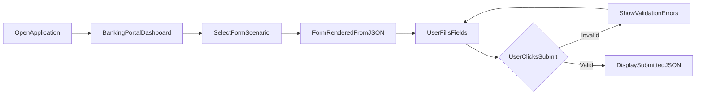

# FormFlow Product Specification

**Document Type:** Product Specification  
**Project:** FormFlow  
**Version:** 1.0  
**Status:** Draft  
**Parent Document:** [constitution.md](./constitution.md) v1.1  
**Related Document:** [schema-contract.md](./schema-contract.md) v1.0  
**Timebox:** 3-day Angular case study

---

## 1. Document Overview

### 1.1 Purpose

This document defines **what** FormFlow V1 shall do. It describes expected application behaviour, user interactions, data contracts, and acceptance criteria so that a development team can implement the product without ambiguity.

This specification does **not** describe how the product will be built. Implementation details, technology choices beyond stated constraints, and architectural decisions are out of scope for this document.

### 1.2 Audience

| Audience | Use of This Document |
|---|---|
| **Development Team** | Understand required behaviour before implementation |
| **Evaluator** | Verify delivered product against stated requirements |
| **Product Owner** | Guard scope and resolve requirement questions |
| **Future Maintainer** | Understand product intent when extending demo schemas |

### 1.3 Document Relationships

| Document | Role |
|---|---|
| [constitution.md](./constitution.md) | Authoritative scope reference; wins on conflict |
| [schema-contract.md](./schema-contract.md) | Detailed JSON schema contract; referenced by Section 13 |
| **spec.md** (this document) | Complete behavioural product specification for V1 |

### 1.4 Spec-Driven Development

FormFlow follows Spec-Driven Development (SDD). This specification, together with the Constitution and Schema Contract, forms the behavioural contract for V1. All features, behaviours, and demo content shall be traceable to requirements in this document or explicitly deferred in the Constitution.

---

## 2. Product Overview

**Project Name:** FormFlow  
**Tagline:** Build Once. Configure Forever.

FormFlow is a configuration-driven dynamic form rendering platform. It turns JSON schemas into fully functional, validated forms through a single reusable rendering engine.

The Banking Portal included in V1 is a **demonstration environment** used to showcase the renderer. FormFlow is **not** a banking application, production SaaS product, low-code platform, or form builder.

### 2.1 Core Value Proposition

- **One engine, many forms** — a single renderer produces different forms from JSON configuration
- **Configuration over duplication** — form structure, labels, options, and validation messages live in data, not repeated markup
- **Credible demonstration** — a polished Banking Portal makes the case study easy to evaluate
- **Objective verification** — submitted form data is displayed as JSON so assessors can confirm output without a backend

### 2.2 What Success Looks Like

V1 succeeds when an evaluator can open the application locally, navigate a Banking Portal dashboard, complete at least two distinct banking form scenarios rendered entirely from JSON, and verify that validation and submission behave as defined in this specification.

---

## 3. Problem Statement

Banking and financial applications frequently require forms for account applications, profile updates, and service requests. In traditional development, each form is built with hardcoded markup, duplicated validation logic, and inconsistent user experience across screens.

For this case study, the challenge is not to build a full banking product. The challenge is to prove that a single, reusable approach can replace repetitive form development while demonstrating proficiency, clean delivery, and adherence to spec-driven development.

FormFlow addresses this by rendering forms entirely from JSON schemas, allowing multiple banking use cases to be demonstrated without rewriting form markup for each scenario.

---

## 4. Objectives

| ID | Objective | Success Indicator |
|---|---|---|
| **OBJ-01** | Demonstrate configuration-driven development | Forms generated from JSON without hardcoded field markup |
| **OBJ-02** | Deliver a working dynamic form experience | All six supported field types render and accept user input |
| **OBJ-03** | Provide a professional demonstration environment | Banking Portal dashboard is present, navigable, and visually polished |
| **OBJ-04** | Support multiple form scenarios | At least two distinct banking forms selectable from the dashboard |
| **OBJ-05** | Complete within the 3-day timebox | Core acceptance criteria (AC-01 through AC-11) satisfied before bonus work |
| **OBJ-06** | Enable objective evaluation | Valid submissions display captured values as readable, structured JSON |

---

## 5. In Scope

The following capabilities are **in scope** for FormFlow V1:

### 5.1 Dynamic Form Rendering

- One reusable dynamic form renderer that accepts a JSON schema and produces a rendered form
- Support for six field types: text, textarea, date, dropdown, multiselect, and checkbox
- Form state managed through reactive forms (programmatic form model)

### 5.2 Validation

- Required field validation driven by schema configuration
- Pattern validation driven by schema configuration (applicable field types only)
- Validation error messages defined in the JSON schema, not hardcoded per field

### 5.3 Form Submission and Output

- User can submit a valid form
- Successful submission displays submitted data as formatted JSON
- Invalid forms cannot be submitted; validation errors are visible to the user

### 5.4 Multi-Schema Support

- Renderer loads and renders different JSON schemas without modification to the renderer itself
- User can select or navigate between at least two banking-related form scenarios from the dashboard

### 5.5 Banking Portal Dashboard

- Banking Portal dashboard UI as the application entry point
- Available form scenarios presented in a clear, visually polished layout

### 5.6 Demo Data and Runtime

- Static JSON schema files bundled with the application
- Entirely client-side operation with no backend, database, or external API dependency
- No authentication or login

### 5.7 Bonus (Time Permitting Only)

The following may be delivered only after core acceptance criteria pass:

- Conditional field visibility based on schema rules
- Hidden fields support
- Disabled fields support
- Readonly fields support

---

## 6. Out of Scope

The following are **explicitly out of scope** for V1. They shall not be introduced even if time remains after bonus work:

### 6.1 Infrastructure and Integration

- Backend server, database, or API integrations
- Authentication, authorization, or role-based access
- Data persistence beyond on-screen JSON display
- External services or remote validation

### 6.2 Product Class

- Form builder UI for non-developers
- Low-code or no-code platform capabilities
- npm library publishing or reusable package extraction
- Multi-tenancy, schema versioning, or workflow engine

### 6.3 Form Capabilities

- File upload fields
- Rich text editors
- Radio button groups
- Number fields with formatting
- Wizard or multi-step form flows
- Async validators or cross-field validation
- Computed fields or formula expressions
- Event hooks or custom action handlers
- External data sources for dropdown options (all options are inline in schema)
- Internationalization (i18n) — labels and messages are plain strings

### 6.4 Banking Product Features

- Real financial data processing
- Regulatory or compliance certification
- Account creation, loan approval, or any real banking operations

---

## 7. Target Users

### 7.1 Evaluator

**Role:** Technical assessor reviewing the case study.

**Goals:**
- Run the application locally and explore form scenarios
- Verify that forms render from JSON schemas
- Confirm validation and submission behaviour
- Review adherence to requirements and overall delivery quality

**Success:** Can objectively verify all core acceptance criteria without backend setup.

### 7.2 Demo User

**Role:** Banking portal visitor experiencing the demonstration.

**Goals:**
- Discover available form scenarios from the dashboard
- Complete forms intuitively with clear labels and feedback
- Understand when submission succeeds or fails

**Success:** Can complete Account Opening and Loan Inquiry forms without confusion.

### 7.3 Developer

**Role:** Builder delivering FormFlow V1 within the 3-day timebox.

**Goals:**
- Implement all core requirements from this specification
- Keep scope bounded and aligned with the Constitution
- Deliver a demonstrable, polished product

**Success:** All AC-01 through AC-11 criteria pass.

### 7.4 Future Maintainer

**Role:** Person extending the demo with additional form scenarios.

**Goals:**
- Add new banking form schemas by authoring JSON
- Understand expected field types, validation, and output format

**Success:** Can add a new conforming schema and register it in the demo without changing renderer behaviour.

---

## 8. User Stories

### 8.1 Core User Stories

| ID | Story | Priority |
|---|---|---|
| **US-01** | As a **Demo User**, I want to see a Banking Portal dashboard listing available form scenarios, so that I can choose which form to complete. | Must Have |
| **US-02** | As a **Demo User**, I want the selected form to render all fields defined in its JSON schema, so that I can provide the requested information. | Must Have |
| **US-03** | As a **Demo User**, I want to interact with text, textarea, date, dropdown, multiselect, and checkbox fields, so that I can complete diverse banking form scenarios. | Must Have |
| **US-04** | As a **Demo User**, I want to see validation errors with messages defined in the schema, so that I understand what to correct before submitting. | Must Have |
| **US-05** | As a **Demo User**, I want to submit a valid form and see my captured data as formatted JSON, so that I can confirm what was collected. | Must Have |
| **US-06** | As a **Demo User**, I want invalid form submission to be blocked with visible errors, so that I cannot accidentally submit incomplete or incorrect data. | Must Have |
| **US-07** | As an **Evaluator**, I want to switch between at least two distinct form schemas from the dashboard, so that I can verify the renderer works for multiple configurations. | Must Have |
| **US-08** | As a **Future Maintainer**, I want to add a new form by authoring a JSON schema that conforms to the documented contract, so that I can extend the demo without altering core rendering behaviour. | Must Have |

### 8.2 Bonus User Stories

| ID | Story | Priority |
|---|---|---|
| **US-B01** | As a **Demo User**, I want fields to show, hide, or become non-editable based on schema configuration, so that forms can demonstrate conditional and restricted field behaviour. | Nice to Have |

---

## 9. Functional Requirements

### 9.1 Dynamic Form Rendering

| ID | Requirement |
|---|---|
| **FR-01** | The system shall provide one reusable dynamic form renderer that accepts a JSON schema and produces a rendered form. |
| **FR-02** | The renderer shall support the following field types: text input, textarea, date picker, dropdown (single select), multi-select, and checkbox. |
| **FR-03** | The renderer shall use reactive forms as the underlying form model; form state shall be managed programmatically. |

### 9.2 Validation

| ID | Requirement |
|---|---|
| **FR-04** | The system shall support **required** field validation driven by schema configuration. |
| **FR-05** | The system shall support **pattern** validation driven by schema configuration. |
| **FR-06** | Validation error messages shall be defined in the JSON schema (configuration-driven messages), not hardcoded per field. |

### 9.3 Form Submission and Output

| ID | Requirement |
|---|---|
| **FR-07** | The user shall be able to submit a valid form. |
| **FR-08** | Upon successful submission, the system shall display the submitted data as formatted JSON. |
| **FR-09** | Invalid forms shall not submit; validation errors shall be visible to the user. |

### 9.4 Multi-Schema Support

| ID | Requirement |
|---|---|
| **FR-10** | The renderer shall dynamically load and render different JSON schemas without requiring modifications to the rendering component. |
| **FR-11** | The user shall be able to select or navigate between at least two banking-related form scenarios from the dashboard. |

### 9.5 Dashboard UI

| ID | Requirement |
|---|---|
| **FR-12** | The application shall include a Banking Portal dashboard UI as the entry point for form demos. |
| **FR-13** | The dashboard shall present available form scenarios in a clear, visually polished layout. |

### 9.6 Bonus Features (Time Permitting Only)

| ID | Requirement |
|---|---|
| **FR-B01** | The system may support conditional field visibility based on schema rules. |
| **FR-B02** | The system may support hidden fields. |
| **FR-B03** | The system may support disabled fields. |
| **FR-B04** | The system may support readonly fields. |
| **FR-B05** | Unit tests covering core renderer and validation behaviour may be delivered. |

*Bonus features are explicitly secondary to V1 delivery and shall not delay core acceptance criteria.*

---

## 10. Non-Functional Requirements

### 10.1 Understandability and Separation

| ID | Requirement |
|---|---|
| **NFR-01** | The delivered project shall be easy to navigate and review; an evaluator shall be able to understand the project organisation within minutes. |
| **NFR-02** | Form rendering capability shall be independent of banking demo content (schemas and dashboard presentation). |
| **NFR-03** | The JSON schema contract shall be documented sufficiently for an evaluator to add a new schema without modifying renderer internals. |

### 10.2 User Experience

| ID | Requirement |
|---|---|
| **NFR-04** | The UI shall be visually polished and consistent with a banking portal theme. |
| **NFR-05** | Forms shall provide clear labels, validation feedback, and accessible field associations. |
| **NFR-06** | The application shall be demonstrable locally without external services. |

### 10.3 Maintainability

| ID | Requirement |
|---|---|
| **NFR-07** | Adding a new field type or schema shall require minimal, localized changes. |
| **NFR-08** | Configuration (schemas, validation messages) shall remain data, not embedded in presentation templates. |

### 10.4 Performance and Reliability

| ID | Requirement |
|---|---|
| **NFR-09** | Forms shall render and validate responsively on a standard developer machine with no perceptible lag for demo-sized schemas. |
| **NFR-10** | The application shall run entirely client-side with no backend dependency. |

### 10.5 Testing (Bonus)

| ID | Requirement |
|---|---|
| **NFR-11** | If unit tests are delivered, they shall cover critical paths: schema parsing, field rendering, and validation behaviour. |

---

## 11. Banking Demo Modules

V1 shall include at least two banking demo modules. The following modules are defined for V1 delivery.

### 11.1 Module 1: Account Opening

| Property | Value |
|---|---|
| **Schema ID** | `account-opening` |
| **Title** | Account Opening |
| **Description** | Apply for a new savings or current account. |
| **Submit Label** | Submit Application |

**Fields:**

| Key | Type | Label | Required | Notes |
|---|---|---|---|---|
| `fullName` | text | Full Name | Yes | Placeholder: "Enter your full name" |
| `email` | text | Email Address | Yes | Pattern: email format |
| `dateOfBirth` | date | Date of Birth | Yes | — |
| `accountType` | dropdown | Account Type | Yes | Options: Savings, Current |
| `services` | multiselect | Additional Services | No | Options: Internet Banking, Debit Card; default: empty array |
| `termsAccepted` | checkbox | I accept the terms and conditions | Yes | Default: false |

**Demonstrates:** text, email pattern validation, date picker, dropdown, multiselect, required checkbox.

### 11.2 Module 2: Loan Inquiry

| Property | Value |
|---|---|
| **Schema ID** | `loan-inquiry` |
| **Title** | Loan Inquiry |
| **Description** | Submit a personal loan inquiry. |
| **Submit Label** | Submit Inquiry |

**Fields:**

| Key | Type | Label | Required | Notes |
|---|---|---|---|---|
| `applicantName` | text | Applicant Name | Yes | — |
| `loanType` | dropdown | Loan Type | Yes | Options: Personal, Home, Auto |
| `loanAmount` | text | Requested Amount | Yes | Pattern: numeric digits only; placeholder: "e.g. 500000" |
| `purpose` | textarea | Purpose of Loan | Yes | Placeholder: "Briefly describe the purpose" |
| `preferredContactDate` | date | Preferred Contact Date | No | Optional date field |
| `consentToContact` | checkbox | I consent to be contacted regarding this inquiry | Yes | Default: false |

**Demonstrates:** textarea, numeric pattern on text field, optional date, dropdown, required checkbox.

### 11.3 Module Registration

Each demo module shall be selectable from the Banking Portal dashboard. The dashboard shall display each module's title and description. Selecting a module shall navigate the user to the rendered form for that schema.

---

## 12. End-to-End User Journey

### 12.1 Journey Flow



### 12.2 Step-by-Step Journey

| Step | Actor | Action | System Response |
|---|---|---|---|
| 1 | Demo User | Opens the application in a browser | Banking Portal dashboard is displayed |
| 2 | Demo User | Views available form scenarios | Dashboard shows at least Account Opening and Loan Inquiry with title and description |
| 3 | Demo User | Selects a form scenario | Form view opens with schema title, field labels, and submit button |
| 4 | Demo User | Enters data into rendered fields | Fields accept input appropriate to their type |
| 5 | Demo User | Leaves required fields empty or enters invalid data and submits | Submission is blocked; schema-configured validation errors are displayed |
| 6 | Demo User | Corrects errors and submits valid data | Submitted values are displayed as formatted JSON on screen |
| 7 | Demo User | Returns to dashboard and selects a different scenario | A different form renders from its JSON schema without requiring separate form markup |
| 8 | Evaluator | Reviews JSON output | Captured field values match user input and schema field keys |

### 12.3 Journey Constraints

- No login or authentication step exists
- No confirmation email, receipt, or backend persistence occurs after submission
- JSON display on screen is the terminal success state for a valid submission

---

## 13. JSON Schema Specification

This section defines the product-level JSON schema contract consumed by the FormFlow renderer. For complete JSON examples, see [schema-contract.md](./schema-contract.md).

### 13.1 Design Principles

1. **Configuration over code** — form structure, labels, options, and validation messages live in JSON
2. **Flat and readable** — schemas are human-editable; no code generation required
3. **Demo-agnostic content** — banking scenario names and field labels are demonstration data
4. **Synchronous validation only** — no async validators, remote lookups, or cross-form dependencies
5. **Stable contract** — field `type` values and root structure shall not change during V1 without updating the Schema Contract

### 13.2 Form Schema Root Structure

Every form is defined by a single JSON object:

| Property | Type | Required | Description |
|---|---|---|---|
| `id` | string | Yes | Unique identifier for the form (e.g., `account-opening`) |
| `title` | string | Yes | Display title shown in the dashboard and form header |
| `description` | string | No | Short summary shown on the dashboard card |
| `submitLabel` | string | No | Label for the submit button. Default: `"Submit"` |
| `fields` | Field[] | Yes | Ordered list of field definitions |

**Root Example:**

```json
{
  "id": "account-opening",
  "title": "Account Opening",
  "description": "Open a new savings or current account.",
  "submitLabel": "Submit Application",
  "fields": []
}
```

### 13.3 Field Definition Structure

Every entry in the `fields` array is a field object:

| Property | Type | Required | Description |
|---|---|---|---|
| `key` | string | Yes | Unique form control name; used as the key in submitted JSON output |
| `type` | FieldType | Yes | One of the supported field types (see Section 14) |
| `label` | string | Yes | Visible label for the field |
| `placeholder` | string | No | Placeholder text for text-based inputs |
| `defaultValue` | any | No | Initial value when the form loads |
| `validation` | Validation | No | Validation rules and messages (see Section 15) |
| `options` | Option[] | Conditional | Required for `dropdown` and `multiselect` field types |
| `visibleWhen` | VisibilityRule | No | Bonus: conditional visibility |
| `hidden` | boolean | No | Bonus: field is not rendered but value may be included in output |
| `disabled` | boolean | No | Bonus: field is rendered but not editable |
| `readonly` | boolean | No | Bonus: field is visible but not editable |

### 13.4 Field Key Rules

- Must be unique within a form
- Use camelCase (e.g., `fullName`, `dateOfBirth`)
- Must not contain spaces or special characters
- Becomes the property name in submitted JSON output

### 13.5 Option Structure

Used by `dropdown` and `multiselect` fields:

| Property | Type | Required | Description |
|---|---|---|---|
| `label` | string | Yes | Display text |
| `value` | string | Yes | Value stored in form state and submitted JSON |

```json
{
  "label": "Savings Account",
  "value": "savings"
}
```

### 13.6 Bonus: Conditional Visibility Rule

When `visibleWhen` is present (bonus feature), a field is shown only when another field's value matches a condition:

| Property | Type | Required | Description |
|---|---|---|---|
| `field` | string | Yes | `key` of the field to watch |
| `operator` | string | Yes | Comparison operator: `equals` |
| `value` | any | Yes | Value to compare against |

### 13.7 Contract Constraints

The following are out of scope for the JSON schema contract:

- Schema versioning or migration metadata
- Async or server-side validation rules
- File upload field types
- Wizard or multi-step form sections
- Computed fields or formula expressions
- Event hooks or custom action handlers
- External data sources for `options`
- Internationalization keys

---

## 14. Supported Field Types

V1 supports exactly six field types. No additional field types shall be introduced in V1.

| Type Value | UI Control | Default Value Type | Options Required | Placeholder Supported | Pattern Supported |
|---|---|---|---|---|---|
| `text` | Single-line text input | string | No | Yes | Yes |
| `textarea` | Multi-line text input | string | No | Yes | Yes |
| `date` | Date picker | string (ISO `YYYY-MM-DD`) | No | No | No |
| `dropdown` | Single-select dropdown | string | Yes | No | No |
| `multiselect` | Multi-select control | string[] | Yes | No | No |
| `checkbox` | Checkbox | boolean | No | No | No |

### 14.1 Field Type Behaviours

**Text**
- Accepts single-line string input
- Supports `placeholder`
- Supports `required` and `pattern` validation

**Textarea**
- Accepts multi-line string input
- Supports `placeholder`
- Supports `required` and `pattern` validation

**Date**
- Presents a date picker control
- Stores and submits date as a string in `YYYY-MM-DD` format
- Supports `required` validation only (no pattern)

**Dropdown**
- Presents a single-select list from the `options` array
- Submits the selected option's `value` as a string
- Supports `required` validation only (no pattern)
- Requires a non-empty `options` array in the schema

**Multiselect**
- Presents a multi-select control from the `options` array
- Submits an array of selected `value` strings
- Default value when unspecified should be an empty array
- When `required: true`, at least one option must be selected
- Requires a non-empty `options` array in the schema

**Checkbox**
- Presents a single checkbox control
- Submits `true` or `false`
- Default value when unspecified should be `false`
- When `required: true`, the checkbox must be checked (`true`)

---

## 15. Validation Rules

Validation is defined per field inside a `validation` object. All validation is synchronous and evaluated on the client.

### 15.1 Validation Object

| Property | Type | Required | Description |
|---|---|---|---|
| `required` | boolean | No | When `true`, the field must have a value |
| `pattern` | string | No | Regular expression string applied to the field value |
| `messages` | ValidationMessages | No | Configuration-driven error messages |

### 15.2 Validation Messages

| Message Key | When Shown |
|---|---|
| `required` | Field is required and empty (or unchecked, or unselected, as applicable) |
| `pattern` | Field value does not match the `pattern` regular expression |

Messages shall be sourced from `validation.messages` in the schema. Example:

```json
{
  "validation": {
    "required": true,
    "pattern": "^[A-Z0-9._%+-]+@[A-Z0-9.-]+\\.[A-Z]{2,}$",
    "messages": {
      "required": "Email address is required",
      "pattern": "Enter a valid email address"
    }
  }
}
```

### 15.3 Required Behaviour by Field Type

| Field Type | Required Behaviour |
|---|---|
| `text` | Value must be a non-empty string |
| `textarea` | Value must be a non-empty string |
| `date` | A date must be selected |
| `dropdown` | An option must be selected |
| `multiselect` | At least one option must be selected |
| `checkbox` | Checkbox must be checked (`true`) |

### 15.4 Pattern Behaviour

| Field Type | Pattern Supported |
|---|---|
| `text` | Yes |
| `textarea` | Yes |
| `date` | No |
| `dropdown` | No |
| `multiselect` | No |
| `checkbox` | No |

Pattern validation applies only when a value is present. For optional fields, an empty value shall not trigger a pattern error.

### 15.5 Validation Timing

- Validation shall be evaluated when the user attempts to submit the form
- Validation feedback shall also be available through standard form interaction (e.g., after a field is touched or blurred)
- No async or server-side validation shall occur

---

## 16. Form Submission Behaviour

### 16.1 Submit Action

- The form shall display a submit button labelled with the schema's `submitLabel` value
- If `submitLabel` is omitted, the default label shall be `"Submit"`
- Submitting a valid form is the primary success action for the Demo User

### 16.2 Valid Submission

When all validation rules pass:

1. The system shall collect current values for all applicable fields
2. The system shall produce a flat JSON object keyed by field `key` values
3. The system shall display the JSON in a readable, formatted manner on screen

**Example Output:**

```json
{
  "fullName": "Jane Doe",
  "email": "jane.doe@example.com",
  "accountType": "savings",
  "services": ["internet_banking", "debit_card"],
  "termsAccepted": true
}
```

### 16.3 Invalid Submission

When any validation rule fails:

1. The system shall **not** submit the form
2. The system shall display validation errors for all failing fields
3. The system shall **not** display submission JSON output
4. The user shall be able to correct errors and resubmit

### 16.4 Output Rules

| Rule | Behaviour |
|---|---|
| Field inclusion | Only fields defined in the schema are included in output |
| Text and textarea | Submitted as string |
| Date | Submitted as `YYYY-MM-DD` string |
| Dropdown | Submitted as selected option `value` string |
| Multiselect | Submitted as `string[]` of selected values |
| Checkbox | Submitted as `boolean` |
| Optional empty fields | Submitted with empty value (empty string, empty array, or `false` as type-appropriate) |
| Hidden fields (bonus) | Not rendered; if `defaultValue` is set, value is included in output |
| Disabled fields (bonus) | Included in output with current value |
| Readonly fields (bonus) | Included in output with current value |
| Conditionally hidden fields (bonus) | Retain last value in output unless cleared by the application |

### 16.5 Post-Submission Behaviour

- No data is persisted to a backend
- No email, notification, or confirmation workflow is triggered
- Displayed JSON is the complete proof of successful form capture

---

## 17. Error Handling

### 17.1 Validation Errors

| Condition | Expected Behaviour |
|---|---|
| Required field is empty on submit | Display `validation.messages.required` for that field |
| Pattern does not match on submit | Display `validation.messages.pattern` for that field |
| Multiple fields invalid on submit | Display all applicable errors; block submission |
| User corrects a field | Error for that field clears when the field becomes valid |

### 17.2 Message Sourcing

- Error messages shall come from the schema's `validation.messages` object
- Messages shall not be hardcoded per field in a way that requires code changes to update copy
- If a schema defines a validation rule but omits the corresponding message key, the system should still indicate the field is invalid (specific fallback text is an implementation detail; bundled demo schemas shall always include explicit messages)

### 17.3 Schema and Configuration Errors

| Condition | Expected Behaviour |
|---|---|
| Schema missing required root properties | Form shall not render; user should see a meaningful error state |
| Field missing required properties (e.g., `options` on dropdown) | Affected field should fail gracefully without breaking the entire application |
| Duplicate field `key` within a form | Invalid configuration; bundled demo schemas shall not contain duplicates |

### 17.4 Runtime Errors

- No network error handling is required (application is entirely client-side)
- No authentication error handling is required (no login)
- No session timeout handling is required

---

## 18. UI & UX Requirements

### 18.1 Banking Portal Theme

- The application shall present a professional banking portal visual theme
- Visual design shall be consistent across dashboard and form views
- Layout shall appear polished and credible as a demonstration environment
- The UI shall not appear as a bare-minimum prototype

### 18.2 Dashboard

- Dashboard is the default landing view when the application opens
- Each form scenario shall be presented as a distinct selectable item
- Each item shall display the schema `title` and `description`
- Navigation from dashboard to form shall be clear and intuitive
- User shall be able to return to the dashboard from a form view

### 18.3 Form View

- Form header shall display the schema `title`
- Each field shall display its schema `label`
- Fields shall be rendered in the order defined in the `fields` array
- Text-based fields shall show `placeholder` when defined in schema
- Dropdown and multiselect shall display option `label` values while storing option `value` values
- Submit button shall use the schema `submitLabel` (or default `"Submit"`)

### 18.4 Validation Feedback

- Validation errors shall be visible and associated with the relevant field
- Error text shall use the schema-configured message
- Invalid submission shall be clearly distinguishable from successful submission
- User shall understand which fields need correction

### 18.5 Submission Output Display

- After valid submission, JSON output shall be clearly visible on screen
- JSON shall be formatted for human readability
- Output shall use field `key` names matching the schema

### 18.6 Accessibility

- Each input shall have an associated visible label
- Label-to-field association shall support assistive technologies
- Error messages shall be perceivable when displayed

### 18.7 General UX

- No login screen or authentication flow
- Application shall run locally without additional setup beyond standard project start
- Switching between form scenarios shall not require browser refresh

---

## 19. Edge Cases

| ID | Scenario | Expected Behaviour |
|---|---|---|
| **EC-01** | User submits without interacting with any fields | All required field errors are shown; submission blocked |
| **EC-02** | Required multiselect with zero selections | Required error shown; submission blocked |
| **EC-03** | Required checkbox left unchecked | Required error shown; submission blocked |
| **EC-04** | Optional text field left empty | No required error; field submitted as empty string |
| **EC-05** | Optional date field left empty | No required error; field submitted without a selected date (empty string) |
| **EC-06** | Optional field with pattern, left empty | Pattern validation not applied; no pattern error |
| **EC-07** | Text field fails pattern validation | Pattern error message shown; submission blocked |
| **EC-08** | User fills form, submits successfully, then modifies a required field to invalid state and resubmits | Submission blocked; errors shown for invalid fields |
| **EC-09** | User navigates from one form scenario to another | Previous form state does not carry over; new form loads fresh from schema |
| **EC-10** | Dropdown with no selection on required field | Required error shown |
| **EC-11** | Multiselect with `defaultValue: []` and not required | Submits as empty array |
| **EC-12** | Checkbox with `defaultValue: false` and not required | Submits as `false` |
| **EC-13** | Schema `submitLabel` is omitted | Submit button displays "Submit" |
| **EC-14** | Conditionally hidden field (bonus) had a value before being hidden | Last value retained in submission output unless explicitly cleared |
| **EC-15** | Hidden field (bonus) with `defaultValue` | Value included in submission output though field is not visible |
| **EC-16** | Duplicate `key` in schema | Invalid configuration; shall not occur in bundled demo schemas |

---

## 20. Definition of Done

FormFlow V1 is **done** when all core acceptance criteria below are satisfied. Bonus criteria are optional and shall not be required for V1 completion.

### 20.1 Core Acceptance Criteria (Must Pass)

| ID | Criterion | Status |
|---|---|---|
| **AC-01** | A single dynamic form renderer renders all six supported field types from JSON schema | ☐ |
| **AC-02** | Reactive forms are used; form state is managed programmatically | ☐ |
| **AC-03** | Required validation works and shows schema-configured error messages | ☐ |
| **AC-04** | Pattern validation works and shows schema-configured error messages | ☐ |
| **AC-05** | Submitting a valid form displays the captured values as JSON | ☐ |
| **AC-06** | Submitting an invalid form is blocked and errors are visible | ☐ |
| **AC-07** | At least two distinct JSON schemas are available and selectable from the dashboard | ☐ |
| **AC-08** | Banking Portal dashboard UI is present, navigable, and visually polished | ☐ |
| **AC-09** | Project is easy to navigate and review; renderer, schemas, and demo UI are clearly separated | ☐ |
| **AC-10** | Application runs locally without backend setup | ☐ |
| **AC-11** | No out-of-scope features were introduced that compromise V1 delivery | ☐ |

### 20.2 Bonus Acceptance Criteria (Nice to Have)

| ID | Criterion | Status |
|---|---|---|
| **AC-B01** | Conditional visibility, hidden, disabled, or readonly fields work per schema config | ☐ |
| **AC-B02** | Unit tests exist and pass for core renderer and validation logic | ☐ |

### 20.3 Success Metrics

In addition to acceptance criteria, V1 delivery should satisfy these measurable outcomes:

1. One reusable renderer supports multiple forms without per-form template changes
2. At least two banking modules are demonstrated and selectable
3. All six supported field types render and behave correctly
4. Schema-driven required and pattern validation enforce rules with configuration-driven messages
5. Submitted data is displayed in structured JSON format
6. All core acceptance criteria (AC-01 through AC-11) pass before bonus features are pursued

---

## 21. Requirement Traceability Matrix

| User Story | Functional Req | Non-Functional Req | Acceptance Criteria | Schema Contract |
|---|---|---|---|---|
| US-01 | FR-11, FR-12, FR-13 | NFR-04 | AC-07, AC-08 | §9 |
| US-02 | FR-01, FR-02 | NFR-08 | AC-01 | §3, §4 |
| US-03 | FR-02 | NFR-05 | AC-01 | §5 |
| US-04 | FR-04, FR-05, FR-06, FR-09 | NFR-05 | AC-03, AC-04, AC-06 | §6 |
| US-05 | FR-07, FR-08 | NFR-06 | AC-05 | §8 |
| US-06 | FR-09 | NFR-05 | AC-06 | §6 |
| US-07 | FR-10, FR-11 | NFR-02 | AC-07 | §9, §11 |
| US-08 | FR-10 | NFR-03, NFR-07 | AC-09 | §11 |
| US-B01 | FR-B01, FR-B02, FR-B03, FR-B04 | — | AC-B01 | §7 |

### 21.1 Functional Requirement to Acceptance Criteria

| Functional Req | Acceptance Criteria |
|---|---|
| FR-01 | AC-01 |
| FR-02 | AC-01 |
| FR-03 | AC-02 |
| FR-04 | AC-03 |
| FR-05 | AC-04 |
| FR-06 | AC-03, AC-04 |
| FR-07 | AC-05 |
| FR-08 | AC-05 |
| FR-09 | AC-06 |
| FR-10 | AC-07 |
| FR-11 | AC-07 |
| FR-12 | AC-08 |
| FR-13 | AC-08 |
| FR-B01–FR-B04 | AC-B01 |
| FR-B05 | AC-B02 |

### 21.2 Objective to Requirement Mapping

| Objective | Supporting Requirements |
|---|---|
| OBJ-01 | FR-01, FR-02, FR-10, NFR-08 |
| OBJ-02 | FR-02, FR-03, FR-04, FR-05 |
| OBJ-03 | FR-12, FR-13, NFR-04 |
| OBJ-04 | FR-10, FR-11 |
| OBJ-05 | AC-01 through AC-11 |
| OBJ-06 | FR-07, FR-08 |

### 21.3 Banking Module to Field Type Coverage

| Module | text | textarea | date | dropdown | multiselect | checkbox | pattern |
|---|---|---|---|---|---|---|---|
| Account Opening | ✓ | — | ✓ | ✓ | ✓ | ✓ | email |
| Loan Inquiry | ✓ | ✓ | ✓ | ✓ | — | ✓ | numeric |

---

## Document Governance

This Product Specification is subordinate to the [FormFlow Constitution](./constitution.md). If a conflict arises, the Constitution takes precedence.

Behavioural details of the JSON schema contract are defined in [schema-contract.md](./schema-contract.md). Section 13 of this document summarises the contract at the product level; the Schema Contract remains the authoritative reference for JSON structure and examples.

Changes to V1 scope, field types, validation behaviour, or demo modules require an update to this specification and the Constitution before implementation changes are made.

When time is constrained, Business Goals and Acceptance Criteria take precedence over Bonus Features and Future Enhancements.
