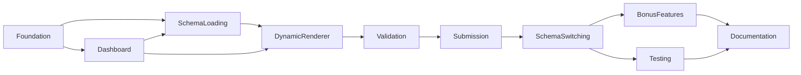

# FormFlow Tasks Planning

**Document Type:** Tasks Planning  
**Project:** FormFlow  
**Tagline:** Build Once. Configure Forever.  
**Version:** 1.0  
**Status:** Approved  
**Parent Document:** [implementation-plan.md](./implementation-plan.md) v1.0  
**Related Documents:** [constitution.md](./constitution.md) v1.1, [spec.md](./spec.md) v1.0, [schema-contract.md](./schema-contract.md) v1.0, [data-model.md](./data-model.md) v1.0, [design.md](./design.md) v1.0, [implementation-plan.md](./implementation-plan.md) v1.0  
**Timebox:** 3-day Angular case study

---

## 1. Document Overview

### 1.1 Purpose

This document defines **how** FormFlow Version 1.0 implementation work will be broken into engineering tasks. It translates the approved Implementation Planning phases into a task-decomposition strategy: categories, ordering principles, dependency rules, review rules, and acceptance rules for a future concrete task inventory.

This document is a **task planning strategy**, not the task list itself. Capability sequencing remains owned by the Implementation Plan. Behaviour remains owned by the Product Specification. Application structure remains owned by the Application Design. JSON structure remains owned by the Schema Contract. Entity vocabulary remains owned by the Data Model. Scope remains owned by the Constitution.

### 1.2 What This Document Is

- A Senior Technical Lead view of how phased capabilities become executable engineering work units
- A category model that aligns task grouping to Implementation Plan phases
- A set of ordering, dependency, review, and acceptance rules for future task authoring
- A governance frame that keeps tasks small, independent, reviewable, testable, and traceable to the Constitution and Product Specification

### 1.3 What This Document Is Not

This document does **not**:

- Generate the implementation task list, ticket backlog, or day-by-day stand-up schedule
- Generate Angular code, TypeScript, or configuration snippets
- Prescribe folder trees, file names, class names, or dependency injection graphs
- Estimate effort, story points, or calendar hours
- Restate full Product Specification journeys, Schema Contract examples, Design responsibility matrices, or Implementation Plan phase narratives

Those concerns belong either to upstream approved documents or to a subsequent concrete tasks document authored under the rules herein.

### 1.4 Audience

| Audience | Use of This Document |
|---|---|
| **Frontend Developer** | Author and execute future tasks under these category, ordering, and quality rules |
| **Technical Lead / Reviewer** | Judge whether proposed work units are well bounded, ordered, and traceable |
| **Evaluator** | See that implementation work was planned as disciplined engineering slices against AC-01–AC-11 |
| **Product Owner** | Confirm core Acceptance Criteria remain ahead of Bonus Features in task planning |
| **Future Maintainer** | Understand how work was intended to be sliced without mistaking this document for a ticket archive |

### 1.5 Document Relationships

| Document | Role |
|---|---|
| [constitution.md](./constitution.md) | Authoritative scope reference; wins on conflict |
| [spec.md](./spec.md) | Behavioural product specification; journeys, AC, UX |
| [schema-contract.md](./schema-contract.md) | JSON structure consumed by the renderer |
| [data-model.md](./data-model.md) | Business entities, relationships, lifecycle |
| [design.md](./design.md) | Application design: architecture, flows, responsibilities, UX |
| [implementation-plan.md](./implementation-plan.md) | Capability phases, milestones, and acceptance gates |
| **tasks-plan.md** (this document) | Strategy for breaking implementation into engineering tasks |

```mermaid
flowchart LR
  constitution[Constitution] --> spec[ProductSpecification]
  spec --> contract[SchemaContract]
  contract --> dataModel[DataModel]
  dataModel --> design[ApplicationDesign]
  design --> implementationPlan[ImplementationPlanning]
  implementationPlan --> tasksPlan[TasksPlanning]
  tasksPlan --> tasksList[ConcreteTasksDocument]
  tasksList --> coding[CodingPhase]
```

### 1.6 Conflict Resolution

Constitution → Product Specification → Schema Contract → Data Model → Design → Implementation Planning → Tasks Planning → Concrete Tasks → Coding.

When time is constrained, Business Goals and Acceptance Criteria (AC-01 through AC-11) take precedence over Bonus Features and Future Enhancements. Task ordering Must honour that precedence.

### 1.7 Planning Status

This document is **Approved**. It is the governing planning document for the FormFlow Version 1.0 implementation task breakdown. The concrete implementation task list Must not be generated until explicitly instructed. Until that instruction, this document stands alone as the task-planning authority subordinate to all upstream approved documents.

---

## 2. Objectives

| ID | Objective | Success Indicator | Upstream |
|---|---|---|---|
| **TASK-OBJ-01** | Provide a clear decomposition strategy for V1 implementation work | Future tasks can be authored without inventing new delivery phases | Implementation Plan §3–§4 |
| **TASK-OBJ-02** | Keep work units small, independent, reviewable, and testable | Each future task conveys a single capability slice with clear done criteria | Design §22; Implementation Plan quality gates |
| **TASK-OBJ-03** | Ensure every future task is traceable to Constitution and Specification | Tasks cite AC/FR/NFR (and Imp Plan phase) rather than undocumented intent | Constitution §11; Spec §20 |
| **TASK-OBJ-04** | Preserve Dynamic Form Renderer vs Banking Portal separation in task boundaries | Demo chrome and product engine work remain distinguishable slices | AC-09; NFR-01, NFR-02; Design §5 |
| **TASK-OBJ-05** | Protect core Acceptance Criteria before Bonus Features in task ordering | Bonus and optional testing follow AC-01–AC-11 readiness | AC-11; Implementation Plan §3.3, §10 |
| **TASK-OBJ-06** | Align task categories to Implementation Plan capability phases | Category model maps cleanly to Phases 1–9 without inventing conflicting timelines | Implementation Plan §4 |
| **TASK-OBJ-07** | Prevent this planning layer from becoming code, folders, or ticket noise | Document contains strategy and rules only; no tasks, estimates, or source | Implementation Plan §1.3, §13.3 |

---

## 3. Task Planning Strategy

### 3.1 Strategic Posture

FormFlow is a configuration-driven Dynamic Form Renderer. The Banking Portal is only a demonstration environment. Task planning therefore optimises for:

1. Stable foundation work that hosts both demo and renderer concerns
2. Early navigable demo shell without hardcoding per-module forms
3. Explicit Schema Loading as the bridge from catalog/host into renderer input
4. A single reusable renderer covering all six FieldTypes
5. Validation correctness before submission success theatre
6. Multi-schema evidence after one complete path is stable
7. Bonus, testing, and documentation only when core AC gates allow

This strategy reduces the risk that polish, bonus logic, or second-schema encoding is sliced into tasks before the primary product can render, validate, and submit.

### 3.2 Decomposition Method

Future implementation work Must be decomposed as follows:

1. Start from Implementation Plan capability phases and their completion criteria
2. Map each phase into one or more of the Task Categories in §4
3. Split category work into discrete engineering tasks only in a later concrete tasks document
4. Bound each future task to a single primary category and a primary upstream AC or FR intent where applicable
5. Keep Banking Portal (demo) tasks separate from Dynamic Form Renderer (product) tasks whenever practical
6. Prefer capability outcomes over ticket verbs when naming and describing future tasks
7. Refuse tasks that reopen settled Schema Contract, Data Model, Design, or Constitution decisions

### 3.3 Relationship to Implementation Phases

Implementation Planning owns **capability gates**. Tasks Planning owns **how those gates become work units**. Concrete tasks Must not redefine phase intent or invent alternate acceptance criteria.

Schema Loading is elevated as a task category even where the Implementation Plan discusses host readiness inside Dashboard and Renderer phases. As an engineering concern it covers obtaining, parsing, and supplying FormSchema to the Form Host / renderer boundary. It Must remain configuration-driven and Must not become a second rendering engine.

### 3.4 Quality Attributes for Every Future Task

Every future task Must be:

| Attribute | Meaning |
|---|---|
| **Small** | Completes a single coherent slice; avoids multi-phase mega-tasks |
| **Independent** | Minimises entanglement with unfinished sibling work; depends only on stated prerequisites |
| **Reviewable** | A reviewer can judge correctness against upstream IDs and category boundaries without reconstructing intent |
| **Testable** | Done criteria are observable (manual demo proof and/or test hooks appropriate to the category) |
| **Traceable** | Links back to Constitution and Product Specification (and relevant Imp Plan phase / AC) |

### 3.5 Principles Recurring Across Categories

- **One engine, many forms** — never plan per-module form-template tasks for banking scenarios
- **Configuration over code** — schema owns labels, options, messages, and order
- **Demo vs renderer boundary** — FormSchema in; FormState updates and Submission out
- **AC-first** — Bonus Features and Future Enhancements yield under time pressure
- **Ruthless timeboxing** — prefer architecture clarity over feature count in task scope
- **Client-side only** — no backend, auth, or remote validation tasks in V1

---

## 4. Task Categories

Future tasks will be grouped into the following categories. This section defines category purpose and upstream mapping only. It does **not** enumerate concrete tasks.

### 4.1 Foundation

**Purpose**

Establish the executable client-only baseline and treat demo-layer vs renderer-layer separation as an implementation invariant from the first coding slices.

**Maps primarily to**

Implementation Plan Phase 1 — Foundation

**Category boundary**

Includes local run readiness and stack baseline adoption. Does **not** claim product rendering, validation, or submission complete. Does **not** invent folder trees as a planning artifact here; coding realises Foundation without violating Design’s demo/renderer boundary.

**Upstream anchors**

AC-10; Design §22; IMP-OBJ-02, IMP-OBJ-07

### 4.2 Dashboard

**Purpose**

Materialise the Banking Portal as a navigable demonstration shell: FormScenario discovery, Form Host framing, and timeboxed portal presentation.

**Maps primarily to**

Implementation Plan Phase 2 — Dashboard UI

**Category boundary**

Demo-layer only. Must not embed per-scenario field markup. Must not consume renderer budget through polishing tasks that expand beyond Form Host readiness.

**Upstream anchors**

AC-08; FormScenario semantics (Data Model); Design navigation/UX guidance

### 4.3 Schema Loading

**Purpose**

Make FormSchema available to the Form Host / renderer boundary: load bundled schema configuration for a selected FormScenario and supply it as the renderer’s input without hardcoding field UI.

**Maps primarily to**

Implementation Plan Phases 2–3 (host ready to receive FormSchema; renderer consumption path)

**Category boundary**

Concerns acquisition and supply of FormSchema at the demo–renderer seam. Must not implement FieldType rendering, validation rules, or submission assembly. Must not introduce remote schema fetching as a V1 requirement.

**Upstream anchors**

Schema Contract root structure; FR-06; NFR-08; Design schema-load workflow

### 4.4 Dynamic Renderer

**Purpose**

Deliver the primary product: one reusable Dynamic Form Renderer that turns FormSchema into a Reactive Forms experience covering all six V1 FieldTypes.

**Maps primarily to**

Implementation Plan Phase 3 — Dynamic Renderer

**Category boundary**

Product engine work. Must remain demo-agnostic. Must not encode banking business rules in the renderer. Structural readiness for Validation attachment is part of the category intent; full Validation belongs in §4.5.

**Upstream anchors**

AC-01, AC-02; FR-01; Schema Contract FieldTypes; Design rendering workflow

### 4.5 Validation

**Purpose**

Apply schema-configured required and pattern validation with schema-configured messages, and ensure invalid submission cannot produce a Submission.

**Maps primarily to**

Implementation Plan Phase 4 — Validation

**Category boundary**

Sync, client-side validation only. Must not introduce async, remote, or cross-field validation engines. Must not celebrate submission success UI as a substitute for blocked invalid submit.

**Upstream anchors**

AC-03, AC-04, AC-06; Schema Contract validation object; Design invalid-submit behaviour

### 4.6 Submission

**Purpose**

Complete the success path: assemble a flat Submission from valid FormState and display formatted JSON for evaluator verification.

**Maps primarily to**

Implementation Plan Phase 5 — Submission Output

**Category boundary**

Client-side proof of capture only. Must not persist, network-post, or store submissions. Terminal success state only when Validation gates pass.

**Upstream anchors**

AC-05; FR-07, FR-08; Submission entity (Data Model)

### 4.7 Schema Switching

**Purpose**

Prove multi-schema reuse: at least two distinct FormSchemas selectable from the dashboard and consumed by the same renderer with correct lifecycle reset on navigate/switch.

**Maps primarily to**

Implementation Plan Phase 6 — Schema Switching

**Category boundary**

Same engine, different FormSchema. Must not create a second renderer. Third-schema convenience is configuration/catalog extensibility intent, not a V1 mandatory task outcome.

**Upstream anchors**

AC-07; FR-10; Design multi-schema switching; Schema Contract demo shapes

### 4.8 Bonus Features

**Purpose**

Optionally implement schema-driven conditional visibility and/or hidden, disabled, and readonly field states—only after core AC are green.

**Maps primarily to**

Implementation Plan Phase 7 — Bonus Features

**Category boundary**

Nice to Have. Must not begin while any of AC-01–AC-11 remain unmet. Must follow Schema Contract bonus properties; must not invent new product scope.

**Upstream anchors**

AC-B01; Constitution Nice-to-Have governance; Implementation Plan §4.7

### 4.9 Testing

**Purpose**

Add focused unit coverage for schema-driven rendering and validation behaviour using the Constitution testing stack expectation, after a stable core path.

**Maps primarily to**

Implementation Plan Phase 8 — Testing

**Category boundary**

Nice to Have relative to demonstrable AC. Tests Must reinforce Contract/Spec behaviour rather than demo chrome. Tests Must not replace manual demonstration of AC-01–AC-11.

**Upstream anchors**

AC-B02; Constitution testing technology expectation; Implementation Plan §4.8

### 4.10 Documentation

**Purpose**

Close the case study with evaluator-facing clarity, structural separation evidence, and confirmation that V1 stayed inside Constitution bounds.

**Maps primarily to**

Implementation Plan Phase 9 — Documentation & Final Review

**Category boundary**

Explains the demo and renderer for evaluation. Must not invent new V1 scope. Must support honest reporting of bonus done vs deferred.

**Upstream anchors**

AC-09, AC-10, AC-11; Implementation Plan §4.9

### 4.11 Category Summary

| Category | Primary Imp Plan Phase | Product vs Demo |
|---|---|---|
| Foundation | Phase 1 | Both (host baseline) |
| Dashboard | Phase 2 | Demo |
| Schema Loading | Phases 2–3 | Demo → Renderer seam |
| Dynamic Renderer | Phase 3 | Product |
| Validation | Phase 4 | Product |
| Submission | Phase 5 | Product + demo output surface |
| Schema Switching | Phase 6 | Demo selection + product reuse |
| Bonus Features | Phase 7 | Product (optional) |
| Testing | Phase 8 | Product focus (optional) |
| Documentation | Phase 9 | Evaluator-facing (both) |

---

## 5. Task Ordering Principles

Future concrete tasks Must be ordered using these principles:

1. **Foundation first** — baseline local run and separation invariant before dependent UI/renderer depth  
2. **Dashboard before deep renderer completion** — navigable Form Host shell exists early, remaining timeboxed  
3. **Schema Loading before claiming Renderer complete** — FormSchema supply path precedes FieldType coverage claims  
4. **Dynamic Renderer before Validation** — all six FieldTypes are renderable before invalid-submit gates are locked  
5. **Validation before Submission** — invalid path must be trustworthy before formatted JSON success theatre  
6. **One solid path before Schema Switching** — second schema after one end-to-end render → validate → submit path  
7. **Bonus only after core AC green** — AC-B01 work Must not precede AC-01–AC-11 readiness  
8. **Testing after stable core behaviour** — lock correct behaviour; avoid thrashing unfinished contracts  
9. **Documentation and structural proof last** — AC-09–AC-11 evidence closes the timebox  
10. **AC-first under time pressure** — drop or defer lower-priority slices rather than compromise mandatory AC

Ordering inside a category Should still keep tasks small and reviewable. Parallelism is allowed only where §6 dependency rules permit.

---

## 6. Task Dependencies

### 6.1 Category Dependency Flow

### 6.2 Hard Gates

Future tasks Must honour these hard gates:

| Dependent Category | Must wait for |
|---|---|
| Dashboard | Foundation |
| Schema Loading | Foundation; Dashboard Form Host framing sufficiently available to receive schema |
| Dynamic Renderer | Foundation; Schema Loading path available for at least one FormSchema; Dashboard host usable to exercise rendering |
| Validation | Dynamic Renderer coverage for the six FieldTypes on the active path |
| Submission | Validation invalid-path behaviour trustworthy |
| Schema Switching | Render → Validate → Submit path complete for at least one schema |
| Bonus Features | AC-01–AC-11 demonstrably green; Schema Switching phase intent met |
| Testing | Stable core renderer and validation behaviour (preferably through Schema Switching) |
| Documentation | Core path through Schema Switching complete |

### 6.3 Soft Parallelism

Limited parallel tasking is allowed after Foundation when:

- Dashboard presentation polish remains timeboxed and does not block Schema Loading / Renderer progress
- Schema Loading preparation and Dashboard catalog framing progress together toward Form Host readiness
- Documentation drafting of evaluator notes may begin late, but Documentation completion Must wait for structural and AC verification

Soft parallelism Must not justify beginning Validation before Renderer FieldType coverage, or Bonus Features before core AC.

### 6.4 Anti-Patterns

Task planning Must not:

- Create a second renderer for a second schema
- Split “Account Opening form template” and “Loan Inquiry form template” as separate product engines
- Place Submission display ahead of Validation gates for schedule optics
- Treat Testing as a substitute for unmet core AC demonstration
- Expand Bonus Features while any core AC remains unmet

---

## 7. Review Strategy

### 7.1 Review of Future Tasks and Work Units

When reviewing a future concrete task (or a PR that implements one), reviewers Must check:

| Check | Pass condition |
|---|---|
| **Traceability** | Task cites Constitution / Spec IDs (AC/FR/NFR) and Imp Plan phase/category |
| **Category fit** | Work matches a single primary category from §4 |
| **Size / independence** | Slice is small enough to review and not entangled with unfinished unrelated categories |
| **Demo vs renderer** | Boundary preserved; banking rules not hardcoded into the engine |
| **Ordering / dependencies** | Prerequisites from §5–§6 are satisfied |
| **Scope discipline** | No out-of-scope V1 expansion (AC-11) |
| **Contract fidelity** | Does not invent FieldTypes, validation modes, or JSON shapes outside Schema Contract |
| **Testability** | Done criteria are observable against Spec / AC |

Reviewers Must reject tasks that reopen settled upstream decisions or that masquerade as folder/API design documents.

### 7.2 Review Checklist for This Document

Use this checklist when reviewing this Tasks Planning document.

| # | Check | Pass? |
|---|---|---|
| 1 | Document defines HOW tasks will be planned, not the task inventory itself | ✓ |
| 2 | No Angular code, TypeScript, folder trees, estimates, or ticket lists | ✓ |
| 3 | Ten categories are defined with purpose, mapping, and boundaries | ✓ |
| 4 | Ordering principles protect Foundation → … → Documentation and AC-first posture | ✓ |
| 5 | Dependencies distinguish hard gates from soft parallelism | ✓ |
| 6 | Quality attributes require Small, Independent, Reviewable, Testable, Traceable | ✓ |
| 7 | Banking Portal is framed as demo; Dynamic Form Renderer as primary product | ✓ |
| 8 | Bonus Features and Testing remain optional after core AC | ✓ |
| 9 | Conflict order places this document after Implementation Planning and before concrete tasks / coding | ✓ |
| 10 | Status is Approved after review | ✓ |
| 11 | Out of Scope covers document exclusions and V1 product exclusions by reference | ✓ |

---

## 8. Acceptance Strategy

### 8.1 Acceptance of This Tasks Planning Approach

This Tasks Planning document is accepted when:

- Category coverage maps to Implementation Plan Phases 1–9 (with Schema Loading explicit at the host–renderer seam)
- Ordering and dependency rules would produce work units that favour AC-01–AC-11 before AC-B01–AC-B02
- Rules enforce Small, Independent, Reviewable, Testable, and Traceable attributes for future tasks
- Document exclusions are respected (no tasks, code, folders, estimates, or tickets herein)
- Demo vs renderer separation is preserved as a task-boundary rule

### 8.2 Acceptance of a Future Concrete Tasks Document

A later concrete tasks document manufactured under this plan is acceptable only when:

- Every task belongs to a category in §4
- Every task includes upstream traceability to Constitution and Product Specification (and Imp Plan phase where relevant)
- Ordering respects §5 and §6
- No task invents out-of-scope V1 product commitments
- The inventory remains a task breakdown for engineering execution—not a replacement for Spec, Design, or Implementation Plan gates

### 8.3 Relationship to Product Acceptance Gates

Product Acceptance Criteria AC-01–AC-11 and bonus AC-B01–AC-B02 remain owned by the Product Specification and Implementation Plan §10. Task planning acceptance proves decomposition quality; it does not itself certify product readiness.

### 8.4 Decision Rules Under Time Pressure

- Core AC unmet ⇒ prefer reordering or shrinking tasks that finish AC paths; do not expand Bonus Features
- Bonus unmet ⇒ not a V1 failure if AC-01–AC-11 hold
- Any proposed task that threatens AC-11 Must be deferred to Future Enhancements
- Conflict under time pressure ⇒ favour AC coverage over bonus depth and over secondary polish

---

## 9. Expected Deliverable

The expected deliverable of the Tasks Planning phase is this document:

**`specs/001-formflow/tasks-plan.md`**

This document is **Approved** and is the governing planning document for the FormFlow Version 1.0 implementation task breakdown.

- A subsequent concrete tasks document may be authored only when explicitly instructed
- That future document Must follow the category model, ordering principles, dependency rules, review strategy, and quality attributes herein
- Coding remains subordinate to Constitution, Product Specification, Schema Contract, Data Model, Design, Implementation Planning, and this Tasks Planning document
- This plan Must not be misread as a ticket backlog or estimate sheet

---

## 10. Writing Conventions

These conventions govern this document and Should guide the authoring of any future concrete tasks document derived from it.

### 10.1 Language

- Prefer product language from upstream docs: FormSchema, Field, FieldType, Validation, Option, FormState, Submission, FormScenario, Dynamic Form Renderer, Banking Portal
- Prefer “Must / Must not” for task-quality, ordering, and scope discipline
- Prefer capability outcomes over ticket verbs
- Prefer evaluator-visible proof language for done criteria in future tasks

### 10.2 Structure

- Numbered sections matching this planning template
- Tables for objectives, categories, dependencies, review checks, and acceptance
- Mermaid diagrams only for document relationships and category dependency flow—not for class or folder diagrams
- Category sections always include purpose, Imp Plan mapping, boundary, and upstream anchors

### 10.3 Prohibitions for This Document Type

- No concrete engineering task inventories
- No ticket IDs, story points, or effort estimates
- No code fences containing application source
- No TypeScript interfaces or Angular snippets
- No folder trees or file inventories
- No API surface design
- No expansion of FieldTypes, validation modes, or Future Enhancements into V1 commitments

### 10.4 Traceability Style

When referencing requirements, cite stable IDs (AC-xx, FR-xx, NFR-xx, IMP-OBJ-xx, TASK-OBJ-xx) or upstream section intent rather than copying large specification passages.

### 10.5 Future Task Authoring Conventions

When a concrete tasks document is later authorised, each task Must:

- Declare a primary category from §4
- State prerequisites using category and/or AC language from §5–§6
- Cite Constitution and Specification anchors
- Define observable done criteria
- Remain Small, Independent, Reviewable, Testable, and Traceable

---

## 11. Out of Scope

### 11.1 Out of Scope for This Document

- Generation of the implementation task list
- Angular / TypeScript implementation
- Effort estimates, story points, or calendar schedules
- Ticket tracker export formats
- Folder structure and naming schemes
- Service, component, or DI API design
- Pixel-perfect mockups and asset pipelines
- CI/CD configuration detail
- Rewriting Constitution, Spec, Contract, Data Model, Design, or Implementation Plan content

### 11.2 Out of Scope for V1 Implementation Work Guided by This Plan

Consistent with Constitution, Product Specification, Schema Contract, Data Model, Design, and Implementation Plan:

- Backend, database, API integrations, persistence of submissions
- Authentication, authorisation, multi-tenancy
- Form builder UI, schema authoring tools, npm library publishing
- FieldTypes beyond the closed set of six
- File upload, rich text, radio groups, formatted number controls as V1 commitments
- Wizard / multi-step forms
- Async validators, remote validation, cross-field validation engines
- Computed fields, event-hook buses, plugin architectures
- External options loading, i18n frameworks
- Schema versioning / migration systems
- Workflow, approvals, analytics
- Treating Bonus Features as mandatory V1 scope
- Any Future Enhancement listed in Constitution §13 as part of the three-day deliverable

### 11.3 Deferred by Governance

If time remains after AC-01–AC-11, only Schema Contract–defined bonus behaviours and focused unit tests may be tasked. Everything else remains deferred. Concrete task generation remains deferred until the next instruction.

---

## Document Governance

This Tasks Planning document is subordinate to the [FormFlow Constitution](./constitution.md). Behavioural requirements come from the [Product Specification](./spec.md). JSON structure comes from the [Schema Contract](./schema-contract.md). Entity vocabulary and lifecycle come from the [Data Model](./data-model.md). Application structure and flows come from the [Application Design](./design.md). Capability sequencing and acceptance gates come from the [Implementation Planning](./implementation-plan.md) document.

**Conflict resolution:** Constitution → Product Specification → Schema Contract → Data Model → Design → Implementation Planning → Tasks Planning.

Changes that affect V1 scope, field types, validation behaviour, navigation, or demo modules require updates to the relevant upstream documents before Tasks Planning or concrete-task changes are made.

When time is constrained, choices that satisfy AC-01 through AC-11 take precedence over Bonus Features and Future Enhancements.

This document is the governing planning document for the FormFlow Version 1.0 implementation task breakdown. Do not generate the concrete implementation task list until explicitly instructed.

### Review Status

| Attribute | Value |
|---|---|
| **Document** | `specs/001-formflow/tasks-plan.md` |
| **Version** | 1.0 |
| **Status** | Approved |
| **Next step** | Wait for instruction to author the concrete implementation task list under this plan; do not generate tasks yet |
