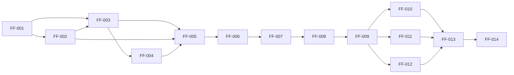

# FormFlow Implementation Tasks

**Document Type:** Implementation Task Backlog  
**Project:** FormFlow  
**Tagline:** Build Once. Configure Forever.  
**Version:** 1.0  
**Status:** Ready for Implementation  
**Parent Document:** [tasks-plan.md](./tasks-plan.md) v1.0  
**Related Documents:** [constitution.md](./constitution.md) v1.1, [spec.md](./spec.md) v1.0, [schema-contract.md](./schema-contract.md) v1.0, [data-model.md](./data-model.md) v1.0, [design.md](./design.md) v1.0, [implementation-plan.md](./implementation-plan.md) v1.0, [tasks-plan.md](./tasks-plan.md) v1.0  
**Timebox:** 3-day Angular case study

---

## 1. Document Overview

### 1.1 Purpose

This document is the **concrete implementation task backlog** for FormFlow Version 1.0. It converts the approved planning documents into discrete engineering tasks that Cursor Agent (or a developer) executes **one task at a time**.

Capability sequencing remains owned by the Implementation Plan. Behaviour remains owned by the Product Specification. Application structure remains owned by the Application Design. JSON structure remains owned by the Schema Contract. Entity vocabulary remains owned by the Data Model. Scope remains owned by the Constitution. Task decomposition rules remain owned by the Tasks Plan.

### 1.2 What This Document Is

- An executable inventory of Small, Independent, Reviewable, Testable, and Traceable tasks
- A category-ordered backlog aligned to [tasks-plan.md](./tasks-plan.md) §4–§6
- The sole task list Cursor Agent should consume during the coding phase

### 1.3 What This Document Is Not

This document does **not**:

- Contain Angular code, TypeScript, configuration snippets, or folder trees
- Estimate effort, story points, or calendar hours
- Replace Spec, Design, Schema Contract, or Implementation Plan acceptance gates
- Treat Bonus Features or Unit Testing as mandatory for V1 completion

### 1.4 Conflict Resolution

Constitution → Product Specification → Schema Contract → Data Model → Design → Implementation Planning → Tasks Planning → **Concrete Tasks (this document)** → Coding.

When time is constrained, Business Goals and Acceptance Criteria (**AC-01 through AC-11**) take precedence over Bonus Features and Future Enhancements.

### 1.5 Nice-to-Have Gate

**FF-010** (Bonus Features) and **FF-011** (Unit Testing) are Nice to Have. They Must not begin until core AC-01–AC-11 are demonstrably green. Either task may be marked **Deferred** without V1 failure if time remains insufficient after the core path.

### 1.6 Anti-Patterns (Must Not)

- Create a second renderer for a second FormSchema
- Split per-module banking form templates as separate product engines
- Place Submission display ahead of Validation gates
- Begin Bonus or Testing while any core AC remains unmet
- Introduce backend, authentication, persistence, async validation, or out-of-scope FieldTypes

### 1.7 Task Dependency Flow

**Soft parallelism note:** FF-004 may progress once the Schema Loading path (FF-003) exists. Renderer completion (FF-005) still requires at least one loadable FormSchema.

### 1.8 Task Inventory Summary

| ID | Category | Title |
|---|---|---|
| FF-001 | Foundation | Establish client-only Angular baseline and demo/renderer separation invariant |
| FF-002 | Banking Dashboard | Deliver navigable Banking Portal dashboard and Form Host shell |
| FF-003 | Schema Loading | Supply FormSchema to Form Host via scenario catalog and bundled load |
| FF-004 | Schema Loading | Author account-opening and loan-inquiry FormSchemas |
| FF-005 | Dynamic Form Renderer | Implement single reusable renderer for all six FieldTypes with Reactive Forms |
| FF-006 | Validation | Apply required validation with schema-configured messages |
| FF-007 | Validation | Apply pattern validation and block invalid submit with visible errors |
| FF-008 | Submission Output | Assemble flat Submission and display formatted JSON on valid submit |
| FF-009 | Schema Switching | Enable two-schema selection with FormState reset on switch |
| FF-010 | Bonus Features | Optionally implement visibility, hidden, disabled, and readonly behaviours |
| FF-011 | Unit Testing | Optionally add unit coverage for renderer and validation |
| FF-012 | Documentation | Produce evaluator-facing run guidance and intent clarity |
| FF-013 | Final QA | Verify AC-01 through AC-11 and V1 Definition of Done |
| FF-014 | Final QA | Confirm demo vs renderer boundary and honest bonus/deferred status |

---

## 2. Foundation

### FF-001 — Establish client-only Angular baseline and demo/renderer separation invariant

| Attribute | Content |
|---|---|
| **Task ID** | FF-001 |
| **Title** | Establish client-only Angular baseline and demo/renderer separation invariant |
| **Category** | Foundation |
| **Objective** | Create an executable, client-only application host that adopts the Constitution technology stack and treats Banking Portal (demo) vs Dynamic Form Renderer (product) separation as an implementation invariant from the first coding slice. |
| **Description** | Establish the runnable baseline for the three-day case study so subsequent dashboard and renderer work share a single client-only application context. Adopt Angular, Reactive Forms posture, PrimeNG, and Tailwind CSS as the working stack baseline. Recognise demo-layer vs renderer-layer separation as a non-negotiable boundary (Design §5, NFR-02). Treat Schema Contract and Data Model vocabulary (FormSchema, Field, FieldType, Validation, Option, FormState, Submission, FormScenario) as the shared domain language. Do not claim product rendering, validation, or submission complete in this task. Do not introduce backend, authentication, or remote services. |
| **Dependencies** | None (first coding task). Requires approved upstream documents: Constitution, Spec, Schema Contract, Data Model, Design, Implementation Plan, Tasks Plan. |
| **Inputs** | [constitution.md](./constitution.md) §§3, 9–11; [design.md](./design.md) §§5, 22; [implementation-plan.md](./implementation-plan.md) §4.1; [tasks-plan.md](./tasks-plan.md) §4.1; [data-model.md](./data-model.md) entity vocabulary |
| **Expected Output** | Local application starts without server, database, or authentication setup. Demo vs renderer separation is an explicit project invariant. Vocabulary alignment is established. No FieldType rendering or form business behaviour is claimed complete. |
| **Acceptance Criteria** | 1. Application runs locally with no backend setup (supports AC-10). 2. Constitution stack (Angular, Reactive Forms intent, PrimeNG, Tailwind) is the adopted baseline. 3. Demo/renderer boundary is preserved as an implementation invariant (supports AC-09 posture). 4. No product claim beyond baseline host readiness. 5. No out-of-scope infrastructure introduced (supports AC-11). |
| **Definition of Done** | Local run is demonstrable; separation invariant is reviewable; task remains Small/Independent; no estimates or extra scope added; traceable to Foundation phase. |
| **Related FR / AC** | AC-10, AC-09 (posture), AC-11; NFR-01, NFR-02, NFR-06, NFR-10; IMP-OBJ-02, IMP-OBJ-07; Implementation Plan Phase 1; TASK-OBJ-04 |

---

## 3. Banking Dashboard

### FF-002 — Deliver navigable Banking Portal dashboard and Form Host shell

| Attribute | Content |
|---|---|
| **Task ID** | FF-002 |
| **Title** | Deliver navigable Banking Portal dashboard and Form Host shell |
| **Category** | Banking Dashboard |
| **Objective** | Materialise the Banking Portal as a navigable demonstration shell with FormScenario discovery, Form Host framing, and a credible portal theme—without embedding per-scenario field markup. |
| **Description** | Build the demo-layer entry experience: Dashboard as default landing view and Form Host as the view that will later receive FormSchema and host the Dynamic Form Renderer. Present conceptual slots for Account Opening and Loan Inquiry with title and description. Support clear navigation Dashboard ↔ Form Host without requiring browser refresh for scenario switching later. Apply a polished banking-portal visual theme using PrimeNG and Tailwind within a strict timebox—credibility over pixel perfection. Dashboard Must not contain hardcoded module-specific form fields. Form Host Must be ready to receive a FormSchema in a subsequent Schema Loading / Renderer task. |
| **Dependencies** | FF-001 (Foundation) |
| **Inputs** | [spec.md](./spec.md) §§8 (US-01), 11, 12, 18.1–18.2; [design.md](./design.md) §§6–7, 10.3, 13; [data-model.md](./data-model.md) FormScenario; [implementation-plan.md](./implementation-plan.md) §4.2; Constitution NFR-04; [tasks-plan.md](./tasks-plan.md) §4.2 |
| **Expected Output** | Navigable Banking Portal dashboard showing at least two scenario slots; Form Host shell reachable from dashboard; return path to dashboard; portal theme applied; no per-module field markup in demo chrome. |
| **Acceptance Criteria** | 1. Banking Portal dashboard is present, navigable, and visually coherent (AC-08). 2. At least Account Opening and Loan Inquiry scenario slots are represented for selection (FR-11/FR-12/FR-13 posture). 3. Navigation Dashboard ↔ Form Host works without inventing login or wizard flows. 4. No hardcoded banking form fields live in the dashboard (NFR-02). 5. UI effort remains timeboxed so renderer budget is not consumed. |
| **Definition of Done** | AC-08 demonstrable at shell level; demo-only boundary honoured; reviewable against Design navigation; Independent of renderer FieldType depth. |
| **Related FR / AC** | AC-08; FR-12, FR-13; US-01; NFR-04; Implementation Plan Phase 2; Design §7 |

---

## 4. Schema Loading

### FF-003 — Supply FormSchema to Form Host via scenario catalog and bundled load

| Attribute | Content |
|---|---|
| **Task ID** | FF-003 |
| **Title** | Supply FormSchema to Form Host via scenario catalog and bundled load |
| **Category** | Schema Loading |
| **Objective** | Make FormSchema available at the demo–renderer seam: resolve a selected FormScenario to a bundled FormSchema and supply that schema as renderer input without hardcoding field UI. |
| **Description** | Implement the configuration-driven load path between Banking Portal / Form Host and the (forthcoming) Dynamic Form Renderer. On scenario selection, resolve FormSchema by `id` from the static bundled catalog. Confirm required root properties (`id`, `title`, `fields`) per Schema Contract. If structurally invalid, do not render the form; show a meaningful configuration error state on the Form Host (Spec §17.3). Do not implement FieldType rendering, validation rules, or submission assembly in this task. Do not introduce remote schema fetching. Demo catalog registration remains a demo-layer concern; the renderer remains schema-agnostic. |
| **Dependencies** | FF-001 (Foundation); FF-002 (Dashboard Form Host framing sufficiently available to receive schema) |
| **Inputs** | [schema-contract.md](./schema-contract.md) §§4, 17–18; [design.md](./design.md) §8.2; [spec.md](./spec.md) §§13, 17.3; [data-model.md](./data-model.md) FormSchema, FormScenario lifecycle; [implementation-plan.md](./implementation-plan.md) Phases 2–3 seam; [tasks-plan.md](./tasks-plan.md) §4.3; NFR-08 |
| **Expected Output** | Selecting a FormScenario loads the corresponding bundled FormSchema into the Form Host boundary ready for the renderer. Invalid root shape yields a configuration error state. No remote fetch. No field rendering claimed complete. |
| **Acceptance Criteria** | 1. FormSchema is obtained from bundled static configuration for a selected scenario. 2. Root structural checks for `id`, `title`, `fields` are honoured. 3. Configuration errors surface a meaningful Form Host state rather than a crash. 4. Load path does not hardcode field UI or banking business rules. 5. Schema remains data (NFR-08); no code-required copy change for labels/messages later. |
| **Definition of Done** | Host–renderer seam for FormSchema supply is demonstrable; configuration error path is observable; category boundary (no rendering/validation) is respected. |
| **Related FR / AC** | FR-06, FR-10 (load posture); NFR-03, NFR-08, NFR-10; Spec §17.3; Design §8.2; Implementation Plan Phases 2–3; AC-07/AC-09 enabling |

---

### FF-004 — Author account-opening and loan-inquiry FormSchemas

| Attribute | Content |
|---|---|
| **Task ID** | FF-004 |
| **Title** | Author account-opening and loan-inquiry FormSchemas |
| **Category** | Schema Loading |
| **Objective** | Provide the two V1 bundled FormSchemas (`account-opening` and `loan-inquiry`) as configuration data conforming to the Schema Contract and Product Specification module definitions. |
| **Description** | Author complete static JSON FormSchemas for Account Opening and Loan Inquiry per Spec §11 and Schema Contract §15–§16. Include titles, descriptions, submit labels, ordered fields, options, defaults, and validation objects with explicit messages for bundled demos. Together the two schemas Must cover all six FieldTypes and both validation kinds (required and pattern). Register both in the demo Scenario Catalog so dashboard cards can expose them. Do not implement a second renderer. Do not invent FieldTypes or JSON properties outside the Contract. Duplicate field keys Must not appear (EC-16). |
| **Dependencies** | FF-003 (Schema load / catalog path available). Soft parallel with early FF-005 work is allowed; FF-005 completion requires at least one loadable schema. |
| **Inputs** | [spec.md](./spec.md) §11, §21.3; [schema-contract.md](./schema-contract.md) §§12, 14–16, Appendix; [data-model.md](./data-model.md) demo instances; [design.md](./design.md) §7.5, §11; [tasks-plan.md](./tasks-plan.md) §4.3 |
| **Expected Output** | Two distinct, Contract-conforming FormSchemas bundled and catalogued: `account-opening` and `loan-inquiry`. Both selectable via dashboard Scenario Catalog. Combined FieldType and validation coverage matrix satisfied. |
| **Acceptance Criteria** | 1. `account-opening` matches Spec §11.1 field/validation intent. 2. `loan-inquiry` matches Spec §11.2 field/validation intent. 3. Both conform to Schema Contract root/field/validation/option rules. 4. Together they cover text, textarea, date, dropdown, multiselect, checkbox, plus email and numeric pattern examples. 5. Catalog registration exposes both scenarios (supports AC-07 data readiness). 6. No duplicate keys; messages are explicit in bundled demos. |
| **Definition of Done** | Schemas are configuration-only deliverables; Contract-faithful; reviewable against Spec modules; Independent of renderer control wiring except as loadable assets. |
| **Related FR / AC** | AC-07 (data prep); FR-10, FR-11; NFR-03, NFR-08; Spec §11, §21.3; Schema Contract §15–§16; US-08 posture |

---

## 5. Dynamic Form Renderer

### FF-005 — Implement single reusable renderer for all six FieldTypes with Reactive Forms

| Attribute | Content |
|---|---|
| **Task ID** | FF-005 |
| **Title** | Implement single reusable renderer for all six FieldTypes with Reactive Forms |
| **Category** | Dynamic Form Renderer |
| **Objective** | Deliver the primary FormFlow product: one reusable Dynamic Form Renderer that turns any V1-conforming FormSchema into a Reactive Forms experience covering all six FieldTypes. |
| **Description** | Implement a single demo-agnostic renderer that accepts FormSchema, initialises FormState with explicit/implicit defaults (Design §8.3 / Data Model), builds the form model programmatically via Reactive Forms (not template-driven forms), and renders fields in schema `fields` array order. Support FieldTypes: `text`, `textarea`, `date`, `dropdown`, `multiselect`, `checkbox`. Bind labels, placeholders (text/textarea), and options (dropdown/multiselect display label / store value). Honour accessibility association of labels to controls. Do not hardcode banking labels/options in the engine. Do not introduce validation gates or Submission JSON display in this task beyond structural readiness to attach validation next. Do not create per-module form templates. |
| **Dependencies** | FF-001; FF-002 (host usable to exercise rendering); FF-003 (load path); FF-004 (at least one—preferably both—loadable schemas available for proof) |
| **Inputs** | [spec.md](./spec.md) §§5.1, 9.1, 14, 18.3, 18.6; [schema-contract.md](./schema-contract.md) §§5–6, 8, 11; [design.md](./design.md) §§8.3–8.5, 10.2; [data-model.md](./data-model.md) Field, FieldType, FormState; [implementation-plan.md](./implementation-plan.md) §4.3; [tasks-plan.md](./tasks-plan.md) §4.4; Constitution FR-01–FR-03 |
| **Expected Output** | One Dynamic Form Renderer renders all six FieldTypes from FormSchema using Reactive Forms state. Labels, order, options, and defaults come from configuration. Renderer unchanged when swapping schema content that belongs in JSON. |
| **Acceptance Criteria** | 1. Single renderer renders all six supported FieldTypes from JSON schema (AC-01). 2. Reactive Forms used; form state managed programmatically (AC-02). 3. Fields render in schema order with schema labels; placeholders apply where defined. 4. Dropdown/multiselect bind Option label/value correctly; checkbox/multiselect defaults follow Contract. 5. Renderer does not require code changes to swap labels/options that belong in schema (NFR-08). 6. No banking business rules hardcoded in the engine (NFR-02). 7. Structural readiness exists to attach Validation without redesigning the engine concept. |
| **Definition of Done** | AC-01 and AC-02 are demonstrable in Form Host; product vs demo boundary remains clean; reviewable against Design rendering workflow. |
| **Related FR / AC** | AC-01, AC-02; FR-01, FR-02, FR-03; US-02, US-03; NFR-02, NFR-05, NFR-08; Implementation Plan Phase 3 |

---

## 6. Validation

### FF-006 — Apply required validation with schema-configured messages

| Attribute | Content |
|---|---|
| **Task ID** | FF-006 |
| **Title** | Apply required validation with schema-configured messages |
| **Category** | Validation |
| **Objective** | Apply schema-configured required validation across FieldTypes with schema-configured error messages, preparing the invalid-submit gate without celebrating Submission success UI. |
| **Description** | Attach required validation driven by Field `validation.required` and display `validation.messages.required` from the FormSchema (FR-06). Honour required behaviour by FieldType (text/textarea non-empty; date selected; dropdown selected; multiselect ≥1; checkbox true). Validation is synchronous and client-side only. Feedback Must be available on submit attempt and Should update through standard interaction (touch/blur). Do not introduce pattern validation depth, async validators, remote validation, or cross-field engines in this task (pattern + submit block complete in FF-007). Do not display Submission JSON as a substitute for validation proof. Bundled demos include explicit messages; fallback text Must not replace that requirement for demos. |
| **Dependencies** | FF-005 (six FieldTypes renderable on the active path) |
| **Inputs** | [spec.md](./spec.md) §§15.1–15.3, 15.5, 17.1–17.2, 19 (EC-01–EC-03, EC-10); [schema-contract.md](./schema-contract.md) §7; [design.md](./design.md) §9; [implementation-plan.md](./implementation-plan.md) §4.4; [tasks-plan.md](./tasks-plan.md) §4.5 |
| **Expected Output** | Required fields show schema-configured required messages when empty/unselected/unchecked. Messages are configuration-driven, not hardcoded per banking field in templates. |
| **Acceptance Criteria** | 1. Required validation works and shows schema-configured error messages (AC-03). 2. Required behaviour matches Spec/Contract FieldType table. 3. Messages sourced from `validation.messages.required` (FR-06). 4. No async/remote/cross-field validation introduced. 5. Blank submit path shows required errors for applicable fields (EC-01 posture). |
| **Definition of Done** | AC-03 demonstrable; category stays within Validation (no Submission display); Independent of pattern/submit-block completion except as sequenced precursor. |
| **Related FR / AC** | AC-03; FR-04, FR-06; US-04; NFR-05, NFR-08; Implementation Plan Phase 4 (partial) |

---

### FF-007 — Apply pattern validation and block invalid submit with visible errors

| Attribute | Content |
|---|---|
| **Task ID** | FF-007 |
| **Title** | Apply pattern validation and block invalid submit with visible errors |
| **Category** | Validation |
| **Objective** | Complete schema-driven pattern validation and ensure invalid submission cannot produce a Submission—errors remain visible and FormState stays editable. |
| **Description** | Apply `validation.pattern` for applicable FieldTypes (`text`, `textarea` only). Display `validation.messages.pattern` on failure. Pattern runs only when a value is present; empty optional fields Must not raise pattern errors (EC-06). On any validation failure at submit: block submission, show all applicable field errors, do not display Submission JSON (AC-06 / Spec §16.3). Allow correction and resubmit (EC-08). Keep validation sync and client-side only. Do not assemble or celebrate formatted Submission output in this task (owned by FF-008). |
| **Dependencies** | FF-006 (required validation path in place; FieldTypes covered) |
| **Inputs** | [spec.md](./spec.md) §§15.4–15.5, 16.3, 17.1, 19 (EC-06–EC-08); [schema-contract.md](./schema-contract.md) §7; [design.md](./design.md) §§9.3–9.5; [implementation-plan.md](./implementation-plan.md) §4.4; [tasks-plan.md](./tasks-plan.md) §4.5 |
| **Expected Output** | Pattern failures show schema messages; invalid submit is blocked with visible errors; no Submission produced on invalid path; user can correct and retry. |
| **Acceptance Criteria** | 1. Pattern validation works and shows schema-configured messages (AC-04). 2. Submitting an invalid form is blocked and errors are visible (AC-06). 3. Pattern applies only to text/textarea and only when value present (EC-06). 4. Multiple failing fields show all applicable errors. 5. No Submission JSON displayed on invalid path. 6. No async/remote validation introduced. |
| **Definition of Done** | AC-04 and AC-06 demonstrable; invalid path trustworthy for FF-008; Reviewable against Spec invalid-submit rules. |
| **Related FR / AC** | AC-04, AC-06; FR-05, FR-06, FR-09; US-04, US-06; Implementation Plan Phase 4 |

---

## 7. Submission Output

### FF-008 — Assemble flat Submission and display formatted JSON on valid submit

| Attribute | Content |
|---|---|
| **Task ID** | FF-008 |
| **Title** | Assemble flat Submission and display formatted JSON on valid submit |
| **Category** | Submission Output |
| **Objective** | Complete the success path: assemble a flat Submission from valid FormState and display human-readable formatted JSON on the Form Host for evaluator verification. |
| **Description** | When all validation rules pass, collect current FieldValues into a flat Submission object keyed by Field `key` values. Include type-appropriate empty values for optional empty fields (`""`, `[]`, `false` as applicable per Spec §16.4). Display formatted JSON clearly on the Form Host (demo-layer output panel). Submit button uses schema `submitLabel` or default `"Submit"` (EC-13). Invalid path continues to produce no Submission. Perform no persistence, network post, email, or storage. Treat on-screen JSON as the terminal success state. |
| **Dependencies** | FF-007 (Validation invalid-path behaviour trustworthy) |
| **Inputs** | [spec.md](./spec.md) §§16, 18.5, 19 (EC-04–EC-05, EC-11–EC-13); [data-model.md](./data-model.md) Submission; [design.md](./design.md) §§8.7, 9.6, 10.1; [schema-contract.md](./schema-contract.md) submission rules; [implementation-plan.md](./implementation-plan.md) §4.5; [tasks-plan.md](./tasks-plan.md) §4.6 |
| **Expected Output** | Valid submit displays captured values as formatted JSON. Keys match schema field keys. Client-side proof of capture only. |
| **Acceptance Criteria** | 1. Submitting a valid form displays captured values as JSON (AC-05). 2. Submission occurs only when validation passes (FR-07, FR-09 gate). 3. Flat object keyed by field `key`; type rules for string/date/dropdown/multiselect/checkbox honoured. 4. Output remains client-side; no persistence (NFR-10 / Constitution). 5. Invalid path still produces no Submission. |
| **Definition of Done** | AC-05 demonstrable on at least one complete schema path; Independent of multi-schema switching; Reviewable against Submission entity rules. |
| **Related FR / AC** | AC-05; FR-07, FR-08; US-05; NFR-06; Implementation Plan Phase 5 |

---

## 8. Schema Switching

### FF-009 — Enable two-schema selection with FormState reset on switch

| Attribute | Content |
|---|---|
| **Task ID** | FF-009 |
| **Title** | Enable two-schema selection with FormState reset on switch |
| **Category** | Schema Switching |
| **Objective** | Prove multi-schema reuse: at least two distinct FormSchemas selectable from the dashboard and consumed by the same Dynamic Form Renderer with correct FormState lifecycle reset on navigate/switch. |
| **Description** | Ensure Account Opening and Loan Inquiry are both selectable from the Banking Portal dashboard and each loads its FormSchema into the **same** renderer. Switching Must not require a second renderer or per-module templates. On navigate away / schema switch, discard prior FormState and any displayed Submission; initialise a fresh FormState from the newly selected schema (EC-09). No browser refresh required (Spec §18.7). Together the two demos exercise the six FieldTypes and both validation kinds for V1 evaluation. Adding a third schema Must remain a configuration + catalog concern, not a renderer rewrite (Design extensibility intent)—a third schema is not required for V1. |
| **Dependencies** | FF-008 (render → validate → submit path complete for at least one schema); FF-004 schemas available; FF-002/FF-003 catalog and load path |
| **Inputs** | [spec.md](./spec.md) §§5.4, 9.4, 11.3, 12, 18.7, 19 EC-09, AC-07; [design.md](./design.md) §11; [implementation-plan.md](./implementation-plan.md) §4.6; [tasks-plan.md](./tasks-plan.md) §4.7; FR-10, FR-11 |
| **Expected Output** | Two distinct schemas selectable; same engine renders both; lifecycle reset on switch; end-to-end validate/submit works on both paths. |
| **Acceptance Criteria** | 1. At least two distinct JSON schemas available and selectable from the dashboard (AC-07). 2. Switching does not require a second renderer (FR-10). 3. Prior FormState does not carry over (EC-09). 4. Combined coverage of six FieldTypes and both validation kinds is demonstrable across the two demos. 5. No browser refresh required to switch scenarios. |
| **Definition of Done** | AC-07 demonstrable; core product path through Schema Switching complete; enables gate for Bonus/Testing/Docs. |
| **Related FR / AC** | AC-07; FR-10, FR-11; US-07, US-08; NFR-02, NFR-03, NFR-07; Implementation Plan Phase 6 |

---

## 9. Bonus Features

### FF-010 — Optionally implement visibility, hidden, disabled, and readonly behaviours

| Attribute | Content |
|---|---|
| **Task ID** | FF-010 |
| **Title** | Optionally implement visibility, hidden, disabled, and readonly behaviours |
| **Category** | Bonus Features |
| **Priority** | Nice to Have — gated |
| **Objective** | If and only if AC-01 through AC-11 are demonstrably green, optionally implement schema-driven conditional visibility and/or hidden, disabled, and readonly field states per Schema Contract bonus properties. |
| **Description** | Implement a subset or all of: `visibleWhen` (equals only), `hidden`, `disabled`, `readonly` according to Schema Contract §9–§10 and Design §14. Honour Submission inclusion rules for bonus states (EC-14, EC-15) when implemented. Core render/validate/submit path Must remain unchanged and uncompromised. Authors Should use one state flag per Field in demos; combining flags is undefined in V1. **Hard gate:** Do not begin while any of AC-01–AC-11 remain unmet. If time cannot support safe delivery, mark this task **Deferred**; deferral is not a V1 failure. |
| **Dependencies** | FF-009 complete; **AC-01–AC-11 demonstrably green** |
| **Inputs** | [schema-contract.md](./schema-contract.md) §§9–10; [spec.md](./spec.md) §§5.7, 9.6, 13.6, FR-B01–FR-B04, AC-B01, EC-14–EC-15; [design.md](./design.md) §14; [implementation-plan.md](./implementation-plan.md) §4.7; [tasks-plan.md](./tasks-plan.md) §4.8; Constitution Nice-to-Have governance |
| **Expected Output** | Either: (a) implemented bonus subset satisfying AC-B01 for what was delivered, or (b) explicit Deferred status recorded for Final QA/Documentation honesty. |
| **Acceptance Criteria** | 1. Work begins only after core AC-01–AC-11 are green. 2. If delivered: behaviours follow Contract bonus properties; AC-B01 satisfied for implemented subset. 3. If not delivered: explicitly deferred; not treated as V1 failure. 4. Core path uncompromised; no new product scope invented. |
| **Definition of Done** | Either AC-B01 demonstrable for chosen subset, or Deferred documented; gate compliance reviewable. |
| **Related FR / AC** | AC-B01; FR-B01, FR-B02, FR-B03, FR-B04; US-B01; Implementation Plan Phase 7 |

---

## 10. Unit Testing

### FF-011 — Optionally add unit coverage for renderer and validation

| Attribute | Content |
|---|---|
| **Task ID** | FF-011 |
| **Title** | Optionally add unit coverage for renderer and validation |
| **Category** | Unit Testing |
| **Priority** | Nice to Have — gated |
| **Objective** | If time remains after a stable core path (preferably through Schema Switching), add focused unit coverage for schema-driven rendering and validation behaviour using the Constitution testing stack (Jasmine & Karma). |
| **Description** | Add meaningful unit tests for core Dynamic Form Renderer and validation logic: schema interpretation/parsing of relevant structures, field rendering paths for FieldTypes, and required/pattern behaviour with schema messages. Tests Must reinforce Contract/Spec behaviour rather than Banking Portal chrome. Tests Must not replace manual demonstration of AC-01–AC-11. Prefer starting after FF-009. If time cannot support delivery, mark **Deferred**; not a V1 failure. |
| **Dependencies** | Stable FF-005–FF-007 behaviour; preferably FF-009 complete. Soft parallel with FF-010 only after core AC green. |
| **Inputs** | [constitution.md](./constitution.md) §3 Testing, FR-B05, NFR-11, AC-B02; [spec.md](./spec.md) §10.5; [implementation-plan.md](./implementation-plan.md) §4.8; [tasks-plan.md](./tasks-plan.md) §4.9 |
| **Expected Output** | Either: (a) unit tests exist and pass for core renderer and validation logic (AC-B02), or (b) explicit Deferred status. |
| **Acceptance Criteria** | 1. If delivered: AC-B02 satisfied; coverage focuses on schema parsing, field rendering, and validation (NFR-11). 2. Tests do not substitute for manual AC-01–AC-11 demo. 3. Demo chrome is not the primary test subject. 4. If not delivered: Deferred; not a V1 failure. |
| **Definition of Done** | Tests pass for chosen scope, or Deferred documented; Reviewable against bonus testing rules. |
| **Related FR / AC** | AC-B02; FR-B05; NFR-11; Implementation Plan Phase 8 |

---

## 11. Documentation

### FF-012 — Produce evaluator-facing run guidance and intent clarity

| Attribute | Content |
|---|---|
| **Task ID** | FF-012 |
| **Title** | Produce evaluator-facing run guidance and intent clarity |
| **Category** | Documentation |
| **Objective** | Close the case study documentation gap: make local run, project intent (demo renderer vs banking product), and structural separation clear to an evaluator—without inventing new V1 scope. |
| **Description** | Produce evaluator-facing guidance that explains how to run the application locally, what FormFlow is (configuration-driven Dynamic Form Renderer with Banking Portal as demonstration only), and how renderer / schemas / demo UI concerns are separated. Support honest reporting of bonus and testing outcomes (done vs deferred). Do not invent platform features, APIs, or Future Enhancements as delivered. Documentation drafting may begin late after FF-009; completion Must wait for structural and AC verification readiness. |
| **Dependencies** | FF-009 (core path through Schema Switching complete). Soft: drafting may start earlier; completion after FF-009. |
| **Inputs** | [implementation-plan.md](./implementation-plan.md) §4.9; [design.md](./design.md) §§5, 15; [constitution.md](./constitution.md) vision, AC-09–AC-11; [spec.md](./spec.md) §§2, 20; [tasks-plan.md](./tasks-plan.md) §4.10; NFR-01, NFR-03 |
| **Expected Output** | Clear local run instructions; explicit statement that Banking Portal is demo chrome; pointer to Schema Contract for adding schemas; honest bonus/deferred notes if known. |
| **Acceptance Criteria** | 1. Evaluator can run the app from documented local steps (supports AC-10). 2. Intent framing prevents misreading FormFlow as a banking SaaS/builder (supports AC-09). 3. Separation of renderer, schemas/models, and demo UI is explained (NFR-01, NFR-02). 4. No new V1 scope invented in docs. 5. Bonus/testing status can be stated honestly for Final QA. |
| **Definition of Done** | Evaluator-facing docs reviewable; supports Final QA; does not replace product AC demonstration. |
| **Related FR / AC** | AC-09, AC-10, AC-11 (support); NFR-01, NFR-02, NFR-03; Implementation Plan Phase 9 |

---

## 12. Final QA

### FF-013 — Verify AC-01 through AC-11 and V1 Definition of Done

| Attribute | Content |
|---|---|
| **Task ID** | FF-013 |
| **Title** | Verify AC-01 through AC-11 and V1 Definition of Done |
| **Category** | Final QA |
| **Objective** | Perform a structured acceptance review proving FormFlow V1 Definition of Done: all core Acceptance Criteria AC-01 through AC-11 are demonstrable. |
| **Description** | Walk the Product Specification Definition of Done checklist. Manually demonstrate: six FieldTypes via one renderer (AC-01); Reactive Forms (AC-02); required and pattern messages (AC-03, AC-04); valid JSON submit (AC-05); invalid blocked (AC-06); two schemas selectable (AC-07); polished navigable dashboard (AC-08); clean separation (AC-09); local run without backend (AC-10); no compromising out-of-scope features (AC-11). Confirm bonus/testing are either green for AC-B01/AC-B02 or explicitly deferred. Do not expand scope during QA. Fail the evaluation claim if any core AC is unmet—regardless of bonus progress. |
| **Dependencies** | FF-009 complete; FF-012 docs available; FF-010 and FF-011 resolved as Done or Deferred |
| **Inputs** | [spec.md](./spec.md) §20; [constitution.md](./constitution.md) §11; [implementation-plan.md](./implementation-plan.md) §§8–10; [tasks-plan.md](./tasks-plan.md) §8 |
| **Expected Output** | Documented/pass-checked AC-01–AC-11 verification. Clear pass/fail against V1 DoD. Bonus/deferred status recorded. |
| **Acceptance Criteria** | 1. Each of AC-01 through AC-11 is explicitly verified. 2. Core unmet ⇒ V1 not ready for evaluation claim. 3. Bonus unmet ⇒ still pass if core AC hold. 4. No out-of-scope features introduced during polish that compromise AC-11. 5. Quality gates QG-08/QG-09 posture satisfied. |
| **Definition of Done** | AC checklist complete; evaluation claim allowed only when all core AC pass. |
| **Related FR / AC** | AC-01–AC-11; IMP-OBJ-01; Implementation Plan §10; Spec §20 |

---

### FF-014 — Confirm demo vs renderer boundary and honest bonus/deferred status

| Attribute | Content |
|---|---|
| **Task ID** | FF-014 |
| **Title** | Confirm demo vs renderer boundary and honest bonus/deferred status |
| **Category** | Final QA |
| **Objective** | Final structural and governance review: prove Banking Portal remains demonstration chrome, Dynamic Form Renderer remains the product engine, and bonus/testing outcomes are reported honestly. |
| **Description** | Verify NFR-01/NFR-02 and AC-09: an evaluator can distinguish renderer concerns from dashboard/schemas within minutes. Confirm no per-module form templates and no second renderer. Confirm client-only operation still holds (AC-10). Confirm Future Enhancements and out-of-scope items were not slipped in (AC-11). Explicitly record FF-010 and FF-011 as Done (with AC-B01/AC-B02) or Deferred. Confirm documents and implementation still honour conflict order and AC-first governance. |
| **Dependencies** | FF-013 (core AC verification performed) |
| **Inputs** | [design.md](./design.md) §§5, 10; [constitution.md](./constitution.md) §§2, 8, 11–13; [spec.md](./spec.md) §§2, 6, 20.2; [implementation-plan.md](./implementation-plan.md) §4.9, §10; [tasks-plan.md](./tasks-plan.md) §§6–8 |
| **Expected Output** | Confirmed separation evidence; confirmed scope discipline; honest bonus/deferred record; FormFlow ready for evaluation demonstration. |
| **Acceptance Criteria** | 1. Demo vs renderer boundary is evident (AC-09; NFR-02). 2. Project organisation is understandable quickly (NFR-01). 3. Local client-only run still holds (AC-10). 4. No compromising out-of-scope features (AC-11). 5. FF-010 and FF-011 status explicitly Done or Deferred with honesty. 6. Evaluation-ready claim only if FF-013 passed. |
| **Definition of Done** | Structural QA complete; governance honesty complete; case study ready for evaluator walkthrough. |
| **Related FR / AC** | AC-09, AC-10, AC-11; AC-B01, AC-B02 (status only); NFR-01, NFR-02; Implementation Plan Phase 9 close-out |

---

## 13. Execution Notes for Cursor Agent

1. Execute **one task at a time** in ID order unless soft parallelism explicitly allowed (see §1.7).
2. Do not generate work outside the active task’s category boundary (tasks-plan §4).
3. Do not reopen settled Schema Contract, Data Model, Design, or Constitution decisions inside a coding task.
4. Prefer AC-01–AC-11 coverage over bonus depth and over secondary polish under time pressure.
5. When a task completes, verify its Acceptance Criteria and Definition of Done before starting the next.
6. Mark FF-010 / FF-011 Deferred rather than compromising core AC or inventing scope.

---

## Document Governance

This Implementation Task Backlog is subordinate to the [FormFlow Constitution](./constitution.md). Behavioural requirements come from the [Product Specification](./spec.md). JSON structure comes from the [Schema Contract](./schema-contract.md). Entity vocabulary and lifecycle come from the [Data Model](./data-model.md). Application structure and flows come from the [Application Design](./design.md). Capability sequencing comes from the [Implementation Planning](./implementation-plan.md) document. Decomposition rules come from the [Tasks Planning](./tasks-plan.md) document.

**Conflict resolution:** Constitution → Product Specification → Schema Contract → Data Model → Design → Implementation Planning → Tasks Planning → Concrete Tasks.

Changes that affect V1 scope, field types, validation behaviour, navigation, or demo modules require updates to the relevant upstream documents before task or coding changes are made.

When time is constrained, choices that satisfy AC-01 through AC-11 take precedence over Bonus Features and Future Enhancements.

### Review Status

| Attribute | Value |
|---|---|
| **Document** | `specs/001-formflow/tasks.md` |
| **Version** | 1.0 |
| **Status** | Ready for Implementation |
| **Task count** | 14 (FF-001 through FF-014) |
| **Next step** | Cursor Agent executes FF-001, then proceeds task-by-task under this backlog |
